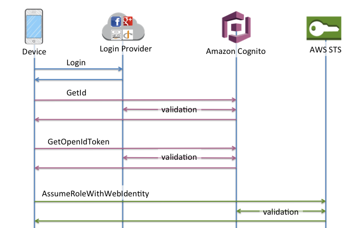
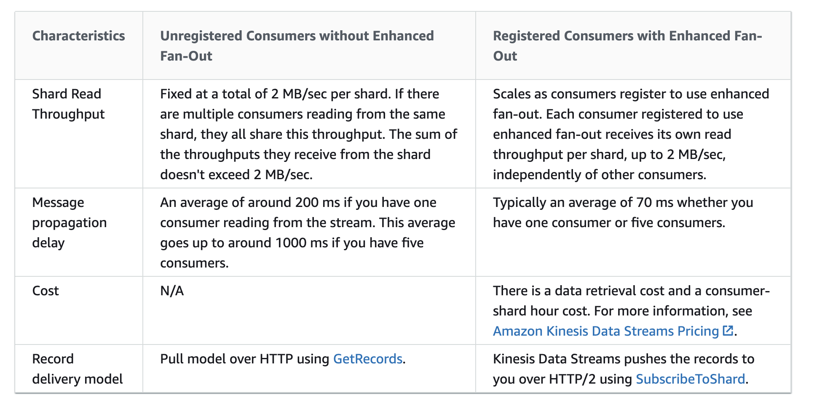

ß# Solutions Architect Professional


Training course notes

# Whitepapers
📘[AWS Securing Data at Rest with Encryption](https://d0.awsstatic.com/whitepapers/aws-securing-data-at-rest-with-encryption.pdf)  
📘[AWS Web Hosting Best Practices](https://d0.awsstatic.com/whitepapers/aws-web-hosting-best-practices.pdf?refid=em_)  
📘[AWS Migrate resources to a new Region](http://d0.awsstatic.com/whitepapers/aws-migrate-resources-to-new-region.pdf?refid=70138000001adyu)  
📘[AWS Best Practices for DDoS Resiliency](https://d0.awsstatic.com/whitepapers/Security/DDoS_White_Paper.pdf)  

# AWS Accounts
Consist of three discrete domains:
- Authentication
- Authorization
- Billing

By default, every AWS Account has separate billing, users and permission (**blast  radius**)  

You cannot limit permission of Root User (unrestricted permission)
Identity Store
Authorization Store


# HA, Fault Tolerance (FT), DR
 - **HA**: _Ability_ to recover from the failure and minimize the outage, might be disruption
 - **FT**: _Able_ to operate during the failure, no disruption
 - **DR**: _Protecting_ the critical system data

 - **RPO**: The time between when a disaster occurs and the last recoverable copy of key business data was created (amount of data lost). Minimize the length of this time period via regular backups, snapshots, transaction logs  

 - **RTO**: The time between when a disaster occurs and when the system can be restored to an operational state and handed over to the business for testing.

# Data Persistence

 - **Ephemeral**: data is local to resource and is lost when that resource is powered down:
  - _Instance Store Volume_ (fastest type of storage available in AWS). If instance reboots, the data in the instance store persists. If instance stops, terminates or the underlying disk fails, the data is lost
  - _Amazon ElastiCache_

- **Transient**: data that exists in a form while it's passed between sources
  - _Queue_

- **Persistent**: data that is durable and survives power events
  - _EBS_
  - _EFS_

# OSI 7-Layer Networking Model
📒https://en.wikipedia.org/wiki/OSI_model  

1. **Physical**
2. **Data Link**: Mac-Addresses
3. **Network**: IP-Addresses, Network Devices, Not reliable IP-protocol, no ordering
4. **Transport**: TCP (reliable) & UDP
5. **Session**: Ports, Connections
6. **Presentation**: Encryption, SSL
7. **Application**: HTTP, Application Devices

# IAM
Only two ways for user to authenticate: via username/password or via access keys - both are long-term credentials

**Real identities**: user and roles:
- have Amazon ARN
- can be referenced (e.g. in resource polices or permission policies

5000 IAM users per account limit

## Identity and Resource Policies
📒https://docs.aws.amazon.com/IAM/latest/UserGuide/reference_policies_elements.html  
📒https://docs.aws.amazon.com/IAM/latest/UserGuide/reference_policies_elements_condition.html  
📒https://docs.aws.amazon.com/IAM/latest/UserGuide/reference_policies_variables.html  

Mandatory elements:
 - `Statement` - contain single statement or array of individual statements
 - `Effects` (Allow, Deny)
 - `Action`/`NotAction`
 - `Resource`/`NotResource`

 Elements:
  - `Principal`/`NotPrincipal` - specify the principal that is allowed or denied to a resource. Not allowed in IAM identity-based policy, but mandatory in trust policies for IAM roles and resource-based policies
  [Principals](https://docs.aws.amazon.com/IAM/latest/UserGuide/reference_policies_elements_principal.html) can be:
  - AWS accounts and root user
  - IAM users
  - Federated users
  - IAM roles
  - Assumed-role sessions
  - AWS services
  - Anonymous users (not recommended)

Conditions:
```json
"Condition" : { "{condition-operator}" : { "{condition-key}" : "{condition-value}" }}
```

[Variables](https://docs.aws.amazon.com/IAM/latest/UserGuide/reference_policies_variables.html) (all are case-insensitive):

Available in ALL requests
- **`aws:CurrentTime`**
- **`aws:EpochTime`**
- **`aws:TokenIssueTime`**
- **`aws:PrincipalType`**
- **`aws:SecureTransport`**
- **`aws:SourceIp`**
- **`aws:UserAgent`**
- **`aws:userid`**
- **`aws:username`**
- **`ec2:SourceInstanceARN`**

**Explicit deny** is better than explicit allow. Other policies may still allow access.

## IAM Roles and Temporary Security Credentials
📒https://docs.aws.amazon.com/AWSEC2/latest/WindowsGuide/ec2-instance-metadata.html  

A role has two components: a **trust** policy (which defines a principle and conditions under which the role can be assumed) and a **permission** policy which defines the AWS access rights granted during `AssumeRole`

A role has _no_ long-term credentials on its own. STS generates temporary credentials (min 15m to max 12h)


### AWS API Access
All interactions with AWS API signed with `AccessKeyId` and `SecretAccessKey` using Sig4
`AccessKeyId` and `SecretAccessKey` map to users or roles in IAM

The _default credential provider chain_ implemented by `DefaultAWSCredentialsProviderChain` looks for credentials in this order:
  1. Specified in the code  
  2. Environment variables `AWS_ACCESS_KEY_ID` and `AWS_SECRET_ACCESS_KEY` and `AWS_SESSION_TOKEN`
  3. Default credential profile in the `~/.aws/credentials` file  
  4. Amazon ECS container credentials: loaded from ECS if environment variable `AWS_CONTAINER_CREDENTIALS_RELATIVE_URI` is set  
  5. Amazon EC2 instance role: used on EC2 instance and delivered via EC2 metadata service:
  `curl http://169.254.169.254/latest/meta-data/iam/security-credentials/<name of IAM role>`

### Revoke session
_Revoke session_ adds an additional `Deny` policy to the role with the condition:
```json
  "Condition": {
    "DateLessThan": {
      "aws:TokenIssueTime":"<current time>"
    }
  }
```

You _cannot_ revoke the existing temporary credentials, but _Revoke session_ (with the condition policy) will invalidate (with explicit Deny) all sessions with token older than the specified `aws:TokenIssueTime`

### Cross-Account Access
📒https://amz.run/3d3f
📒https://amz.run/3d3c

Cross-Account Access to S3 Buckets and Objects

ACL | Bucket Policy | IAM Role
---|---|---
ACLs is a legacy access control for S3. Access control only. Objects are _owned by the identity who PUTS them_. ACL can apply to objects! | Permission control is handled within S3. There is no IAM involved. Account who PUTS objects is the owner. Bucket policies can require the bucket owner account be the owner for objects as they are put (buy a different account) in the bucket | Objects are owned by the role in account which owns the role. Permission are managed by IAM, not S3

Scenarios for **ACL** use:
- control access to the objects
- S3 Logging (Log Delivery Group)

You can grant bucket/object access to other account (using canonical id) via ACL
**Main limitation** for ACL - all objects created by the account B in the bucket owned by account A, are owned by the account B and the account A doesn't have permission to these objects

The same situation with access via **Bucket Policy** (the objects are owned by the creator of the object and not by the bucket owner account).

To give full control to the bucket owner account, the following bucket policy should be applied to grant Cross-Account Permissions to Upload Objects While Ensuring the Bucket Owner Has Full Control:

```json
{
   "Version":"2012-10-17",
   "Statement":[
     {
       "Effect":"Allow",
       "Principal":{"AWS":"123456789012"},
       "Action":"s3:PutObject",
       "Resource":"arn:aws:s3:::awsexamplebucket1/*"
     },
     {
       "Effect":"Deny",
       "Principal":{"AWS":"123456789012"},
       "Action":"s3:PutObject",
       "Resource":"arn:aws:s3:::awsexamplebucket1/*",
       "Condition": {
         "StringNotEquals": {"s3:x-amz-acl":"bucket-owner-full-control"}
       }
     }
   ]
}
```

## Cognito
📒https://docs.aws.amazon.com/cognito/latest/developerguide/identity-pools.html  
📒https://docs.aws.amazon.com/cognito/latest/developerguide/authentication-flow.html  
📒https://docs.aws.amazon.com/cognito/latest/developerguide/cognito-user-pools-user-groups.html  

### User Pools
A user pool is a user directory in Amazon Cognito

User pools provide:

- Sign-up and sign-in services.
- A built-in, customizable web UI to sign in users.
- Social sign-in with Facebook, Google, Login with Amazon, and Sign in with Apple, as well as sign-in with SAML identity providers from your user pool.
- User directory management and user profiles.
- Security features such as multi-factor authentication (MFA), checks for compromised credentials, account takeover protection, and phone and email verification.
- Customized workflows and user migration through AWS Lambda triggers.

### Identity Pools (Federated Identities)
Amazon Cognito identity pools provide temporary AWS credentials for users who are guests (unauthenticated) and for users who have been authenticated and received a token. An identity pool is a store of user identity data specific to your account.

#### Enhanced (Simplified) Authflow


#### Basic (Classic) Authflow




## Advanced Identity in AWS

### Identity Federation
📒https://docs.aws.amazon.com/IAM/latest/UserGuide/id_roles_providers_saml.html  
📒https://docs.aws.amazon.com/IAM/latest/UserGuide/id_roles_providers_oidc_cognito.html
📒https://docs.aws.amazon.com/IAM/latest/UserGuide/id_roles_providers_create_saml.html  
📒https://docs.aws.amazon.com/IAM/latest/UserGuide/id_roles_common-scenarios_federated-users.html

When to use STS:
- Identity Federation:
  - Enterprise identity federation, STS supports SAML (allows use of Microsoft AD)
  - Web identity federation (Facebook, Google, Amazon) supporting OIDC (OpenID Connect)
- Roles for cross-account access
- Roles for Amazon EC2 and other AWS services
  - grant access to application running on EC2 to access other AWS services without having to imbed credentials

For mobile applications [**Cognito use is recommended**](https://docs.aws.amazon.com/IAM/latest/UserGuide/id_roles_providers_oidc_cognito.html)  

STS API:
- `AssumeRole`  
- `AssumeRoleWithWebIdentity`  
- `AssumeRoleWithSAML`  

When requested via STS API call, a credential object is returned containing:
- Session Token
- Access Key ID
- Secret Access Key
- Expiration Timestamp

❗You can use [External ID](https://docs.aws.amazon.com/IAM/latest/UserGuide/id_roles_create_for-user_externalid.html) with `AssumeRole` when you need to give a third party access to your AWS resources (delegate access)
Add trust to the IAM role trust policy:
```json
"Principal": {"AWS": "Example Corp's AWS Account ID"},
"Condition": {"StringEquals": {"sts:ExternalId": "Unique ID Assigned by Example Corp"}}
```
Example Corp will call `sts:AssumeRole` with role ARN and ExternalId


**`AssumeRoleWithWebIdentity`**  
1. Log into Google, ID token returned
2. Using ID token to call STS API `AssumeRoleWithWebIdentity`  
3. STS provides temporary credentials
4. Use temp credentials to call AWS API

**`AssumeRoleWithSAML`**  
❗Possible to have [access to AWS Console](https://docs.aws.amazon.com/IAM/latest/UserGuide/id_roles_providers_enable-console-saml.html) - SSO - (not possible with WebIdentity)  


#### Identity Federation Use Cases
- Amazon Cognito
- Developer Authenticated Identities (via Amazon Cognito)
- OpenID Connect (OIDC)
- SAML 2.0
- Custom Identity Broker


### IAM Permission Boundaries
📒https://docs.aws.amazon.com/IAM/latest/UserGuide/access_policies_boundaries.html  

Limit the maximum permissions an identity can have.
Can be applied to:
- IAM Users
- IAM Roles
- AWS Organisations (SCP)

Do not give any permissions
Used to delegate the access

**Resource-based policies** – Resource-based policies control how the specified principal can access the resource to which the policy is attached. Within an account, an implicit deny in a permissions boundary does not limit the permissions granted by a resource-based policy. Permissions boundaries reduce permissions that are granted to an entity by identity-based policies, and then resource-based policies provide additional permissions to the entity.

**Organizations SCPs** – SCPs are applied to an entire AWS account. They limit permissions for every request made by a principal within the account. An IAM entity (user or role) can make a request that is affected by an SCP, a permissions boundary, and an identity-based policy. In this case, the request is allowed only if all three policy types allow it. The effective permissions are the intersection of all three policy types. An explicit deny in any of these policies overrides the allow.

**Session policies** – Session policies are advanced policies that you pass as a parameter when you programmatically create a temporary session for a role or federated user. The permissions for a session come from the IAM entity (user or role) used to create the session and from the session policy. The entity's identity-based policy permissions are limited by the session policy and the permissions boundary. The effective permissions for this set of policy types are the intersection of all three policy types.

### Policy Evaluation Logic
📒https://docs.aws.amazon.com/IAM/latest/UserGuide/reference_policies_evaluation-logic.html  

Organisation Boundaries -> User or Role Boundaries -> Role Polices -> Permissions (Identity Polices + Resource Polices)

explicit DENY -> explicit ALLOW -> implicit DENY

# Account Management

## AWS Accounts and AWS Organisations
📒https://docs.aws.amazon.com/awsaccountbilling/latest/aboutv2/useconsolidatedbilling-discounts.html   
📒https://docs.aws.amazon.com/organizations/latest/userguide/orgs_introduction.html  

AWS Organisations is a global service physically hosted in us-east-1

Only one single master account in any organisation
**Master account** (root container):
- A master account is the AWS account you use to create your organization
- You cannot change which account in your organization is the master account
- Create organisations and OUs
- Invite an external account to join organisation
- Pay all charges accrued by all accounts in organisation
- **Never affected by SCP**  

**Member account**:
- can join only **one** Organisation even if it receives multiple invitations
- if an invitation is not accepted or rejected for over 15d, the invitation will expire

**Organisation Unit (OU)**:
- can contain other OUs
- an OU can have exactly one parent
- each account can be a member of exactly one OU
- before deleting an OU, you must firstly move all accounts out of the OU and any child OU. Child OUs need to be deleted as well
- OU names must be unique within a parent OU or root
- OU can be nested up to 5 levels deep
- ❗You cannot move an OU to another place from the console or CLI. You has to create a new OU and move accounts to it

Minimum permissions needed to create an OU
  - `organizations:DescribeOrganization` (console only)
  - `organizations:CreateOrganizationalUnit`

Delete an OU:
  - `organizations:DescribeOrganization` (console only)
  - `organizations:DeleteOrganizationalUnit`

Minimum permissions needed to move accounts among OUs:
  - `organisations:DescribeOrganisation` (console only)
  - `organisations:MoveAccount`

IAM -> Organisation activity:
  you can review access activity of the account within the organisation

Applying policies at the root level propagates them to all OUs and accounts below

Organisations operate in either **Consolidated Billing** or **All Features** mode
❗**All Features** cannot be switched back to **Consolidated Billing
If you create an organization with consolidated billing features only, you can later enable all features.

AWS Organisations is a free service regardless of how many OUs in the Organisation

When you **create** a member account in your organization, AWS Organizations automatically creates an IAM role `OrganizationAccountAccessRole` in the member account that enables IAM users in the master account to exercise full administrative control over the member account. This role is subject to any service control policies (SCPs) that apply to the member account.

When an **invited** account joins your organization, you do not automatically have full administrator control over the account, unlike created accounts. If you want the master account to have full administrative control over an invited member account, you must create the `OrganizationAccountAccessRole` IAM role in the member account and grant permission to the master account to assume the role.

AWS Organizations also automatically creates a service-linked role named `AWSServiceRoleForOrganizations` that enables integration with select AWS services. You must configure the other services to allow the integration.

### Adding accounts to AWS Organisation
📒https://docs.aws.amazon.com/organizations/latest/userguide/orgs_manage_accounts_invites.html


### Remove member account
📒https://docs.aws.amazon.com/organizations/latest/userguide/orgs_manage_accounts_remove.html  

- you can remove a member account only after you enable IAM user access to billing in the member account
- you can remove an account from your organisation only if the account has the information required for it to operate as a standalone account

Minimum permissions:
- To remove a member account from your organisation, master account IAM user must have the following permissions:
  `organizations:DescribeOrganization` (console only)  
  `organizations:RemoveAccountFromOrganization`  
- Member account can leave the organisation if member account IAM user has the following permissions:
  `organizations:DescribeOrganization` (console only)  
  `organizations:LeaveOrganization`   
  ❗also the member account must have IAM user access to billing enabled

❗To remove the **the master account** you must **delete the organization**  

## AWS Organizations Policy Types
**Authorization policies**:  
  - Service Control Policies (SCP)

**Management policies**:  
  - AI services opt-out policies
  - Backup policies
  - Tag policies


## Service Control Policies (SCP)
similar to IAM permissions policies but SCP _don't grant any permissions_  
SCP's don't have any effect on **master** account, but for all other accounts they **impact** IAM and ROOT user

If multiple SCPs apply to an account - only the **overlap** of those SCPs is permitted

- **Allow list strategy**: explicitly specify the access that is allowed. All other access is implicitly blocked.
  By default, AWS Organisations attaches an AWS managed policy `FullAWSAccess` to all roots, OUs and accounts.
  When you restrict permissions, you _replace_ the `FullAWSAccess`
  You can't add permissions back at lower lever in the hierarchy
- **Deny list strategy**: explicitly specify the access that is not allowed. All other access is allowed.
  This is the default behavior of AWS Organisations.
  You leave the default `FullAWSAccess` policy in place and attach additional policies that explicitly _deny_ access to unwanted services and actions


## AWS Account Limits
📒https://docs.aws.amazon.com/general/latest/gr/aws-general.pdf#aws-service-information  
📒https://docs.aws.amazon.com/general/latest/gr/aws_service_limits.html  
📒https://docs.aws.amazon.com/IAM/latest/UserGuide/reference_iam-limits.html  

## AWS Support Tiers
📒https://aws.amazon.com/premiumsupport/plans/  
- Developer
- Business
- Enterprise

# AWS Config
📒https://aws.amazon.com/blogs/aws/aws-config-rules-dynamic-compliance-checking-for-cloud-resources  
📒https://docs.aws.amazon.com/config/latest/developerguide/evaluate-config-rules.html  

- AWS resource inventory, configuration history and configuration change notification
- Region-based
- Stores all in S3 Bucket
- Snapshot of current configuration of your account
- Can stream configuration changes to SNS
- Can trigger Lambda on Events
- Can enable rule compliance by monitoring and triggering SNS notification
- Compliance checks - periodic or triggered
- Managed Rules available (AWS Config Rules)
- You can see the timeline of changes and retrieve past configurations

AWS Config **requires IAM role** with permissions:
 - Read-only to recorded resources
 - Write to S3 logging bucket
 - Publish access to SNS

AWS Config rules can, e.g:
- Ensure that EC2 instances launched in a particular VPC are properly tagged.
- Make sure that every instance is associated with at least one security group.
- Check to make sure that port 22 is not open in any production security group.

# AWS Service Catalog
📒https://docs.aws.amazon.com/servicecatalog/latest/adminguide/getstarted-iamenduser.html  

Regional service

Administrators define products and portfolios (groups of products and configurations) make them available for end users
personalised portal - deploy only approved resources that comply with organisational policies and budget constraints
- Access Control
- Enforce Standards

Portfolio - collection or grouping of products, selectively grant access
Product - definition, support contract, owner - CFN template
Add users to the portfolio
Can share portfolio cross-account or within AWS Organisations

Service Catalog Admin:
1. Create portfolio
2. Author template (CloudFormation)
3. Create product (upload the CloudFormation template)
4. Add constraints and access
8. Events from CloudFormation

need to create a `Service Catalog` service role for product cloud formation template (which creates all resources for the product, not the end users)

End Users:
5. Browse products
6. Launch products
7. Events from CloudFormation

# Resource Billing Modes: On-Demand, Reserved, and Spot
📒https://aws.amazon.com/blogs/compute/new-amazon-ec2-spot-pricing/  
📒https://docs.aws.amazon.com/AWSEC2/latest/UserGuide/using-spot-instances.html  
📒https://docs.aws.amazon.com/AWSEC2/latest/UserGuide/ec2-capacity-reservations.html  
📒https://docs.aws.amazon.com/AWSEC2/latest/UserGuide/ec2-reserved-instances.html  
📒https://docs.aws.amazon.com/AWSEC2/latest/UserGuide/instance-purchasing-options.html  
📒https://github.com/open-guides/og-aws#billing-and-cost-management  

  

# CloudWatch
📒https://docs.aws.amazon.com/AmazonCloudWatch/latest/monitoring/aws-services-cloudwatch-metrics.html  

- **Alarm** can trigger:
    SNS (multiple SNS topics are possible)  
    Auto scaling action (ASG or ECS)  
    EC2 action (recover, stop, terminate, reboot) - _Per-instance_ metric is required  
- **Rule** can trigger:  
    SNS, SQS, EC2, ECS Task, Lambda, CodeBuild, CodePipeline, Step Function, SSM, Eventbus in other account, Kinesis Data Streams and Firehose  
    Event Source for the rule can be almost any AWS Service (Event type: CloudTrail API Call)

CloudWatch agents on Windows use `StatsD` protocol and `collectd` on Linux


CloudWatch Events:
- consists of three parts:
  - **Event Source**  
  - **Rule**  
  - **Target**: can be more than one  

- Retention:
  - 1m metric - 15d
  - 5m metric - 63d
  - 1h metric - 455d

- Metric resolution:
  - Default: 5m
  - Detailed: 1m
  - High-resolution: CloudWatch stores it with resolution 1s and you can read and retrieve it with a period of 1, 5, 10, 30 or any multiple of 60s

- Can be used on-prem: Need to install SSM agent and CloudWatch agent

## CloudWatch Logs
📘https://linuxacademy.com/cp/courses/lesson/course/4478/lesson/1/module/341  

Log Group 0..N Log Stream

# CloudTrail
📒https://docs.aws.amazon.com/awscloudtrail/latest/userguide/creating-an-organizational-trail-prepare.html   

You can create many different **Trails** each with own configuration
**Trail** is sent to S3 bucket

Trail configuration options:
  - **Management Events**: enabling will log control plane events, such as:
    - User login events
    - Configuring security
    - Setting up logging
  - **Data Events**:
    - Object-level events in **S3**
    - Function-level events in **Lambda**
  - **Encryption**:
    - encrypted in S3 by default, can be changed to KMS

You can enable log file validation (tamper-check), stored in `-Digest` folder

❗CloudTrail can also deliver logs to CloudWatch log group

# Route 53 Logging
Only for public hosted zones
Integrates with CloudWatch
Logs any DNS resolution requests

Format:
  Timestamp
  DNS Zone
  Query Type
  Query response code
  Layer 4 protocol used (TCP/UDP)
  R53 Edge location code
  Resolver IP

# S3 Logging
📒https://docs.aws.amazon.com/AmazonS3/latest/dev/ServerLogs.html  

provides detailed records for the requests that are made to a bucket
Details:
```
single access request, requester, bucket name, request time, request action, response status, error code
```
No extra charge for enabling and PUTs (but usual charge for storing)
Logs are saved to a bucket in the same AWS regions as the source bucket
Uses a special log delivery account _Log Delivery Group_ to write access log  
Best effort server log delivery:
The completeness and timeliness of server logging is not guaranteed. The log record for a particular request might be delivered long after the request was actually processed, or _it might not be delivered at all_.

To enable:
1. Turn on logging on S3 bucket
2. Grant S3 _Log Delivery group_ write persmission on the target bucket
    **only through bucket ACL** and not through bucket policy
    only SSE-S3 can be used, **SSE-KMS is not supported**  
    Object Lock _cannot_ be enabled on the target bucket
You can _optionally_ specify prefix in the target bucket while enabling logging

# AWS Systems Manager
:question:https://aws.amazon.com/systems-manager/faq/  
📒https://docs.aws.amazon.com/systems-manager/latest/userguide/systems-manager-managedinstances.html  

Access methods:
- Console
- SDK's
- Powershell
- CLI

❗SSM runs inside public zone and EC2 instance need either an Internet GW or VPC endpoint to access the SSM

❗The Systems Manager Run Command requires **no inbound ports to be open** - it operates entirely over outbound HTTPS (which is open by default for security groups).

Provisioning, Deployment, Management

managed policy `AmazonEC2RoleforSSM` to attach to EC2 role to communicate with SSM
Parts:
- **SSM Automation**  
- SSM Inventory
- **Patch Manager**  
- **Run Command**  
- Parameter Store
- Trusted Advisor and PHD

For set-up of Systems Manager for Hybrid environment:

Step 1: Complete general Systems Manager setup steps
Step 2: Create an IAM service role for a hybrid environment (to communicate with SSM service)
Step 3: Install a TLS certificate on on-premises servers and VMs
Step 4: Create a **managed-instance activation** for a hybrid environment
Step 5: Install SSM Agent for a hybrid environment (Linux or Windows)
Step 6: (Optional) Enable Advanced-Instances Tier for **more than 1000 servers per account per region**  

## SSM State Manager
📒https://docs.aws.amazon.com/systems-manager/latest/userguide/sysman-ssm-docs.html  

uses **Command Document** to keep EC2 in predefined state
Different Types of SSM Documents
Type | Use with
---|---
Command Document | Run command, State Manager, Maintenance Windows, apply to configuration
Automation Document | Automation, common deployment/maintenance tasks
Package Document | ZIP archive files that contain software to install on managed instances
Session Document | Session Manager (type of session to start)
Policy Document | Enforcing a policy on a managed instance
Change Calendar Document | Associated events that can allow/prevent Automation actions

## SSM Parameter Store
- Can store parameters in hierarchies
- Keeps history of value changes
- Tiers:
  - Standard: 10K parameters, size max 4KB, no parameter policies
  - Advanced: >10K parameters, size max 8KB, parameter policies
- Parameter policy: Expiration, Notification
- Parameter Types: `String`, `StringList`, `SecureString`  
- API Actions:
  - `PutParameter`  
  - `GetParameter`  
  - `GetParameters`  
  - `DeleteParameter`


# AWS CloudFormation
📘https://linuxacademy.com/cp/modules/view/id/157  
📒https://docs.aws.amazon.com/AWSCloudFormation/latest/UserGuide/intrinsic-function-reference.html  
📒https://docs.aws.amazon.com/AWSCloudFormation/latest/UserGuide/parameters-section-structure.html
📒https://docs.aws.amazon.com/AWSCloudFormation/latest/UserGuide/pseudo-parameter-reference.html
📒https://docs.aws.amazon.com/AWSCloudFormation/latest/UserGuide/using-cfn-updating-stacks-update-behaviors.html  
📒https://docs.aws.amazon.com/AWSCloudFormation/latest/UserGuide/aws-template-resource-type-ref.html  

- Template JSON or YAML
- Only `Resources` section is required
- Max 60 parameters
- **CloudFormer**: create CloudFormation template from existing resources
- Resources:
  - Format `AWS::aws-product-name::data-type-name`
  - Properties depending on resource
  - Policies:
    - _CreationPolicy_
    - _DeletionPolicy_
    - _DependsOn_
    - _Metadata_
    - _UpdatePolicy_
- Parameter data types:
  - String
  - Number
  - List: array of integers or floats separated by commas
  - CommaDelimitedList: array of literal strings separated by commas
  - AWS-Specific Parameter Types: such as EC2 key pair names and VPC IDs
  - SSM Parameter Types: points to SSM parameter store, CloudFormation fetches automatically the parameter values  
- CloudFormation Stacks
  - Stack resources are treaded as one single unit
- You can create nested CloudFormation stacks by using `AWS::CloudFormation::Stack` resource
- CloudFormation Functions (intrinsic functions), here is some:
  - `Fn::GetAtt`
  - `Fn::GetAZs`  
  - `Fn::Join`  
  - `Ref`  
  - `Fn::ImportValue`  

## Stack Updates
You can create new resources, update or delete existing

Update behaviors of Stack Resources:
- Update with no Interruption (no changing physical ID)
- Updates with some interruption (no changing physical ID)
- Replacement (new physical ID)

## Template Portability and Reuse
Use default values for parameters (for automated deployment)
Use SSM to retrieve region-dependend values (e.g. AMI id)
Use **Pseudo Parameters**: pre-defined parameters in CloudFormation
Use **Intrisic Functions**: can be used only in specific parts of a template:
  - resource properties  
  - outputs  
  - metadata attributes  
  - update policy attributes  
Do not specify explicit resource names

## Wait Conditions
You can use a wait condition for situations like the following:
- To coordinate stack resource creation with configuration actions that are external to the stack creation
- To track the status of a configuration process

For these situations, use a `CreationPolicy` attribute with the wait condition.

Associate the `CreationPolicy` attribute with a resource to prevent its status from reaching create complete until AWS CloudFormation receives a specified number of success signals or the timeout period is exceeded

```yaml
CreationPolicy:
  AutoScalingCreationPolicy:
    MinSuccessfulInstancesPercent: Integer
  ResourceSignal:    
    Count: Integer
    Timeout: String
```
## Deletion Policies
📒https://docs.aws.amazon.com/AWSCloudFormation/latest/UserGuide/aws-attribute-deletionpolicy.html

`DeletionPolicy` attribute

if no `DeletionPolicy` attribute is specified, CloudFormation deletes the resource by default
**Exception**: the default policy is `Snapshot` for RDS Cluster and DB Instances

Values:
- **`Delete`**: delete the resource and all its content if applicable during stack deletion
  you can use this deletion policy with any resource
  **for S3 buckets you must delete all objects in the bucket for deletion to succeed**  

- **`Retain`**: keep a resource when its stack is deleted, can use for any resource
  if you want to modify resource outside of CloudFormation, use a retain policy and then delete the stack

- **`Snapshot`**: for resources that support snapshot CloudFormation create a snapshot and deletes the resource
  Resources that support snapshots:
  - `AWS::EC2::Volume`  
  - `AWS::ElastiCache::CacheCluster`  
  - `AWS::ElastiCache::ReplicationGroup`  
  - `AWS::Neptune::DBCluster`  
  - `AWS::RDS::DBCluster`  
  - `AWS::RDS::DBInstance`  
  - `AWS::Redshift::Cluster`  


## Stack References and Nested Stacks

cross-stack references: **re-use the existing stack**  
  Stack A (provider of the reference) defines all exported resource references in `Outputs` section
  Stack B (recipient of the reference) references an imported resource via `Fn::ImportValue`

nested stacks: **re-use the template**  
  For nested stacks use resource type `AWS:CloudFormation:Stack`
  Refer to nested stack output via `!GetAtt <StackName>.Outputs.<LogicalResourceId>`

## Stack roles
IAM CloudFormation role - create resources on your behalf
Allows for role separation

## Stack Sets
📒https://docs.aws.amazon.com/AWSCloudFormation/latest/UserGuide/what-is-cfnstacksets.html  

- You can use StackSets to create, update, or delete stacks across multiple accounts and regions
- StackSets orchestrate the deployment of stacks in mulitple accounts
- Using an administrator account, you define and manage an AWS CloudFormation template, and use the template as the basis for provisioning stacks into selected target accounts across specified regions.

## Using CloudFormation for DR
📗https://d1.awsstatic.com/asset-repository/products/CloudEndure/CloudEndure_Affordable%20Enterprise-Grade%20Disaster%20Recovery%20Using%20AWS%20082019.pdf  

## CloudFormation Security Best Practicies
📗https://aws.amazon.com/blogs/devops/aws-cloudformation-security-best-practices/

There are three CloudFormation-specific IAM conditions that you can add to your IAM policies:
- `cloudformation:TemplateURL`  
- `cloudformation:ResourceTypes`  
- `cloudformation:StackPolicyURL`  

### DR Scenarios
🔸**Backup and Restore Method**  
- Slowest restoration time after an event
- Requires frequent snapshots of data
- Storage Gateway enables snapshots of on-prem data to be copied to S3
- Gateway VTL can replace magnetic tape backup
- Used with other DR methods

🔸**Pilot Light Method**
- Quicker than backup and restore
- slower than warm standby
- _most critical core components_ are always running and kept up to date
- typically includes DB servers (replication)
- restoring other components include EBS snapshots and EC2 AMIs

🔸**Warm Standby Method**
- Scaled-down version of fully functional environment is always running
- resize instances after failover
- like pilot light uses DB replication

🔸**Multi-Site Solution Method**
- Fastest possible system restore
- 1:1 copy of all Infrastructure in another AZ/region
- **Active-Active**  
- Can perform weighted DNS routing
- uses ASG and instance resizing to increase capacity in a disaster scenario

## Custom Resources
📒https://docs.aws.amazon.com/AWSCloudFormation/latest/UserGuide/template-custom-resources.html  

Use the `AWS::CloudFormation::CustomResource` or `Custom::<MyCustomResourceTypeName>` resource type to define custom resources in your templates.

The template developer defines a custom resource in their template, which includes a service token and any input data parameters. Depending on the custom resource, the input data might be required; however, the service token is always required.

The service token specifies where AWS CloudFormation sends requests to, such as to an Amazon SNS topic ARN or to an AWS Lambda function ARN.


# EC2
:question:https://aws.amazon.com/ec2/faqs/

## Virtualization and EC2 Instance Type
📒https://aws.amazon.com/ec2/instance-types/

  

🔸**General Purpose (A, T, M)**
  - M5: default instance type, general workhorse inside AWS, steady state 80-90% CPU
  - M5a: using AMD CPU
  - T*: burstable CPU performance
  - A1: Arm CPU AWS Graviton

🔸**Compute Optimized (C)**
  - instances use more CPUs
  - C5
  - C5n with additional network capabilities

🔸**Memory Optimized (R, X)**
  - more memory
  - X1 and X1e: the highest amount of memory

🔸**Accelerated Computing (P, Inf, G, F)**
  - GPU-based instances
  - P: GPU-based general computing
  - G: graphic-intense application
  - F: customizable hardware-acceleration with FPGAs

🔸**Storage Optimized (I, D, H)**
  - additional NVMe SSD-backed instance storage optimized for low latency
  - H: up to 16TB local HDD-storage
  - I: up to 60TB local NVMe SSD-storage

## Creating and using AMIs
- AMIs are objects (meta data) containing all the information required to launch an instance, the owner of AMI, launch permissions (public, explicit or implicit), the architecture and operating system and block device mapping of all volumes required.

- AMIs contain mapping to any volumes, these mappings reference EBS volume snapshots in the same region
- AMIs are regional but can be copied between regions which **also copies any volume snapshots**

When AMI created from the instance `create image`:
- Root volume snapshot created
- other volume snapshots created

By default no permissions are stored when AMI is created (implicit creator permission)
You can modify permission to be public or private (shared with specific AWS accounts)

❗when creating AMIs from instances with instance store root volumes - a **bundle** is created and stored on S3 containing ALL the root volume data

## EC2 Storage and Snapshots
📒https://docs.aws.amazon.com/AWSEC2/latest/UserGuide/InstanceStorage.html  
📒https://docs.aws.amazon.com/AWSEC2/latest/UserGuide/EBSPerformance.html  
📒https://docs.aws.amazon.com/AWSEC2/latest/UserGuide/EBSVolumeTypes.html  

Block-level storage:
- **Instance store**
  - local physical storage attached to hosts
  - Temporary storage
  - High I/O and Throughput (**highest** I/O available in AWS)
  - volumes mapped as `ephemeral0` to `23` (max 24 volumes)
  - included in the instance cost
  - if you create an **AMI** from an instance, the data on its instance store volume **isn't preserved and isn't presented** on the instance store volumes of the instances that you launch from the AMI
  - you need to format and mount the instance store volumes before using them (the root volume of an instance store-backed instance is mounted automatically)
  - you cannot make an instance store volume available after you launch the instance
  - if you change the instance type, an instance store will not be attached to the new instance type.

  ❗**no support for snapshots and no resilience**  

- **EBS**
 - network storage associated with one instance
 - Persistence
 - Durability (but EBS is not the most durable storage service)
 - Elasticity - requirements for variable or changing performance demands over time
 - Provisioned Performance - certain EBS types can provide guaranteed performance levels
 - EBS Optimized instances provide a dedicated storage network (dedicated ENI)

 ❗Max IOPS per instance - 160000
 ❗Max throughput per instance - 4750MB/s

  🔸**General Purpose gp2**
    - 1-16TB
    - max 16000 IOPS
    - max throughput 250 MB/s
    - burst up to 3000 IOPS
    - baseline 3 IOPS/GB (100 - 16000)
  🔸**Provisioned IOPS SSD io1, io2**
    - 4-16TB
    - max 64000 IOPS
    - max 1000 MB/s
  🔸**Throughput Optimized HDD st1**
    - 500GB-16TB
    - max 500 IOPS
    - max 500 MB/s
  🔸**Cold HDD sc1**
    - 500GB-16TB
    - max 250 IOPS
    - max 250 MB/s

EBS volume type can be modified in flight without the volume being detached or the instance being restarted. However, there are [some limitations](https://docs.aws.amazon.com/AWSEC2/latest/UserGuide/modify-volume-requirements.html) that need to be noticed.
❗Decreasing the size of an EBS volume is not supported

## EC2 Hibernation
📒https://docs.aws.amazon.com/AWSEC2/latest/UserGuide/Hibernate.html  

You can hibernate an instance only if it's:
- **enabled for hibernation**:
  **only** when you launch it. You can't enable or disable hibernation for an instance after you launch it

- meets **hibernation prerequisites**:
  - Supported instance family, size and AMI
  - RAM < 150 GB
  - root volume is EBS (not instance-store) and only `gp2` or `io1/io2`
  - EBS root volume size > RAM size
  - EBS root volume must be **encrypted** (enforced at instance launch)
  - only on-demand or RI
  - instance **not** in ASG or used by ECS (ASG marks the stopped instance as unhealthy and may terminate it)
  - max 60d of hibernation


❗If an instance or application takes a long time to bootstrap and build a memory footprint to become fully productive, you can use hibernation to pre-warm the instance.

## EC2 Instance Profiles and Roles
Instance profile allow a role to be assumed to a single EC2 instance, and for applications running on that instance to assume a role while being abstracted away from any AWS identity. Applications running on EC2 are not AWS Identities and so it's instance profile which bridges that gap.

`http://169.254.169.254/latest/meta-data/iam/security-credentials/ROLENAME`

Credentials are automatically renewed when expired
Only a single instance profile can be associated with an EC2 instance containing a single EC2 role

❗If associating a role via the console, the instance profile is **automatically** created and associated.
If using API or CLI or CloudFormation the two steps are distinct and must be done explicitly.

❗All applications running on the instance share the role credentials - it's not possible to be more granular

## HPC and Placement Groups
📒https://docs.aws.amazon.com/AWSEC2/latest/UserGuide/placement-groups.html  

Not possible to modify placement group after creation

### Cluster Placement Groups
- only in a **single AZ**
- can span peered VPCs in the same Region
- High speed, low latency
- reserve physical capacity keeping instances in physical vicinity
- higher chance of capacity related failures
- not every instance type supports cluster PG
- deploy in advance

### Partition Placement Groups
- EC2 divides each group into logical segments called partitions - each partition has its own set of racks with own network and power source
- isolated logical blocks of infrastructure in isolated fault-domains
-  A partition placement group can have a maximum of **7 partitions per AZ**  
- can be **single or multi-AZ**  
- used when you need to ensure HA, but need physical location control
- instances in one partition do not share the underlying hardware with groups of instances in different partitions
- typically used by large distributed and replicated workloads like Hadoop, Cassandra, Kafka

### Spread Placement Groups
- designed for a **small** number of critical components where you **need** to ensure separation
- can be **single- or multi-AZ**  
- up to **7 instances per AZ per group**  
- highest level of availability
- strictly places a small group of instances across distinct underlying hardware

## Custom Logging to CloudWatch
📒https://docs.aws.amazon.com/AmazonCloudWatch/latest/monitoring/install-CloudWatch-Agent-on-EC2-Instance-fleet.html  
📒https://docs.aws.amazon.com/AmazonCloudWatch/latest/monitoring/CloudWatch-Agent-Configuration-File-Details.html  
📒https://docs.aws.amazon.com/AmazonCloudWatch/latest/monitoring/create-cloudwatch-agent-configuration-file.html  

Roles needed for EC2:
`AmazonEC2RoleforSSM` - if SSM is used
`CloudWatchAgentServerPolicy`

Install CloudWatch Agent on the instance
Create a CloudWatch agent configuration file (JSON)
Start agent

# VMware
:tv:https://www.youtube.com/watch?v=RStQrGmHqy0  

# Containers

## ECS Architecture
📒https://linuxacademy.com/cp/modules/view/id/261  
📒https://docs.aws.amazon.com/AmazonECS/latest/developerguide/example_task_definitions.html  

Container > Task > Service > Cluster

# ECS Security
📒https://docs.aws.amazon.com/AmazonECS/latest/developerguide/using_awslogs.html  
📒https://docs.aws.amazon.com/AmazonECS/latest/developerguide/task-iam-roles.html  

Fargate-type:
- Each task is associated with ENI in VPC
- ENI is associated with a SG - you can use the SG to restrict traffic to the container

EC2-type:
- **hosts** have EC2 role attached (`AmazonEC2ContainerServiceEC2Role`):
```json
{
    "Version": "2012-10-17",
    "Statement": [
        {
            "Effect": "Allow",
            "Action": [
                "ec2:DescribeTags",
                "ecs:CreateCluster",
                "ecs:DeregisterContainerInstance",
                "ecs:DiscoverPollEndpoint",
                "ecs:Poll",
                "ecs:RegisterContainerInstance",
                "ecs:StartTelemetrySession",
                "ecs:UpdateContainerInstancesState",
                "ecs:Submit*",
                "ecr:GetAuthorizationToken",
                "ecr:BatchCheckLayerAvailability",
                "ecr:GetDownloadUrlForLayer",
                "ecr:BatchGetImage",
                "logs:CreateLogStream",
                "logs:PutLogEvents"
            ],
            "Resource": "*"
        }
    ]
}
```
- **Tasks** have IAM role attached - allows fine-graned permission on the task-level (and only way to manage permissions with Fargate)

❗Task execution role - used by ECS on your behalf to interact with CloudWatch, ECR etc - given to ECS container agent

# EKS
:tv:https://www.youtube.com/watch?v=EDaGpxZ6Qi0  


# Serverless

# Lambda
:tv:https://www.youtube.com/watch?v=QdzV04T_kec  

- max timeout 15m
- priced per # of requests and duration
- can be used cross-region

Soft Limits:
  - default *1000* concurrent execution across all functions per region per account (`TooManyRequestsException` if exceeded)
  - 75GB function and layer storage
  - 250 ENI per VPC  

Hard Limits:
  - 6MB sync and 256KB async Invocation payload (request and response)  
  - Deployment package size: 50MB (zipped, direct upload), 250MB (unzipped, including layers), 3MB (console editor)  
  - 512MB /tmp directory storage
  - 1024 file descriptors
  - 1024 execution processes/threads

Version Control:
  Each Lambda version has a unique ARN  
  After publishing, the version is immutable (you can edit only `$LATEST`)  
  `$LATEST` - maintains the latest code  
    _Qualified ARN_ - function ARN + version suffix  
    _Unqualified ARN_ - only function ARN, use `$LATEST`  
  Aliases: use to point specific ARN (application use alias incl. `$LATEST`)  
    aliases have static ARN but can point to any version of the same function  
    you can use weighted alias to shift traffic between versions  
    rollback as easy as updating the version in the alias  

Invocation can be synchronous/asynchronous

Function configuration:
- Basic settings: Runtime, Handler (filename.functionname), Memory, Timeout  
- Monitoring (CloudWatch, X-Ray)  
- Permissions  
- Enviroment Variables: max 4KB, by default encrypted at rest using KMS, can be encrypted in transit  
- VPC - function can access VPC resources in specified VPC (e.g RDS)  
    - Also provide Subnet ID and Security Group ID  
    - Lambda sets up ENIs using an available IP address from your private subnet  
    - in CLI: `--vpc-config SubnetIds=subnet-XXXX, SecurityGroupIds=sg-YYYYYY`  
    - Lambda execution role should have the following EC2 permissions:  
      `ec2::CreateNetworkInterface`  
      `ec2::DeleteNetworkInterface`  
      `ec2::DescribeNetworkInterface`  

    ❗If a function connected to a VPC it does not have access to internet unless the VPC provides access. The NAT GW can provide the internet access for the VPC

    - File System - connect to EFS  
    - Asynchronous invocation settings + DQL - SQS or SNS  
    - Concurrency, _provisioned concurrency_ (e.g. for weighted alias)  
    - Database proxies (manages pool of connections)  

Lambda API Actions:  
    `AddPermission`: add permission to the resource policy to invoke Lambda   
    `CreateFunction`:  
    `Invoke`: synchronous  
    `InvokeAsync`   
    `CreateEventSourceMapping`: identifies a stream as an event source for Lambda
      can be DynamoDB stream or Kinesis

Lambda metrics:  
    Invocation, Performace, Concurrency

## Lambda Layers
📒https://docs.aws.amazon.com/lambda/latest/dg/runtimes-custom.html  
📒https://docs.aws.amazon.com/lambda/latest/dg/runtimes-walkthrough.html  
📒https://docs.aws.amazon.com/lambda/latest/dg/configuration-layers.html#configuration-layers-path  
📒https://github.com/awslabs/aws-lambda-cpp  

- ZIP archive that contains libraries, custom runtime or other dependencies
- You can use libraries in your function without needing to include them in your deployment package
- Up to 5 layers per function
- `update-function-configuration` to add layers to the function, include all layers every time  
- Layers are versioned and **immutable**
- Layers are extracted to the `/opt` directory in the function execution environment  
- You can move runtime dependencies out of your function code by placing them in a layer  

# API Gateway
:tv:https://www.youtube.com/watch?v=tIfqpM3o55s  
📒https://docs.aws.amazon.com/apigateway/latest/developerguide/api-gateway-caching.html  
📒https://docs.aws.amazon.com/apigateway/latest/developerguide/getting-started-http-integrations.html  
📒https://docs.aws.amazon.com/apigateway/latest/developerguide/getting-started-aws-proxy.html  
📒https://docs.aws.amazon.com/apigateway/latest/developerguide/api-gateway-api-integration-types.html    
📒https://aws.amazon.com/about-aws/whats-new/2017/11/amazon-api-gateway-supports-canary-release-deployments/  
📒https://docs.aws.amazon.com/apigateway/latest/developerguide/canary-release.html  
📒https://docs.aws.amazon.com/apigateway/latest/developerguide/how-to-cors.html  
📒https://docs.aws.amazon.com/apigateway/latest/developerguide/api-gateway-request-throttling.html  
📒https://aws.amazon.com/blogs/aws/new-usage-plans-for-amazon-api-gateway/  
📒https://docs.aws.amazon.com/apigateway/latest/developerguide/stage-variables.html  
📒https://docs.aws.amazon.com/apigateway/latest/developerguide/apigateway-integrate-with-cognito.html  
📒https://aws.amazon.com/appsync/  
📒https://docs.aws.amazon.com/apigateway/latest/developerguide/handle-errors-in-lambda-integration.html
❗https://docs.aws.amazon.com/apigateway/latest/developerguide/limits.html  

- Resource URL
- Stage is added to default API endpoint
- Respond to request: Lambda, HTTP Endpoints, other AWS services
- Deployments -> snapshot of API's resources and methods
- Stages -> dev, prod, beta.
  Specific settings: caching, request throttling, logging, stage variables
- Caching -> set capacity, encryption, TTL, per-key invalidation
- Dashboard -> API calls, Latency, Integration Latency, 4xx and 5xx Errors
- Can import API from Swagger 2.0
- Throttling -> by default limits the steady-state request rate to 10000 rps
    Max 5000 concurrent requests accross all APIs within AWS account
    429 Too Many Requests error
- Can configure SOAP Webservice Passthrough (doesn't convert XML!)
- Canary releases - create/promote canary
- Stage variables:
  - name-value pairs you can define as configuration attributes associated with a deployment stage
  - use as environment variables in API setup and mapping templates (`${stageVariables.Name}`)
- To support CORS, API resource needs to implement an OPTIONS method that can respond to the OPTIONS request with following header:
  `Access-Control-Allow-Headers`
  `Access-Control-Allow-Origin`
  `Access-Control-Allow-Methods`  

Integration types:
  - `AWS`: AWS Service actions (integration with AWS services)  
      you must configure both integration request and response  
  - `AWS_PROXY`: Lambda proxy integration, API Gateway passes the incoming request direct to Lambda  
      you do not set integration request or response  
  - `HTTP`: HTTP endpoints in the backend  
      you must configure both integration request and response  
  - `HTTP_PROXY`: access to HTTP backend with a streamlined integration setup on single API method  
      you do not set integration request or response   
  - `MOCK`: API Gateway return a response without sending the request to the backend  

[Access Control](https://docs.aws.amazon.com/apigateway/latest/developerguide/apigateway-control-access-to-api.html) - supported mechanisms:
  - **Resource policies**: resource-based policies to allow or deny access to APIs and methods from specified source IP or VPC endpoints (e.g. AWS accounts whitelist, IP range blacklist, Source VPC whitelist). These resource policies are attached to resources
  - **Standard IAM roles and policies**: can be applied to entire API or individual methods (e.g. who can create, managed and invoke APIs).  
    `authorizationType=AWS_IAM`  
  - **IAM tags**: can be used together with IAM policies to control access - using `aws:ResourceTag` in IAM policies  
  - **Endpoint policies for interface VPC endpoints**: allow you to attach IAM resource policies to interface VPC endpoints to improve the security of private APIs.  
  - **Lambda authorizers**: _Lambda functions_ that control access to API methods using bearer token authentication (OAuth or SAML)- as well as information described by headers, paths, query strings, stage variables, or context variables request parameters to determine the caller's identity.  
    - _token-based_: `TOKEN` authorizer: based on JWT or OAuth token (not supported for WebSocket APIs)  
    - _request parameter-based_: `REQUEST` autorizer: receives the caller's identity in a combination of headers, query string parameters, stageVariables and $context variables  
  - **Amazon Cognito user pools**: user pools are used to control who can invoke API methods.
    `autorizationType=COGNITO_USER_POOLS`  

❗The maximum of integration timeout for API Gateway is 29s (minimal is 50ms)

## Handling Errors in Amazon API Gateway
📒https://docs.aws.amazon.com/apigateway/api-reference/handling-errors/  

- **Client Errors**: 4xx HTTP response code. Client errors indicate that Amazon API Gateway found a problem with the client request, such as an authentication failure or missing required parameters. Fix the issue in the client application before submitting the request again.
- **Server Errors**: 5xx HTTP response code. Need to be resolved on the Server side.
  - 502: Bad Gateway Exception, usually for an incompatible output returned from a Lambda proxy integration backend and occasionally for out-of-order invocations due to heavy loads.  
  - 503: Service Unavailable Exception  
  - 504: Endpoint Request Timed-out Exception

## Handling Lambda Errors in API Gateway
📒https://docs.aws.amazon.com/apigateway/latest/developerguide/handle-errors-in-lambda-integration.html  

For Lambda custom integrations, you **must map errors** returned by Lambda in the integration response to standard HTTP error responses for your clients. Otherwise, Lambda errors are returned as `200 OK` responses by default and the result is not intuitive for your API users.

There are two types of errors that Lambda can return: **standard errors** and **custom errors**. In your API, you must handle these differently.

# Scaling Architectures

## AWS Service Resilience
- IAM: global, same data globally, accessible from all region
- EC2 and EBS-volumes are in specific AZ (failure of AZ will cause failure of EC2 and volumes)
- EBS snapshots are replicated across AZs (optionally copied cross-region)
- S3 replication is over 3 AZ, S3 is regional service
- R53 operates its name servers from edge locations globally (resistant even to issues in AWS region)
- ELB: regional service, ELB node is placed in specific AZ, ELB place ENI per configured AZ
- VPC: regional service
- NAT gateways operates in specific subnet (single AZ) - place NAT GW in each AZ
- ASG: operates in VPC across subnets in AZs
- VPN - provision 2 IPSec endpoints (in different AZs)

## Stateless Architectures

## Deciding between Spot, OnDemand and Reserved Instances
🔸**OnDemand**: ad-hoc usage, where you can't calculate future usage patterns

🔸**Reserved**: usage is known and steady-state (base consistent load 24x7), Reserved model can also reserve capacity, providing high-priority startup (e.g for fail-over AZ)

🔸**Spot**: sporadic workloads where you can tolerate interruptions. Have the lowest startup priority

## Auto Scaling Groups
https://linuxacademy.com/cp/courses/lesson/course/2856/lesson/4/module/245  

:question:https://aws.amazon.com/ec2/autoscaling/faqs/  
📒https://docs.aws.amazon.com/autoscaling/ec2/userguide/AutoScalingGroupLifecycle.html  
📒https://docs.aws.amazon.com/autoscaling/ec2/userguide/as-scaling-simple-step.html  
📒https://aws.amazon.com/premiumsupport/knowledge-center/cloudwatch-alarms-trigger-actions/  
📒https://aws.amazon.com/premiumsupport/knowledge-center/auto-scaling-troubleshooting/  
📒https://docs.aws.amazon.com/autoscaling/ec2/userguide/lifecycle-hooks.html  
📒https://docs.aws.amazon.com/autoscaling/ec2/userguide/Cooldown.html  
📒https://docs.aws.amazon.com/autoscaling/ec2/userguide/as-suspend-resume-processes.html  
📒https://docs.aws.amazon.com/autoscaling/ec2/userguide/as-instance-termination.html  


## ELB
:tv:https://www.youtube.com/watch?v=VIgAT7vjol8  
:question:https://aws.amazon.com/elasticloadbalancing/faqs/  
📒https://aws.amazon.com/elasticloadbalancing/features/#compare  
📒https://docs.aws.amazon.com/elasticloadbalancing/latest/network/introduction.html  
📒https://docs.aws.amazon.com/elasticloadbalancing/latest/application/listener-authenticate-users.html  
📒https://docs.aws.amazon.com/elasticloadbalancing/latest/application/introduction.html  
📒https://docs.aws.amazon.com/elasticloadbalancing/latest/classic/introduction.html  

❗Do **not** assign public IPs to application load balancers - communication is based on DNS name

Use **A-type record alias** for R53 for all types of ELB

### ALB
- **Layer 7** device  
  - **Host-based rules**  
  - **Path-based rules**
- both IPv4 and IPv6
- supports ECS, EKS, HTTPS, HTTP/2, WebSockets, AccessLogs, Sticky Sessions, AWS WAF
- Targets can belong to multiple target groups
- ALB can send traffic to Lambda functions
- can manage multiple SSL certificates
- you can use the single ALB to serve multiple applications - via multiple DNS names and target groups

### Network Load Balancers
- **Layer 4** device  
- supports static IP and ultra low latency
- accepts TCP, UDP and TSL termination
- NLB assigned a single static IP address per AZ (EIP can be assigned as well) - easier firewall management
- **Preserve the client IP** - its passthrough device, even with TSL termination on NLB
- ❗any traffic that reaches the load balancer on a valid listener will be routed to your targets, not absorbed
- for data encryption in transit use TLS listener with X.509 server certificate:
    - Certificate can come from **ACM** (preferred way) or **IAM** (own certificates or in the regions where ACM is not supported)

📒https://docs.aws.amazon.com/elasticloadbalancing/latest/network/create-tls-listener.html

# CloudFront
📒https://docs.aws.amazon.com/AmazonCloudFront/latest/DeveloperGuide/high_availability_origin_failover.html  
📒https://docs.aws.amazon.com/AmazonCloudFront/latest/DeveloperGuide/secure-connections-supported-viewer-protocols-ciphers.html  

- Viewer Protocol
- Origin Protocol

Use Alias recordset for R53 for CloudFront

you can have CloudFront sit in front of your on-prem web environment, via a custom origin. This would protect against unexpected bursts in traffic by letting CloudFront handle the traffic from the cache.

## Distributions
Isolated configuration containers:
  - set of settings
  - collection of origin and origin groups
  - behaviors
  - restrictions
  - invalidations

- additional cost for clients not supporting SNI (CF need to allocate dedicated IP addresses at each edge location)

## Behaviors
- Lambda associations with events:
  - Viewer Request
  - Viewer Response
  - Origin Request
  - Origin Response
- Path Pattern - e.g. separation of static and dynamic content

## Working with custom origins
- EC2 instances
- on-prem servers

❗Custom origins need to be accessible via public internet

## CloudFront Security
📒https://docs.aws.amazon.com/AmazonCloudFront/latest/DeveloperGuide/cnames-and-https-requirements.html  
📒https://docs.aws.amazon.com/AmazonCloudFront/latest/DeveloperGuide/private-content-restricting-access-to-s3.html  
📒https://docs.aws.amazon.com/AmazonCloudFront/latest/DeveloperGuide/private-content-signed-urls.html  
📒https://docs.aws.amazon.com/AmazonCloudFront/latest/DeveloperGuide/georestrictions.html#georestrictions-cloudfront  
📒https://docs.aws.amazon.com/AmazonCloudFront/latest/DeveloperGuide/georestrictions.html#georestrictions-geolocation-service  
📒https://docs.aws.amazon.com/AmazonCloudFront/latest/DeveloperGuide/field-level-encryption.html  

### SSL
- two connections - 1) Client to Edge Location and 2) Edge Location to Origin
- install certificate for 1) on the Edge location (Distribution settings), must be trusted by client (publicly trusted and valid, on self-signed certificates)!

### Signed URL
allows an entity (generally application) to create a RUL which includes the necessary information to provide the holder of that URL with read/write access to an object, even if they have no permissions on that object.

- Linked to an existing identity (Role/User) and they have permissions of that entity
- have validity period (default 60m)
- expire either at the end of the period or until the entity on which they are based expire (e.g. when the role temp credentials expire)
- anyone can create a signed URL, even if they don't have permissions on the object
- with CF you define the accounts which can sign, the key pair TrustedSigners is needed for CF

Cookies extend this, allowing access to an object type or area/folder and don't need a specifically formatted URL

Use `Restrict Viewer Access` in **Behavior** settings to create private CF distribution

### Restrictions
two methods:
- **Geo-Restrictio Whitelist or Blacklist** - based on GeoIP Database (99.8% accurancy) country location ONLY
- **Third-Party Geo Restriction** needs a server/serverless app - Signed URL's are used. Used for extra accuracy - e.g. city, locale, Lat/Long in some cases

### Field-level Encryption
📒https://docs.aws.amazon.com/AmazonCloudFront/latest/DeveloperGuide/field-level-encryption.html  

configured in Behaviors


## Optimizing Caching
📒https://docs.aws.amazon.com/AmazonCloudFront/latest/DeveloperGuide/ConfiguringCaching.html  

Distribution settings -> Behaviors

## Lambda@Edge
📒https://docs.aws.amazon.com/AmazonCloudFront/latest/DeveloperGuide/lambda-examples.html  
📒https://docs.aws.amazon.com/AmazonCloudFront/latest/DeveloperGuide/lambda-event-structure.html  
📒https://docs.aws.amazon.com/AmazonCloudFront/latest/DeveloperGuide/lambda-requirements-limits.html  

Function associations are defined at **Behaviors** level:
- Lambda associations with events:
  - Viewer Request
  - Viewer Response
  - Origin Request
  - Origin Response

## CloudFront Logging, Reporting, Monitoring
📒https://docs.aws.amazon.com/AmazonCloudFront/latest/DeveloperGuide/AccessLogs.html  

Cache Statistics Report
CloudFront Usage Reports
Popular objects
Usage
Top Referrers

## Using Amazon CloudFront for Video Streaming
📗https://aws.amazon.com/blogs/aws/using-amazon-cloudfront-for-video-streaming/

# Route 53 (R53)
📒https://docs.aws.amazon.com/Route53/latest/DeveloperGuide/routing-policy.html  
📒https://docs.aws.amazon.com/Route53/latest/DeveloperGuide/traffic-flow.html  
📒https://docs.aws.amazon.com/Route53/latest/DeveloperGuide/traffic-policies.html  
📒https://aws.amazon.com/premiumsupport/knowledge-center/multivalue-versus-simple-policies/  

Hosted Zones:
- **public hosted zone**
- **private hosted zone**: attached to VPC

R53 Record Sets:
- comprising:
  - Record type: A, AAAA, CNAME, MX
  - Standard/alias: alias can point to _AWS specific resource_ (S3, ELB, CloudFront distribution, Elastic Beanstalk)
  - Routing policy
  - Evaluate target health: Endpoint IP address or Domain name

Routing types:
- Simple - all values delivered in random order
- Failover (primary/secondary)
- Geolocation
- Latency
- Weighted
- Multivalue answer (same as simple, but with health checks)

# Elastic Beanstalk
:question:https://aws.amazon.com/elasticbeanstalk/faqs/  
📒https://docs.aws.amazon.com/elasticbeanstalk/latest/dg/using-features.managing.db.html  
📒https://docs.aws.amazon.com/elasticbeanstalk/latest/dg/AWSHowTo.RDS.html  
📒https://docs.aws.amazon.com/elasticbeanstalk/latest/dg/ebextensions.html (`.ebextensions`)  
📒https://docs.aws.amazon.com/elasticbeanstalk/latest/dg/environment-cfg-manifest.html (`env.yaml`)  

# OpsWorks
[AWS OpsWorks for Puppet Enterprise](https://docs.aws.amazon.com/opsworks/latest/userguide/welcome_opspup.html)  
[AWS OpsWorks for Chef Automate](https://docs.aws.amazon.com/opsworks/latest/userguide/welcome_opscm.html)  
[Using Auto Healing to Replace Failed Instances](https://docs.aws.amazon.com/opsworks/latest/userguide/workinginstances-autohealing.html)  
[Managing AWS OpsWorks Stacks User Permissions](https://docs.aws.amazon.com/opsworks/latest/userguide/opsworks-security-users.html  )
[Recipes](https://docs.aws.amazon.com/opsworks/latest/userguide/workingcookbook-installingcustom-components-recipes.html)  
[Stacks](https://docs.aws.amazon.com/opsworks/latest/userguide/workingstacks.html)  
[Layers](https://docs.aws.amazon.com/opsworks/latest/userguide/workinglayers.html)  
[Instances](https://docs.aws.amazon.com/opsworks/latest/userguide/workinginstances.html)  
[Apps](https://docs.aws.amazon.com/opsworks/latest/userguide/workingapps.html)  

# Data Pipeline
📒https://docs.aws.amazon.com/datapipeline/latest/DeveloperGuide/dp-how-pipeline-definition.html  
📒https://docs.aws.amazon.com/datapipeline/latest/DeveloperGuide/dp-concepts-datanodes.html  
📒https://docs.aws.amazon.com/datapipeline/latest/DeveloperGuide/dp-concepts-activities.html  

Workflow-style data transformations or data pipelines

Use EMR in background

# AWS Snow
📒https://docs.aws.amazon.com/snowball/latest/developer-guide/device-differences.html  
📒https://docs.aws.amazon.com/snowball/latest/developer-guide/how-it-works.html  
📒https://docs.aws.amazon.com/snowball/latest/developer-guide/BestPractices.html  

- Snowball: 50-100TB, economical when transferring more than 10TB
- Snowball Edge: +local compute (lambda/instances), up to 100TB
  - Storage Optimized
  - Compute Optimized
  - Compute Optimized with GPU
- Snowmobile: up to 100PB, use for data transfers > 10PB

Encrypted at rest

# SQS
:question:https://aws.amazon.com/sqs/faqs/  
📒https://docs.aws.amazon.com/AWSSimpleQueueService/latest/SQSDeveloperGuide/FIFO-queues.html  
📒https://docs.aws.amazon.com/AWSSimpleQueueService/latest/SQSDeveloperGuide/sqs-delay-queues.html  
📒https://aws.amazon.com/blogs/compute/new-for-aws-lambda-sqs-fifo-as-an-event-source/  
📒https://docs.aws.amazon.com/lambda/latest/dg/with-sqs.html  
📒https://docs.aws.amazon.com/AWSSimpleQueueService/latest/SQSDeveloperGuide/sqs-visibility-timeout.html  
📒https://aws.amazon.com/getting-started/hands-on/send-fanout-event-notifications/  

❗Public service - needs NAT or IGW or VPC endpoint

- HA with the region
- can be PCI compliant and encrypt messages using KMS
- Polling types:  
    - short polling (0s receive message wait time), queries **only subset** of the SQS servers, will not return all possible messages in a poll
    - long polling (1-20s receive message wait time)

- Queue types (has to be selected BEFORE creating queue):  
    - **Standard** (nearly unlimited throughput, **at least once** semantic)  
    - 120K in-flight messages (received from a queue by a consumer, but not yet deleted)
    - Multiple producers and multiple consumers

    - **FIFO** (**exactly once**, soft limits 3000 mps with batching or 300 without by default)
    - Multiple producers, but multiple consumers only through Group IDs
    - 20K in-flight messages
    - The name of FIFO queue must end with `.fifo`  
    - Supports message groups - allow multiple ordered message groups within a queue
    - ❗you cannot convert an existing queue into FIFO queue

- Message up to **256KB** (but can link S3 with [Amazon SQS Extended Client Library for Java](https://github.com/awslabs/amazon-sqs-java-extended-client-lib) and AWS SDK for Java)

- Up to 10 metadata attributes (outside of message body)
- Message Components:
    - Body
    - ReceiptHandle - allows to delete message after processing
    - Metadata attributes (up to 10)
    - VisibilityTimeout
    - DelaySeconds

- Can have attached resource policy (access policy)

- Queue configuration:
    - Visibility timeout (0s-12h): Use `ChangeMessageVisibility`  
    - **Delay Queue**: Delivery delay (0s-15m): delay each message coming to the queue   
        not retrospective for standard queues  
        retrospective for FIFO queues  
    - Receive message wait time (0-20s): max time polling will wait for messages  
    - Message retention period (1m-14d)  
    - Max message size (1-256KB)  
    - Access policy -> defines who can send and who can receive  
    - DLQ: should be the same type as the main queue  
- Use URL to access
- `ApproximateNumberOfMessages` -> metric for ASG

- Managing Access to SQS
  - same as with SNS

- AWS Lambda uses long polling for standard queues and message group ID for FIFO queues

# SNS
📒https://docs.aws.amazon.com/sns/latest/api/CommonErrors.html   
📒https://docs.aws.amazon.com/sns/latest/dg/mobile-push-send-register.html  

❗Public service - needs NAT or IGW or VPC endpoint

- HA within a region
- Messages up to **256KB**

- Topics: name max 256 characters, alphanumeric + "-" and "_
    - Encryption (optional), AWS KMS
    - Access Policy (default access for topic owner)
    - Delivery retry policy (to HTTP/S endpoints)
    - Delivery status logging (successful/failed deliveries) for Lambda, SQS, HTTP/S, APP

- Subscriptions:  
    Endpoints:  
      `HTTP/S`  
      `Email, Email JSON`  
      `SQS (Fun-out)`  
      `Lambda`  
      `Platform application endpoint (mobile application)`  
      `SMS`  
    Filters
    DLQ settings
- SNS Message attributes:
    `Name, Value, Type (String, String array, number, binary)`

- SNS Message Delivery Retries:


- Access to SNS resources:
  SNS access control policies:
    - Grant access to SNS topic to another AWS service or account
      API: `AddPermission`
    - Grant right to some AWS services to publish to SNS topic (many services will use IAM Role instead)
    - Can use IAM Policies and Access Control Policies at the same time

- Message Data:
    - Message Body:
        Message, MessageID, Signature, SigningCertURL, Subject, Timestamp, TopicARN, Type, UnsubscribeURL
    - Message Attributes:
        Name, Type, Value (useful for SQS and mobile push)

- Mobile Push with SNS:
    - MPNS Process
    Create a platform application->Add endpoints->Publish messages
    - Can publish additionally a notification to SNS topics (endpoint created, deleted, updated, failure)

- SNS API and Errors:
  - `CreateTopic`: Name  
  - `Publish`: Send message: Message  
  - `Subscribe`  
  - `Unsubscribe`  

# Amazon MQ
📒https://docs.aws.amazon.com/amazon-mq/latest/developer-guide/network-of-brokers.html  
📒https://aws.amazon.com/amazon-mq/features/  
📒https://docs.aws.amazon.com/amazon-mq/latest/developer-guide/amazon-mq-getting-started.html  

- Opensource message broker
- Managed Apache ActiveMQ
- Compatible with JMS API or AMQP, MQTT, OpenWire, STOMP
- Can function as **Queue** or **Topic** or **Virtual Topic** (like fan-out)
- **One-to-One** or **One-to-Many**  
- supports **Network of Brokers**  

Associated with VPC, not a public service
Not controllable by AWS API or permissions

Components:
- Broker:
  - Single instance or
  - HA pair (active/standby)
  - Managed updates
- ActiveMQ Web Console

# Step Functions
📒https://docs.aws.amazon.com/step-functions/latest/dg/welcome.html  
📒https://docs.aws.amazon.com/step-functions/latest/dg/tutorial-handling-error-conditions.html  

Based on the concepts of tasks and state machines

Two types of state machines:  
  - Standard  
  - Express: for high-volume event processing workloads  

- Components: Tasks, State Machines (defined using **JSON** Amazon States Language)
- Activity can be:
  - Program code interacting with Step Function API actions
  - Lambda function
- State Types (7 types):
  - Task: do some work
  - Choice:
  - Fail/Succeed
  - Pass: Pass inputs to outputs, do some transformation
  - Wait
  - Parallel
- Transitions
- API Actions:
  - `CreateStateMachine`  
  - `StartExecution`  
  - `ListExecution` - list executions is eventually consistent (use `nextToken`)  
  - `StopExecution`  

# Simple Workflow Service
- Workflow coordinates and manages the execution of **activities** that can be run asynchronous across multiple devices
- Consistent execution
- No duplication of tasks
- Guarantees delivery order of messages/tasks
- Primarily an API which an application can integrate its workflow into
- Execution can last up to 1y
- Components:
  - Workflows (Decider)
  - Activities (single step in workflow)
  - Tasks: what interacts with the workers that are part of a workflow

# S3 & Glacier
:tv:https://www.youtube.com/watch?v=rHeTn9pHNKo  
:tv:https://www.youtube.com/watch?v=gidUa4lJd9Y  

📒https://docs.aws.amazon.com/AmazonS3/latest/dev/Introduction.html#ConsistencyModel  
📒https://docs.aws.amazon.com/AmazonS3/latest/dev/WebsiteHosting.html  
📒https://docs.aws.amazon.com/AmazonS3/latest/dev/ListingKeysHierarchy.html  
📒https://docs.aws.amazon.com/AmazonS3/latest/dev/BucketRestrictions.html  
📒https://aws.amazon.com/s3/storage-classes/  
📒https://docs.aws.amazon.com/AmazonS3/latest/dev/example-bucket-policies.html  

100 (soft) and 1000 (hard) buckets limit for the account

S3 Objects:
- Key (simple keys or complex keys)
- Version ID
- Value
- Metadata
- Subresources
- Access Control information

All storage classes offer 99.999999999% (eleven nines) durability

## Versioning and Locking
Locking methods:
- retention periods: prevent updates or deletions for a period of time
- legal holds: no expiration date
- works only on new buckets

Versioning:
- Object stored in the bucket **before** you set the versioning state have a version ID of **null**  

## Controlling Access to S3 Buckets
📒https://docs.aws.amazon.com/AmazonS3/latest/dev/PresignedUrlUploadObject.html  

Bucket policies attached **only** to bucket (not an IAM user)
Both buckets and **objects** can have ACLs - enables sharing of the object via URL

Objects are owned by creator by default

## Cross-region replication
- one way only and noretroactive replication - from the point of enabling onwards
- **SSE-C is not supported**, SSE-S3 enabled by default (SSE-KMS can be enabled)
- only non-system actions are replicated
- can change the storage class or object ownership
- Need a IAM role for replication

## Object encryption
🔸**SSE-S3**: S3 encrypts an objet with a key which is stored with the object. All keys are encrypted with a master key, all operations are managed in S3  
🔸**SSE-C (AES-256)**: customer-provided key, `x-amz-server-side-encryption-customer-key`. Key used for encryption and then discarded. The customer is 100% responsible for key management and rotation  
🔸**SSE-KMS**: master keys are managed in KMS. Allows for role separation

## Optimizing S3 performance
📒http://s3-accelerate-speedtest.s3-accelerate.amazonaws.com/en/accelerate-speed-comparsion.html  
📒https://docs.aws.amazon.com/AmazonS3/latest/dev/request-rate-perf-considerations.html    
📒https://docs.aws.amazon.com/AmazonS3/latest/user-guide/enable-transfer-acceleration.html   
📒https://docs.aws.amazon.com/AmazonS3/latest/dev/transfer-acceleration.html#transfer-acceleration-requirements  

### Multipart upload
from 5GB is mandatory

### Transfer Acceleration
enabled on per-bucket basis and uses the cloudfront edge location network

### Partitions and Object Naming
S3 allows max 3500 write TPS and 5500 read TPS **per partition**  
Partition are determined by prefixes of objects in the bucket

## Glacier Architecture
📒https://docs.aws.amazon.com/amazonglacier/latest/dev/data-retrieval-policy.html  
📒https://docs.aws.amazon.com/amazonglacier/latest/dev/retrieving-vault-info.html  
📒https://docs.aws.amazon.com/amazonglacier/latest/dev/vault-inventory.html  
📒https://docs.aws.amazon.com/amazonglacier/latest/dev/vault-lock.html  
📒https://docs.aws.amazon.com/amazonglacier/latest/dev/working-with-archives.html  

A vault is a container in Glacier created in a specific AWS region. Name need to be unique in a region/account
Archives are data and are located in ONE vault
No user-definable metadata is stored with archives in glacier
Archives don't have a name, only a unique ID and optional description set when initially uploaded
Archives cannot be edited, only deleted and new ones uploaded (given a new Archive ID)

Any jobs to download archives are asynchronous, and there are three speeds:
- **Expedited**: 1-5m for < 250MB archives
- **Standard**: 3-5h
- **Bulk**: for large amounts - 5-12h

# Databases
🔹[AWS Database Offering Cheatsheet](../databases/aws-data-services.pdf)  

## EC2 Self-Managed Databases
provides OS level root user access and full control over all OS and DB vendors & components

## Database Data Models and Engines
- Relational DB: ACID
- NoSQL
  - Key-Value
  - DocumentDB
  - GraphDB
  - Column Based DB

## RDS
:tv:https://www.youtube.com/watch?v=HuvUD7-RyoU  
📒https://docs.aws.amazon.com/AmazonRDS/latest/UserGuide/UsingWithRDS.IAMDBAuth.html#UsingWithRDS.IAMDBAuth.Availability   
📒https://docs.aws.amazon.com/AmazonRDS/latest/UserGuide/UsingWithRDS.IAMDBAuth.Enabling.html  
📒https://aws.amazon.com/premiumsupport/knowledge-center/users-connect-rds-iam/  

By default is a private VPC service. Can be exposed to the public internet
Encryption - underlying EBS volume encryption

**Cannot be changed** after creation:
- Encryption
- VPC
- Option Group

## Aurora
:tv:https://www.youtube.com/watch?v=2WG01wJIGSQ  
:tv:https://www.youtube.com/watch?v=U42mC_iKSBg  

Replica Autoscaling

### Aurora Global
Logs are streamed between the replication server and agent
Replication server - local region
Replication agent - remote region
Lag less than 1s

### Aurora Serverless
:tv:https://www.youtube.com/watch?v=4DqNk7ZTYjA  
📒https://docs.aws.amazon.com/AmazonRDS/latest/AuroraUserGuide/aurora-serverless.how-it-works.html  
📒https://docs.aws.amazon.com/AmazonRDS/latest/AuroraUserGuide/data-api.html  

 - On-demand, autoscaling configuration that automatically starts up, shuts down, scales capacity up or down based on the application’s need.
 - Aurora Serverless maintains a warm pool of instances (without any data) ready to swap into an existing rerverless cluster as capacity is needed
 - Connections are made by a shared proxy layer which brokers connections and stops interruptions due to scaling events or failures
 - Serverless applications can use a new AWS DATA API


 1 ACU = 1vCPU and 2GB RAM

 ❗No multi-AZ architecture. Fail will result in failover to a new AZ (slower than Multi-AZ setup)

## DynamoDB
:tv:https://www.youtube.com/watch?v=HaEPXoXVf2k  
:tv:https://www.youtube.com/watch?v=eTbBdXJq8ss  

📒https://docs.aws.amazon.com/amazondynamodb/latest/developerguide/bp-indexes-general.html  
📒https://docs.aws.amazon.com/amazondynamodb/latest/developerguide/HowItWorks.ReadConsistency.html  
📒https://aws.amazon.com/blogs/database/design-patterns-for-high-volume-time-series-data-in-amazon-dynamodb/  

Accessible via private VPC endpoints (VPC gateway) or using public endpoints

- max item size is **400KB**, but S3 can be used to save items and object identifier is saved in DDB table
- **1 WCU**: 1 write of 1 item of 1KB or less (round up to nearest KB)
- Writes are applied in the order received
- There are "conditional writes" - only succeed if the attributes meet some conditions
- **1 RCU**: 1 read of 1 item of 4KB or less (**strongly** consistent) or 2 reads 4KB per sec for **eventually** consistent
- IAM condition parameter: fine-graned access per-item or per-attribute
📒https://docs.aws.amazon.com/amazondynamodb/latest/developerguide/specifying-conditions.html  
    `dynamodb:LeadingKeys` - allow users to access only the items where partition key = user_id
    `dynamodb:Attributes` - limits access to the specified attributes
    `dynamodb:Select`  
    `dynamodb:ReturnValues`  
    `dynamodb:ReturnConsumedCapacity`  

Read operations:
    `GetItem`, `GetItem` (up to 100 items and max 16MB)  
    Use `ProjectionExpression` to return only selected attributes  
    **Query** - max 1MB per call  
        results are always sorted by Sort Key. Reverse by setting `ScanIndexForward`  
    **Scan** - max 1MB per, can scan only one partition at a time  
        can configure parallel scans by logically dividing a table or index  
- No strongly consistent reads on GSI
- Can delete GSI any time, cannot delete LSI

- For query: specify the search criteria:
  - partition key name and value in _quality condition_

**Partitions**:    
    - Can accomodate max 3000 RCU or 1000 WCU  
    - Max 10GB of data  
    - never deleted  

**LSI**:  
  - same PK, different Sort Key
  - share capacity with the  table
**GSI**:  
  - different PK and Sort Key
  - independent capacity

TTL
📒https://docs.aws.amazon.com/amazondynamodb/latest/developerguide/howitworks-ttl.html  
  - Any attribute of your choice
  - In epoch time format

Encryption
  - always encrypted at rest

DynamoDB Transactions:
  - ACID
  - across multiple tables

Atomic Counters:
  - writes applied in the order received - can be used to increment existing value
Conditional writes
  - only succeed if condition is met (`ConditionalCheckFailedException` if not met
CommonErrors:
  - ThrottlingError
  - ProvisionedThroughputExceededException (number of requests is too high)
  - ResourceNotFoundException (e.g. table does not exist/in CREATING)

Specify `ReturnConsumedCapacity=TOTAL` in Query request to obtain how much of capacity is being used  

DAX  
📒https://docs.aws.amazon.com/amazondynamodb/latest/developerguide/DAX.concepts.html  
  - write-through  
  - ❗Eventually consistent only!!!  
  - **For strongly consistent reads DAX pass all requests to DDB & does not cache for these requests**  

Throttling Issues and Fixes:  
  Hot partitions  
  Capacity limitations  
  Fixes:  
    - slowly increase provisioned capacity  
    - review capacity on GSI (throttle on index double-counted)  
    - implement error retries and exponential backoff (built-in in AWS SDK)  
    - distribute operations evently across partitions  
    - implement caching solution (ElastiCache or DAX)  
    - use TTL on items in the table  

DDB Streams  
  - Time-ordered change log for the table, stored for 24 hours  
  - Encrypted by default  
  - Can trigger Lambda: **Triggers**  

Encryption at rest (only AWS owned CMK or AWS managed CMK)
  > DDB uses the CMK to generate and encrypt a DEK (known as __Table Key__). **AWS Owned** (free for charge)
  > or **AWS Managed CMK** (charge) can be used. Customer managed CMK's are not supported.

Global Tables
 - DDB Streams should be enabled
 - Ansync replication
 - Cannot add new regions after the table is populated (but can remove a region)

## Neptune
:tv:https://www.youtube.com/watch?v=VGxYE4-pors  

Open Source APIs:
- TinkerPop Gremlin
- RDF SPARQL

- HA (3 AZ)
- up to 64TB, 15 read replicas
- SSE

Use cases:
- Social Network
- Knowledge Graphs
- Fraud Detections
- Recommendation Engines

## QLDB
:tv:https://www.youtube.com/watch?v=7G9epn3BfqE  

full DBaaS product, requires no IO provisioning

immutable DB using cryptographically verifiable ledger technology to track every change to data in a way which cannot be manipulated

"Hash chained" journal

ACID based with strong transactional consistency

## DocumentDB
📒https://docs.aws.amazon.com/documentdb/latest/developerguide/document-database-documents-understanding.html  
📒https://docs.aws.amazon.com/documentdb/latest/developerguide/getting-started.connect.html  

MongoDB compatibility

Build on **Cluster Storage Volume**  

Primary instance (writer) + 1 to 15 read replicas

PITR 1-35 days

# ElastiCache

Engines:
- Redis: sophisticated data types, multi-AZ, replication, backup/restore, transactions, pub/sub
- Memcached: simplicity, simple key-value store, large nodes with multi-threaded, vertical scaling


Feature | Memcached | Redis (Cluster mode Disabled) | Redis (Cluster mode)
---|---|---|---
Data types | Simple | Complex | Complex
Data partitioning | **Yes** | No | **Yes**
Cluster modifiable | **Yes** | **Yes** | **Yes**
Online resharding | No | No | **Yes**
Compliance Certification | No | **Yes** | **Yes**
Multi-threaded | **Yes** | No | No
Node type upgrade | No | **Yes** | No
HA/Replication | No | **Yes** | **Yes**
Auto failover | No | Optional | Required
Pub/Sub | No | **Yes** | **Yes**
Sorted sets | No | **Yes** | **Yes**
Backup/restore | No **Yes** | **Yes**
Geospatial indexing | No | **Yes** | **Yes**
Transactions | No | **Yes** | **Yes**


# AWS Storage Gateway
:question:https://aws.amazon.com/storagegateway/faqs/  
📒https://docs.aws.amazon.com/storagegateway/latest/userguide/HardwareAppliance.html  
📒https://docs.aws.amazon.com/storagegateway/latest/userguide/StorageGatewayConcepts.html  

Can run as VM on-prem or EC2 instance or physical appliance  
You can manage backup and retention policies for cached and stored volume modes of Volume Gateway through AWS Backup

Supports PrivateLink for all gateway types (File/Volume/Tape)  

**File Gateway**: stores data on S3
- NFS or SMB  
- 1:1 mapping between files and S3 objects  
- Objects written through File Gateway can be **directly** accessed in S3  
- most recent data is cached on the gateway  
- up to 10 file shares per gateway  
- max size of the individual file is 5TB  
- max size of the local cache is 64TB  

**Volume Gateway**:  
- block storage for on-prem applications using iSCSI
- can take PiT copies of volumes which are stored in AWS as EBS snapshots
- you can restore EBS snapshots to a **Volume Gateway** volume or an **EBS** volume  
- you can create a snapshot schedule for each of your volumes (every 1,2,4,8,12 or 24 hours)
- can also take copies of volumes and manage their retention using [AWS Backup](./architect-pro-notes.md#aws-backup)  
- max 32 volumes  
- compress data before transfer to AWS and while stored in AWS
- you billed for only the amount of data stored on the volume, not the size of the volume your create  
- you cannot directly access the volumes using S3 API
- all data transferred is encrypted using SSL
- by default all data stored in S3 encrypted SSE-S3 (supporting also SSE-KMS)

  - _Cached Volumes_ mode:
    - mounted iSCSI devices, data stored on S3, cached on-prem
    - from 1GB to 32TB
    - max 32 volumes for total max volume **1PB**  

  - _Stored Volumes_ mode:
    - store all data locally
    - takes snapshot asynchronously as incremental backup and store on S3
    - from 1GB to 16TB
    - max 32 volumes for total max **512TB**  

**Tape Gateway**:  
- Virtual tapes are stored in S3 and can be archived to Glacier or Glacier Deep Archive
- Supports S3 standard, Glacier and Glacier Deep Archive
- Can run as VM on-prem or EC2 instance

# Networking

## VPC
:tv:https://www.youtube.com/watch?v=fnxXNZdf6ew  

VPC tenancy modes - Default or Dedicated
Can have only one DHCP Option set

Size from /16 to /28
You can add up to 5 CIDR ranges to your VPC


Reserved IP addresses (first 4 + last):
- 10.0.0.0 - Network address
- 10.0.0.1 - VPC router
- 10.0.0.2 - DNS server address
- 10.0.0.3 - reserved
- 10.0.0.255 - broadcast address (VPC does not support broadcast)

Default VPC
- Size /16
- Default SN in each AZ size /20
- IGW
- RT with route sending all trafic to IGW
- Default SG allowing all trafic
- Default ACL allowing all traffic
- Default DHCP option

## IDS/IPS solution using VPC
https://awsmedia.s3.amazonaws.com/SEC402.pdf

Create a separate Security-VPC with only IDS/IPS instances, and route the incoming traffic via this VPC to the other VPC that contains the other EC2 resources


## AWS Resource Access Manager (RAM)
📒https://docs.aws.amazon.com/ram/latest/userguide/what-is.html  
📒https://console.aws.amazon.com/ram/home#Setting  
📒https://docs.aws.amazon.com/ram/latest/userguide/working-with-az-ids.html  
📒https://docs.aws.amazon.com/vpc/latest/userguide/vpc-sharing.html  

Allows sharing of AWS resources between accounts

AZ-ID - **consistent** between accounts

## VPC Routing
Every VPC comes with a VPC Router, virtual device - CORE network entity responsible for routing traffic between a VPC and other networks.
The VPC router places an interface in the `Network+1` address of every subnet

Every route table starts with one rule - local route (VPC CIDR as destination and Target `local`)
❗Local  route cannot be deleted  

- VPC endpoints use the VPC router
- VPC peering connections use the VPC router

- More specific routes take priority (/32 > /16)

## NACLs
https://en.wikipedia.org/wiki/Ephemeral_port

Stateless security filtering
Can explicitly DENY
Rules processed in order
A SN can have **one** associated NACL
VPCs have a default NACL associated with any subnets in VPC by default
NACL does not impact traffic **inside** SN
Use NACL to limit traffic to services/resources which do not support Security Groups

## Security Groups
Attached to network interfaces
Multiple SG can be associated with an interface and a single SG cna be associated with many interfaces
**All** rules are evaluated at once, no order
There is a **default implicit DENY**
SG cannot **explicitly** deny traffic
SG can reference AWS logical resources

## Egress-Only Gateways
[IPv6 Subnetting - Overview and Case Study](https://community.cisco.com/t5/networking-documents/ipv6-subnetting-overview-and-case-study/ta-p/3125702)  

Allows **outbound** only public internet and AWS Public Zone routing

## DNS in a VPC
📒https://docs.aws.amazon.com/Route53/latest/DeveloperGuide/resolver.html  

DNS service (R53 Resolver) operates on `Network+2` IP address inside VPC - operates only inside VPC
Resolver can resolve internal DNS names to internal IP addresses (R53 private hosting zone)

**Route 53 Resolver** - regional service that lets you route DNS queries between your VPCs and your network
- Define Inbound- and Outbound-Endpoints
- Endpoints created in 2 AZ (you need 2 SG) for HA

## VPC Flog Logs
📒https://docs.aws.amazon.com/vpc/latest/userguide/flow-logs.html#flow-log-records  
📒https://docs.aws.amazon.com/athena/latest/ug/vpc-flow-logs.html  

Flow Logs capture network flow **metadata**, not actual data flowing

```
<version> <account-id> <interface-id> <srcaddr> <dstaddr> <srcport> <dstport> <protocol> <packets> <bytes> <start> <end> <action> <log-status>
```
Protocol:
id | Protocol
---|---
1 | ICMP
6 | TCP
17 | UDP
27 | RDP

❗Not logged:
- DHCP
- AWS DNS
- Metadata
- License Activation Requests

Stored in CloudWatch logs or S3 bucket
Each network interface has a unique log stream
Can be on the level:
  - VPC
  - Subnet
  - Network interface
**Not real-time** - delay of several min

FlogLogs can capture _Accepted_, _Rejected_ or _All_ types of traffic

You need to create a new IAM Role for FlogLogs

Ability to create multiple flog logs per interface (e.g. accepted, rejected or all traffic)
Launching EC2 _after_ creating flow logs will automatically create logs for each new NI

Log schema:
```sql
CREATE EXTERNAL TABLE IF NOT EXISTS vpc_flow_logs (
  version int,
  account string,
  interfaceid string,
  sourceaddress string,
  destinationaddress string,
  sourceport int,
  destinationport int,
  protocol int,
  numpackets int,
  numbytes bigint,
  starttime int,
  endtime int,
  action string,
  logstatus string
)
PARTITIONED BY (`date` date)
ROW FORMAT DELIMITED
FIELDS TERMINATED BY ' '
LOCATION 's3://your_log_bucket/prefix/AWSLogs/{account_id}/vpcflowlogs/{region_code}/'
TBLPROPERTIES ("skip.header.line.count"="1");
```

https://docs.aws.amazon.com/vpc/latest/userguide/flow-logs-troubleshooting.html  

`LogDestinationNotFoundException` or `Access Denied for LogDestination` error
- Ensure that you have specified the ARN for an existing S3 bucket, and that the ARN is in the correct format
- If you do not own the S3 bucket, verify that the bucket policy has sufficient permissions to publish logs to it. In the bucket policy, verify the account ID and bucket name

`LogDestinationPermissionIssueException`:  
Amazon S3 bucket policies are limited to 20 KB in size.
Each time that you create a flow log that publishes to an Amazon S3 bucket, we automatically add the specified bucket ARN, which includes the folder path, to the Resource element in the bucket's policy.
Creating multiple flow logs that publish to the same bucket could cause you to exceed the bucket policy limit.

- Clean up the bucket's policy by removing the flow log entries that are no longer needed.
- Grant permissions to the entire bucket by replacing the individual flow log entries with the following:
```
arn:aws:s3:::bucket_name/*
```

## Advanced and Hybrid VPC Networking

### VPC Endpoints - ProvisionedThroughputExceededException
allow access to AWS public services in AWS Public Zone without giving resources public Internet access
Two types of VPC endpoings:
- 🔸**Gateway endpoints**
- 🔸**Interface endpoints**

Attach VPC endpoint policy

You can create multiple endpoints in a single VPC, for example, to multiple services. You can also create multiple endpoints for a single service, and use different route tables to enforce different access policies from different subnets to the same service.

#### Gateway endpoints
Prefix list `pl-xxxxx` ([prefix list](https://docs.aws.amazon.com/vpc/latest/userguide/managed-prefix-lists.html) is representation of CIDR) added to the **route table**  
Highly Available
**Not associated with SN or SG**

- S3
- DynamoDB

#### Interface endpoints
**Do not use route tables**  
- Privatelinks (represented inside VPC via VPCE and ENI)
  - you can use PrivateLinks for Service providers in other VPC (like ELB, SaaS applications)
  - you can use PrivateLinks to access many AWS Public services without crossing the Internet
- use ENI created within a **subnet and AZ** - with **a SG associated**
- (Optionally) Enable Private DNS for the endpoint to make it default for that service

Enable Private DNS name can be utilized to change the default service DNS name to use the endpoint inside VPC - removing the need for code changes

Gateway Endpoints | Interface endpoints
---|---
Do not use SG | Use SG
virtual devices | physical devices
do not use ENI | Use ENI
HA | not HA, need to be associated with SN/AZ
do not associated with SN/AZ | associated with SN/AZ
use route table | do not use route table
Do not use DNS | Use DNS. Create unique DNS names for AZ and region. Public service DNS can be resolved to private IP (private DNS must enabled)

### VPC Peering
VPC can be in another account and another region
VPC peering connections are created as logical objects and require route table entries on both sides
SG's can reference SG's in the **same** region
Process to create:
- create connection, accept on the receiving VPC side
- update RTs for requesting and receiving VPC
- update SGs/NACL if needed

All VPC peering connections are fully encrypted (with no single point of failure or bandwidth bottleneck)
Traffic using Inter-region VPC Peering always stays on the global AWS backbone

🔹By default, DNS resolves the other VPC names to public IP. You can enable DNS resolution from accepter VPC and from requester VPC - in this case names will be resolved to private IP.

### AWS Site-to-Site VPN
📒https://docs.aws.amazon.com/vpn/latest/s2svpn/VPC_VPN.html  

Components:
1. VPN connection(s) - each VPN connection includes **two** VPN tunnels which can be simultaneously used
2. VPN tunnel - each tunnel using a unique VPG public IP address (2 IPs per VPG)
3. VPG or Transit Gateway - only **one** is needed to server all VPN connections
4. CGW - AWS logical resource which provides information to AWS about your customer gateway device
5. CGW device - a physical device or software application on on-prem side


VPN connection link the VGW and CGW. They provision 2 tunnel endpoints(for HA in different AZ), set authentication and define dynamic BGP or static routing. Dynamic learn remote CIDRs - static VPN must have them set

Virtual private gateways (VGW) are **logical** devices inside VPC - can be used as route targets
Customer gateways (CGW) are **physical** customer routers AND a record inside AWS for there devices. IP address and optionally ASN are provided (Allowing BGP)

Limitations:
- IPv6 traffic not supported for VPN connections on VPG
- VPN connection does not support Path MTU Discovery
- **1.25 Gbps** per VPN connection, but with ECMP you can distribute traffic over multiple tunnels

Different architectures:
📒https://docs.aws.amazon.com/vpn/latest/s2svpn/site-site-architechtures.html  
(all have the **single** VGW object, HA by design)

#### No HA
Single VPN tunnel
Single CGW

#### AWS HA
2 tunnel endpoint (in different AZs) - dual endpoint design - you need to provision two IP addresses on the customer side
Requires BGP (dynamic routing)

Single Site-to-Site VPN connections:


Multiple Site-to-Site VPN connections:


#### Full HA
2 VPN connections to different CGW (2), each with 2 tunnels in different AZs


### VPC Sharing
📒https://amz.run/3d31

Share VPC using AWS Resource Manager (**cross-account**)  
No VPC Peering required
Separation of duties

VPC Owner:
  - responsible for creating and managing all VPC level entities
  - cannot modify or delete participant resources

VPC Participant:
  - responsible for creating managing their resources including EC2, RDS, ELBs
  - cannot modify any VPC-level entities including RT, NACL or

https://docs.aws.amazon.com/vpc/latest/userguide/vpc-sharing.html

### Direct Connect Architecture
:tv:https://www.youtube.com/watch?v=Pj11NFXDbLY  
📒https://docs.aws.amazon.com/directconnect/latest/UserGuide/getting_started.html  
📒https://aws.amazon.com/answers/networking/aws-multiple-data-center-ha-network-connectivity  

For dedicated connections DX requires **single-mode fiber**: 1Gbps (1000BASE-LX) or 10Gbps
The network device on-prem must support BGP

1. Submit App for DX port (on DX location)
2. Connect your customer router to port on DX location
3. Create **Public** or **Private VIF** associated with VGW and
  - Public VIF allows only to contact the AWS public services **globally**
  - Private VIF is associated with VPC via VGW - can be **cross-region**

Connection over DX is **unencrypted**

❗You can use Direct Connect Gateway (DXGW) to connect CGW to multiple VGW in **different VPC** in **different regions**  

#### Link Aggregation Groups (LAGs)
📒https://docs.aws.amazon.com/directconnect/latest/UserGuide/lags.html  

You can use multiple connections for redundancy. A link aggregation group (LAG) is a logical interface that uses the Link Aggregation Control Protocol (LACP) to aggregate multiple dedicated connections at a single AWS Direct Connect endpoint, allowing you to treat them as a single, managed connection. LAGs streamline configuration because the LAG configuration applies to all connections in the group.

The following rules apply:
- All connections must be dedicated connections and have a port speed of 1Gbps or 10Gbps
- All connections in the LAG must use the same bandwidth
- You can have a maximum of four connections in a LAG. Each connection in the LAG counts towards your overall connection limit for the Region
- All connections in the LAG must terminate at the same AWS Direct Connect endpoint

### AWS Transit Gateway (TGW)
📒https://aws.amazon.com/about-aws/whats-new/2019/12/aws-transit-gateway-supports-inter-region-peering/  
📒https://docs.aws.amazon.com/vpc/latest/tgw/what-is-transit-gateway.html  

Transit Gateways have multiple route tables allowing complex routing hierarchies to be defined from true **hub-and-spoke** to edge consolidation and anywhere in between

Compatible with RAM (can be shared between accounts - TGW can work cross-accounts

**50 Gbps** bandwidth per AZ

# Account and Service Security

## KMS
📒https://en.wikipedia.org/wiki/FIPS_140-2  
📒https://docs.aws.amazon.com/kms/latest/developerguide/importing-keys.html  
📒https://docs.aws.amazon.com/kms/latest/developerguide/concepts.html#enveloping  
📒https://aws.amazon.com/blogs/security/how-to-protect-the-integrity-of-your-encrypted-data-by-using-aws-key-management-service-and-encryptioncontext/  
📒https://docs.aws.amazon.com/kms/latest/developerguide/grants.html  
📒https://aws.amazon.com/kms/details/#compliance  

KMS is compliant with FIPS 140-2

CMK with imported material:
- Not portable (cannot decrypt a ciphertext encrypted under a CMK by using raw key material outside of AWS KMS)
- Only symmetric CMK are supported  
- No automatic key rotation (only manual)

CMK never leave KMS and never leave a region
Access to CMK is governed by key policies

`GenerateDataKey` creates a encrypted and plaintext data key. The plaintext version is used to encrypt and then discarded. It's never stored in plaintext. The encrypted version is stored along with the encrypted data (envelop encryption).
KMS is used to decrypt the encrypted key, returning plaintext, and the data is decrypted. Encrypt and decrypt perform those functions and are handled by KMS

Key rotation can be automatic (every 3y for AWS managed CMK or once per year for customer managed) where a new backing key is added. Or they can be manual, where a new CMK is generated and an alias is changed.

Role separation with Key Policies

## AWS CloudHSM
📒https://docs.aws.amazon.com/cloudhsm/latest/userguide/initialize-cluster.html  

FIPS 140-3

Dedicated HSM which runs within your VPC (via dedicated ENI) (or on-prem connected via DX, Peered or VPN), accessible only to you in a single tenant architecture.
AWS manages and maintains the hardware but has **no access** to the cryptographic component.
Interaction via _industry standards_, **no normal AWS APIs**

**No HA** unless multiple HSM's are provisioned
On-prem - if you **really need to control own physical hardware**

## AWS Certificate Manager
📒https://docs.aws.amazon.com/acm/latest/userguide/acm-concepts.html   
📒https://docs.aws.amazon.com/IAM/latest/UserGuide/id_credentials_server-certs.html  

managed service providing **X509 v4 SSL/TLS certificates**. The certificates are asymmetric. One half is private and stored on resources (Servers, Load Balancers) and the other half is public.

ACM is **regional**
KMS is used - certificates are **never** stored unencrypted

Only supported on ELB, CloudFront, Elastic Beanstalk, API Gateway

Certificates provided by ACM are free and automatically renew

❗Use IAM as a certificate manager in a Region that is not supported by ACM

#### Certificate renewal and replacement:
🔸Certificates **provided by ACM** and deployed on your load balancer can be renewed automatically
🔸If you **imported a certificate into ACM**, you must monitor the expiration date of the certificate and renew it before it expires
🔸If you **imported a certificate into IAM**, you must create a new certificate, import the new certificate to ACM or IAM, add the new certificate to your load balancer, and remove the expired certificate from your load balancer


## AWS Directory Service
Group of products:
- Simple AD (small - up to 500 users and large - up to 5000 users)
- Microsoft Active Directory (AD)
- AD Connector
- Amazon Cognito
- Amazon Cloud Directory (Graph based store of information)

  

# Network Security
📙https://aws.amazon.com/blogs/security/how-to-automatically-update-your-security-groups-for-amazon-cloudfront-and-aws-waf-by-using-aws-lambda/  

## AWS WAF and Shield
📒https://docs.aws.amazon.com/waf/latest/developerguide/getting-started-ddos.html  
📒https://aws.amazon.com/shield/features/  
📒https://docs.aws.amazon.com/waf/latest/developerguide/aws-shield-use-case.html  

Ingress traffic > AWS Shield > AWS WAF > Resources (CloudFront, API GW, ELB)

WebACL - rules for **allow/block/count** any traffic which matches them
**regular** or **rate-based** rules

three layers in rules:
conditions > rules > webACL

🔹webACLs contains rules each with their own action, and a default action for any traffic not explicitly matching a rule
🔹webACLs are processed in order and processing stops when a rule is triggered in the ACL

WebACLs can be associated with:
  - CloudFront distributions
  - Regional resources (ALB and API Gateways) - you need to specify a region

**WAF Sandwich**: a WAF layer with EC2 instances are placed between two ELBs - one that faces the web, receives all the traffic, sends it to WAF layer to filter out the malicious requests, WAF layer sends the filtered non-malicious request to another ELB, which sends them to EC2 instances for processing


https://docs.aws.amazon.com/waf/latest/developerguide/waf-dg.pdf

### AWS Shield Standard
- Always on
- Network flow monitoring
- Layer 3 and 4 DDOS attacks
- **CloudFront** and **R53** (automatic protection)
- No cost protection

### AWS Shield Advanced
- Layer 3,4,7
- Application traffic monitoring (layer 7)
- Layer 7 anomaly detection
- CloudFront
- R53 hosted zones
- Global Accelerator accelerators
- ALB
- ELB
- Can protect EIPs (e.g. useful for NLB or EC2)
- WAF and Firewall Manager is included
- Cost protection
- 24x7 access to DRT (DDoS Response Team)

Read the AWS whitepaper: https://d0.awsstatic.com/whitepapers/Security/DDoS_White_Paper.pdf

## AWS GuardDuty
📒https://docs.aws.amazon.com/guardduty/latest/ug/what-is-guardduty.html  

GuardDuty monitors event sources (VPC Flow  Logs, R53 DNS Query logs, Cloudtrail events)
Publish events to Guard Duty console or CloudWatch events
Multiple AWS accounts (via AWS Organisation) can be added to Guard Duty
Requires role permission


# EFS
📒https://docs.aws.amazon.com/efs/latest/ug/performance.html  
📒https://docs.aws.amazon.com/efs/latest/ug/using-amazon-efs-utils.html  


- resides inside VPC
- Multiple AZs
- data encryption _at rest_ can be enabled when **creating** EFS
- data encryption _in transit_ can be enabled when **mount** the file system
- create mount targets in each availability zone
- NFS v4/4.1
- Storage classes (Lifecycle Management):
  - Infrequent Access
  - Standard
- can apply lifecycle policies
- throughput for parallel workloads
- for on-prem servers, use **AWS DX or VPN**  
- Linux only
- 2 Performance modes (should be selected at _creation_ time):
  - **General Purpose**: ideal for latency-sensitive use cases
  - **Max I/O**: high level of aggregate throughput, but higher latency. Use for highly parallelized apps
  - monitor `PercentIOLimit`
- 2 throughput modes (can be adjusted _after_ creation):
  - **Bursting**: scales as size grows
  - **Provisioned throughput**: independent of the amount of data
  - < 1TB - burst to 100MB/s independent of size
  - > 1TB - burst to 100MB/s per 1TB of data stored

❗EFS Mount Targets can be accessed **only on following systems**:
- Amazon EC2 instance in local VPC
- Lambda via VPC
- EC2 instance in VPC having VPC peering with other VPC
- On-prem servers having **AWS DX** or **VPN to Amazon VPC**

❗Security groups attached to mount target should allow inbound connection on NFS port

Supports POSIX permissions

Can use:
- AWS DataSync
- AWS Backup

Encrypting EFS data in transit with TLS:
  - done by enabling TLS when you mount EFS using EFS mount helper:
  `sudo mount -t efs  -o tls fs-12345678:/ /mnt/efs`  
  - encryption of data in transit is configured on a per-connection basis

## FSx
📒https://docs.aws.amazon.com/fsx/latest/WindowsGuide/using-file-shares.html  
📒https://docs.aws.amazon.com/fsx/latest/WindowsGuide/multi-az-deployments.html  
📒https://docs.aws.amazon.com/fsx/latest/WindowsGuide/group-file-systems.html  
📒https://docs.aws.amazon.com/fsx/latest/WindowsGuide/limits.html  

SMB file share for Windows
integration with AD (AD Trust must be configured)
encrypted by default

FSx for Lustre (for Lustre file system for HPC)
**Not HA**, need be deployed in two AZ

- Resilience:
VSS Backup
Microsoft DFS Replication


# EFS Monitoring
📒https://docs.aws.amazon.com/efs/latest/ug/monitoring-cloudwatch.html  

- metric sent at 1m intervals and retained for 15months

## Transit Gateway
:tv:https://www.youtube.com/watch?v=yQGxPEGt%5C_-w  
:tv:https://www.youtube.com/watch?v=ar6sLmJ45xs  

## VPN
:tv:https://www.youtube.com/watch?v=qmKkbuS9gRs  

## DNS
:tv:https://www.youtube.com/watch?v=D1n5kDTWidQ  


# IoT Platform
📒https://docs.aws.amazon.com/iot/latest/developerguide/iot-rules.html   
📒https://docs.aws.amazon.com/iot/latest/developerguide/iot-basic-ingest.html  

uses MQTT

IoT Devices
Device Gateway
IoT Shadows (allows asynchrounous communication)
Topics -> Subscribers
IoT Rule

**Basic ingest** allows devices to publish directly to rules using $aws/rules/rule-name avoiding messaging costs incurred when using pub/sub

# Elasticsearch
📘https://linuxacademy.com/cp/modules/view/id/193  
📘https://linuxacademy.com/cp/modules/view/id/213  

Implementation of ELK stack (Elasticsearch, Logstash, Kibana)

Components:
- Kibana: Visualize
- Elasticsearch: Store, Search, Analyze (stores data in document-based format)
- Beats + Logstash: Ingest & Transform

Use case: Real-time monitoring of logs

Configure:
  - Data nodes
  - Dedicated master nodes
  - Storage

Can be deployed in 3-AZ (recommendation for production workloads) or 2-AZ


# Analytics, Streaming, Big Data

## Kinesis
📒https://docs.aws.amazon.com/streams/latest/dev/key-concepts.html  
📒https://docs.aws.amazon.com/firehose/latest/dev/encryption.html  
📒https://docs.aws.amazon.com/streams/latest/dev/building-consumers.html  

- `Data record`: sequence number, partition key, data blob (up to **1MB**)
- Retention period **24h-168h** (`IncreaseStreamRetentionPeriod` and `DecreaseStreamRetentionPeriod`)
- Supports ordering of the messages in an individual shard (`PutRecord` with `sequenceNumberForOrdering` parameter) - strictly increasing sequence number for puts from the same client and same partition key  

- Consumers (Kinesis Data Stream Application):
  - _shared fan-out consumers_: fixed total 2MB/s per shard **shared** between all consumers. 200ms message propagation delay if there is one consumer reading from the stream. 1000ms delay with 5 consumers
  Pull mode over HTTP using `GetRecords`  

  - _enhanced fan-out consumers_: 2 MB/s per consumer per shard. 70ms propagation delay
  Push mode over HTTP/2 using `SubscribeToShard`  

  

- **Shard**: sequence of data records in a stream, each record has a unique sequence number  
  - **reads**: up to 5tps and up to 2MB/s - for each shard  
  - **writes** up to 1000 record/s and up to 1MB/s - for each shard  

  Kinesis Client Library (KCL) creates a record processor for each shard to read data from the shard and load balances the processors over existing consumers.  
  With KCL generally you should ensure that **the number of instances does not exceed the number of shards**  
  You **never** need multiple instances to handle the processing load of one shard  
  However, one worker **can** process multiple shards  
  CPU utilisation is what should drive the quantity of consumer instances you have, **not** the number of shards in your Kinesis stream  
  Use ASG scaling based on CPU load  

❗Data Encryption in Kinesis Firehose:  
  Depends on the source of data:  
    - Kinesis Data Stream as data source: Firehose reads encrypted data from the stream, buffers the data in memory and delivers to the destination _without_ storing unencrypted data at rest  
    - If you send data to Firehose using `PutRecord` or `PutRecordBatch` - turn on SSE by using `StartDeliveryStreamEncryption`  

Kinesis Producers:
- put data into named stream, specify partition key (shard selected based on PK)

Kinesis Consumers:
- KCL
- Lambda Functions set to invoke based on stream data records
- Kinesis Firehose


Components:
 - Kinesis Data Streams
 - Kinesis Firehose (stores data in Elasticsearch, S3, Redshift)
 - Kinesis Data Analytics

### Kinesis Firehose (Delivery Stream)
🔹Sources:
  - Kinesis Data Stream
  - Direct Put from the source (`PutRecord` or `PutRecordBatch`)
🔹Destinations:
  - S3
  - Redshift
  - Elasticsearch
  - HTTP Endpoint
  - 3rd party providers (Datadog, MongoDB Cloud, New Relic, Splunk)
🔹Optional S3 backup for all destinations
🔹Allows for data tranformation using lambda functions and format conversion (e.g. to PARQUET)

### Data Analytics in Kinesis
📒https://docs.aws.amazon.com/kinesisanalytics/latest/dev/how-it-works-input.html  
📒https://docs.aws.amazon.com/kinesisanalytics/latest/dev/continuous-queries-concepts.html  
📒https://docs.aws.amazon.com/kinesisanalytics/latest/dev/windowed-sql.html  
📒https://docs.aws.amazon.com/kinesisanalytics/latest/dev/examples.html  

Runtime:
- SQL
- Apache Flink

Queries:
 - Continuous
 - Windowed

Components:
 - Kinesis Streams/Firehose :arrow_right: In-application input stream
 - In-application output stream :arrow_right: Kinesis Streams/Firehose
 - In-application error stream :arrow_right: Kinesis Streams/Firehose
 - Reference tables

### Kinesis Video Streams
📒https://docs.aws.amazon.com/kinesisvideostreams/latest/dg/what-is-kinesis-video.html

Store and watch video streams in real time


Producer API:
  - `PutMedia` API - producer sends a stream or media fragment

Consumer API:
  - `GetMedia` - media data in the fragment is packed into MKV - for continious consumer
  - `GetMediaFromFragmentList` - for batch processing consumer offline

Video Playback:
  - **GetMedia**:  
    use `GetMedia` API to build your own aplication to process KVS.
  - **HLS** (HTTP Live Streaming):  
    industry-standard HTTP-based media streaming communication protocol
    create streaming session: `GetHLSStreamingSessionURL` - you can open URL in a browser/media player
    use of live or archived video
    Latency is typically between 3 and 5 seconds, but it can be between 1 and 10 seconds
  - **MPEG-DASH**:   
    adaptive bitrate streaming protocol  
    Latency is typically between 3 and 5 seconds, but it can be between 1 and 10 seconds
    You can use a third-party player
  - **GetClip**:  
    use `GetClip` API to download a clip containing the archived, on-demand media from the specified video stream over the specified time range

📒https://docs.aws.amazon.com/kinesisvideostreams/latest/dg/examples.html

## Live Streaming on AWS
https://aws.amazon.com/solutions/implementations/live-streaming-on-aws/


## Athena
📒https://docs.aws.amazon.com/athena/latest/ug/querying-AWS-service-logs.html  
📒https://gist.github.com/mojodna/292a825eb5b111f306615301c80a5782  
📒https://planet.openstreetmap.org/  
📒https://s3.console.aws.amazon.com/s3/buckets/osm-pds/planet/?region=us-east-1&tab=overview#  

Source formats: XML, JSON, CSV, TSV, AVRO, ORC, PARQUET
Schema-on-read

Used to query:
- CloudTrail logs
- CloudFront logs
- ELB logs
- VPC Flow logs

## Redshift
:tv:https://www.youtube.com/watch?v=TJDtQom7SAA  
📒https://docs.aws.amazon.com/redshift/latest/dg/c_choosing_dist_sort.html  
📒https://aws.amazon.com/redshift/pricing/#Amazon_Redshift_node_types  

Column-based

### Disaster Recovery in Redshift

- Single-AZ cluster
Data is replicated within the cluster (each drive’s data is mirrored to other nodes)
- Backups are stored on S3 (eleven nines of durability)  
- Automated provision of a node and rebuild of a drive from replicas in case of failure. The most frequently queried data is restored first.
The cluster will be unavailable for queries and updates until a replacement is provisioned and added to the cluster. Single-node clusters do not support replication.
- In case of AZ failure you can restore the cluster from the backup in a different AZ - this will create a new cluster with a new endpoint.
- You can run several clusters in multiple AZs by loading data into your clusters from the same set of Amazon S3 input files.

- You can restore a cluster in a new region from the cross-region snapshot (cross-region snapshots should be enabled)

You can copy snapshots cross-region (automatically and manually)
Can perform either a **full restore** or **table restore**  

## QuickSight
https://docs.aws.amazon.com/quicksight/latest/user/editions.html  

Enterpise Edition:
- can select AD groups in directory services for access to Amazon QuickSight
- supports encryption at rest (Standard doesn't)

## EMR
📒https://docs.aws.amazon.com/emr/latest/ReleaseGuide/emr-release-components.html  

Cluster configuration
Software configuration:
- Core Hadoop (Hadoop, Hive, Hue, Mahout, Pig, Tez)
- HBase (HBase, Hadoop, Hive, Hue, Phoenix, ZooKeeper)
- Presto
- Spark (Spark, YARN, Zeppelin)

Configuration:
- Master Node: HDFS Name node
- Core Node: HDFS Data node, run the map/reduce tasks
- Task Node: used to execute tasks, but no involvement in HDFS storage - Spot instances are ideal

Data can be retrieved from S3 and output to S3. Intermediate data can be stored either on HDFS or EMRFS (S3 backed cluster storage).
All nodes in the same AZ (by default)

### EMR Cost and Performance Optimization
📒https://docs.aws.amazon.com/emr/latest/ManagementGuide/emr-plan-instances-guidelines.html  

- Place EMR cluster in the same region where data resides (S3), especially for EMRFS

Guidelines for instance type selection:
- The master node does not have large computational requirements.
  fewer then 50 nodes - **m5.xlarge**  
  more than 50 nodes - **m4.xlarge**  
- Core and task nodes - depends on the type of processing
  general - **m5.xlarge** (balanced)
  if there are exernal dependencies introducing delays - **t2.medium** to save costs
  improved performance - **m4.xlarge**
  DB and memory-caching - High Memory Instances (**X family**)

- Total number of nodes you can have in a cluster - 20 (max number of EC2 instances you can run on a single AWS account)


  

The amount of HDFS storage available to your cluster depends on these factors:
- The number of EC2 instances used for core nodes.
- The capacity of the EC2 instance store for the instance type used. For more information on instance store volumes, see Amazon EC2 Instance Store in the Amazon EC2 User Guide for Linux Instances.
- The number and size of EBS volumes attached to core nodes.
- A replication factor, which accounts for how each data block is stored in HDFS for RAID-like redundancy. By default, the replication factor is three for a cluster of 10 or more core nodes, two for a cluster of 4-9 core nodes, and one for a cluster of three or fewer nodes.

# Migration to AWS Cloud
:tv: https://www.youtube.com/watch?v=UpeV4OqB6Us&list=PL_RVC-cMNyYTz8zlxq117O1bfji-knooI&index=23  

## AWS Migration Hub
📒https://docs.aws.amazon.com/migrationhub/latest/ug/whatishub.html  

supports migration status updates from:
- Database Migration Service
- Server Migration Service
- CloudEndure Migration

Discover > Asses > Migrate

## Application Discovery Service
📒https://docs.aws.amazon.com/application-discovery/latest/userguide/what-is-appdiscovery.html  
📒https://docs.aws.amazon.com/application-discovery/latest/userguide/discovery-connector.html  
📒https://docs.aws.amazon.com/application-discovery/latest/userguide/discovery-agent.html  
📒https://docs.aws.amazon.com/application-discovery/latest/userguide/discovery-import.html   

  

🔹**Agentless discovery**  
    - Discovery Connector
    - Installed as a VM in VMware vCenter using OVA file
    - Supported OS: _any OS running in VMware vCenter_ (V5.5, V6, V6.5)
    - Can collect static configuration and utilization data including CPU/RAM/Disk IO for each VM running in vCenter (but it cannot look inside each of the VM, e.g. cannot figure out processes are running on each VM)

🔹**Agent-based discovery**  
    - Discovery Agent
    - Installed on your on-prem physical servers and VMs
    - Supported OS: Amazon Linux, Linux 2, Ubuntu, Red Hat Enterprise Linux, CentOS, SUSE, Windows Server

🔹**Migration Hub Import**  
    For the situations that Discovery Connector and Discovery Agent cannot be used, users can upload data directly with import template (including server specifications and utilization data)


## AWS Server Migration Service (SMS)
📒https://docs.aws.amazon.com/server-migration-service/latest/userguide/server-migration.html  
📒https://aws.amazon.com/blogs/apn/category/aws-server-migration-service/   
📒https://docs.aws.amazon.com/server-migration-service/latest/userguide/application-migration.html   

AWS Server Migration Service automates the migration of your on-premises **VMware vSphere**, **Microsoft Hyper-V/SCVMM**, and **Azure virtual machines** to the AWS Cloud. AWS SMS **incrementally** replicates your server VMs as cloud-hosted Amazon Machine Images (AMIs) ready for deployment on Amazon EC2. So SMS can upload the servers while the data center cluster is still running. The data center cluster must be shut down prior to the final incremental sync of all the VMs only.

SMS is **agentless** service

- Automates an incremental replication of live server volumes to AWS reducing server downtime at cutover.
- Orchestrates large-scale server migrations in a cost effective manner.
- Supports most widely used operating systems.
- Manages and tracks the progress of your server migration through an easy to use UI.


The final output of AWS SMS is an Amazon Machine Image (AMI); the migration process will produce an AMI for each replication run until the job is terminated (deleted by you or terminated automatically after 90 days).

The migration stages are iterative with an adjusted replication frequency. The minimum time between each replication run is **12 hours**, and the maximum time is **24 hours**. The lifetime of this iterative cycle is 90 days, and after that, the replication job is terminated.

You can select a group of VMs for migration. SMS supports up to 50 concurrent VM migrations per account.

### Application Migration with SMS
Where server migration is accomplished by replicating a single server as an Amazon Machine Image (AMI), application migration replicates all of the servers in an application as AMIs and generates an AWS **CloudFormation template** to launch them in a coordinated fashion.

## VM Import/Export
📒https://aws.amazon.com/ec2/vm-import/

- You can import Windows and Linux VMs that use VMware ESX or Workstation, Microsoft Hyper-V, and Citrix Xen virtualization formats
- To import your images, use the AWS CLI or other developer tools to import a virtual machine (VM) image from your VMware environment
- As part of the import process, VM Import will convert your VM into an Amazon EC2 AMI, which you can use to run Amazon EC2 instances

Common Uses for VM Import/Export
- Migrate Your Existing Applications and Workloads to Amazon EC2
- Copy Your VM Image Catalog to Amazon EC2
- Create a Disaster Recovery Repository for your VM images


## AWS Database Migration Service
📒https://docs.aws.amazon.com/dms/latest/userguide/Welcome.html  

❗The only requirement to use AWS DMS is that one of your endpoints must be on an AWS service. You can't use AWS DMS to migrate from an on-premises database to another on-premises database.

An AWS DMS migration consists of three components:
- replication instance
- source and target endpoints
- replication task  

You create an AWS DMS migration by creating the necessary replication instance, endpoints, and tasks in an AWS Region.

Replication instance can be setup as Multi-AZ (active-standby)

Sophisticated migration tasks can be achieved by using:
- Table Selection (you can specify selection criteria for migration)
- Transformation using JSON

📒https://docs.aws.amazon.com/dms/latest/userguide/CHAP_Tasks.CustomizingTasks.TableMapping.html

# Billing

## Cost & Usage Reports (CUR)
Can be delivered:
- S3 (mandatory) as CSV-files

Time granularity:
- Hourly/Daily/Monthly

Versioning:
- Create new version of report/Overwrite existing report

Data Integration for:
- Athena
- Redshift
- QuickSight


# Managed Blockchain
📒📒https://docs.aws.amazon.com/managed-blockchain/latest/managementguide/what-is-managed-blockchain.html

Hyperleger Fabric framework and Ethereum are supported

# RAID Configuration Options

RAID 0 - performance focus, IOPS is aggregated
RAID 1 - fault tolerance focus

RAID 5 & 6 are not recommended by EBS because the parity operations consume some of the IOPS (20-30% fewer usable IOPS)

# AWS Backup
📒https://docs.aws.amazon.com/aws-backup/latest/devguide/whatisbackup.html  

Managed backup service to centralize and automate the backup of data across AWS services
Supported resources:
- EFS
- DynamoDB
- EC2 instances (EBS-backed, **no support** for instance-store backed)
- EBS volumes
- RDS
- Aurora
- Storage Gateway Volumes

Capabilities:
- Centralized backup management
- Cross-Region backup
- Cross-account management
- Policy-based backup solutions
- Tag-based
- backup activity monitoring
- lifecycle management policies
- backup access polcies


---
