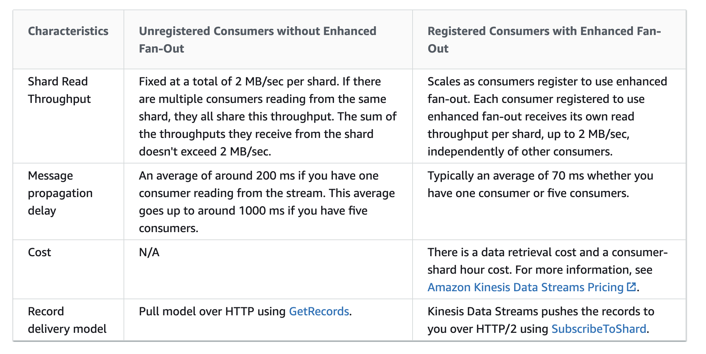
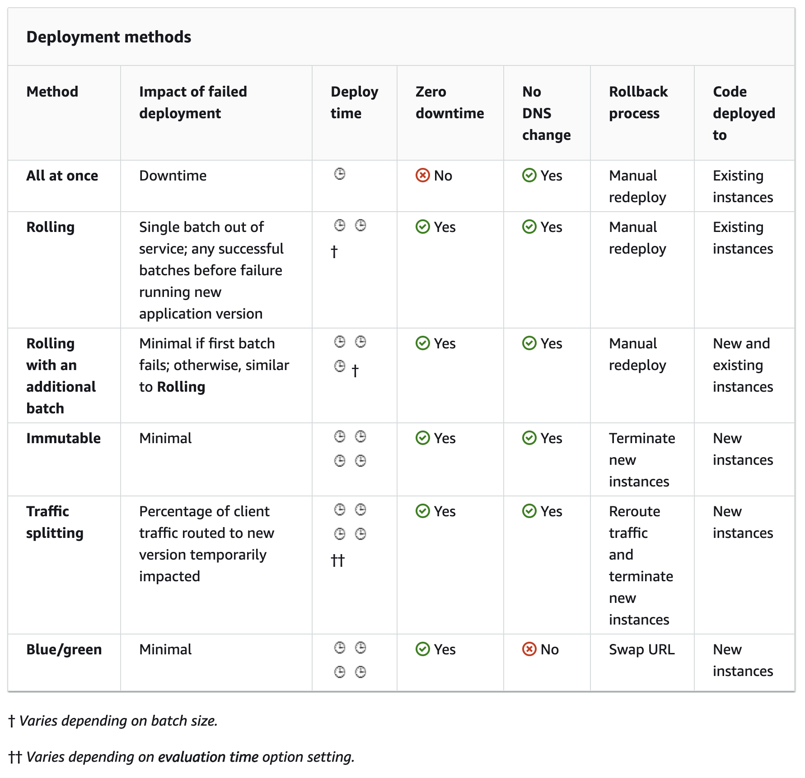

# Developer Associate

Training course notes

# Whitepapers
[AWS Security Best Practices](https://d0.awsstatic.com/whitepapers/Security/AWS_Security_Best_Practices.pdf)
| [Linux Academy Notes](https://www.lucidchart.com/documents/view/dfdee40b-893c-4d68-80ff-a980b62592d1/0)  
[AWS Well-Architected Framework](https://d0.awsstatic.com/whitepapers/architecture/AWS_Well-Architected_Framework.pdf) | [Linux Academy Notes](https://app.lucidchart.com/documents/view/81457ecf-406a-41a6-af1f-c72dc82b8c01/0_0)  
[Practicing Continuous Integration and Continuous Delivery on AWS Accelerating Software Delivery with DevOps](https://d1.awsstatic.com/whitepapers/DevOps/practicing-continuous-integration-continuous-delivery-on-AWS.pdf) | [Linux Academy Notes](https://www.lucidchart.com/documents/view/b8a9e318-d525-469d-8016-793fb41da2f2/0)  
[Microservices on AWS](https://d1.awsstatic.com/whitepapers/microservices-on-aws.pdf) | [Linux Academy Notes](https://app.lucidchart.com/documents/view/f51c65c7-fda0-400c-b20f-cc920e55d0a8/0)  
[Serverless Architectures with AWS Lambda](https://d1.awsstatic.com/whitepapers/serverless-architectures-with-aws-lambda.pdf) | [Linux Academy Notes](https://app.lucidchart.com/documents/view/69c1b85c-a4dd-4828-be58-3ef5a15efce8/0)  
[Optimizing Enterprise Economics with Serverless Architectures](https://d1.awsstatic.com/whitepapers/optimizing-enterprise-economics-serverless-architectures.pdf) | [Linux Academy Notes](https://www.lucidchart.com/documents/view/f012ef3f-deaf-4442-8008-a796d80db3fe/0)  
[Running Containerized Microservices on AWS](https://d1.awsstatic.com/whitepapers/DevOps/running-containerized-microservices-on-aws.pdf) | [Linux Academy Notes](https://www.lucidchart.com/documents/view/392c5e21-5047-41fe-8f46-f610c844c4ce/0)  
[Blue/Green Deployments on AWS](https://d1.awsstatic.com/whitepapers/AWS_Blue_Green_Deployments.pdf) | [Linux Academy Notes](https://www.lucidchart.com/documents/view/e7f49c8f-34d7-4b31-9313-1485e84b0510)  

---

# EC2
https://docs.aws.amazon.com/AWSEC2/latest/UserGuide/ebs-creating-snapshot.html#ebs-create-snapshot-multi-volume
https://docs.aws.amazon.com/AWSEC2/latest/UserGuide/dedicated-hosts-recovery.html
https://docs.aws.amazon.com/AWSEC2/latest/UserGuide/capacity-reservation-sharing.html
https://docs.aws.amazon.com/AWSEC2/latest/UserGuide/ri-market-concepts-buying.html#ri-queued-purchase
https://docs.aws.amazon.com/AWSEC2/latest/UserGuide/dh-sharing.html
https://aws.amazon.com/blogs/aws/new-trigger-a-kernel-panic-to-diagnose-unresponsive-ec2-instances/
https://aws.amazon.com/blogs/aws/automate-os-image-build-pipelines-with-ec2-image-builder/
https://aws.amazon.com/blogs/aws/new-amazon-ebs-fast-snapshot-restore-fsr/
https://docs.aws.amazon.com/AWSEC2/latest/UserGuide/ec2-instance-connect-set-up.html

- You can create multi-volume snapshots for ALL EBS volumes attached to an
  EC2 instance (select resource type as Instance in create snapshot dialog),
  up to 40 volumes per instance
- Capacity reservation can be shared with other AWS accounts or within AWS Org
- Automate AMI build pipelines with EC Image Builder
- Fast Snapshot Restore (FSR): can be enabled for new and existing snapshots per AZ

Instance-store backup

AWS compute solutions:
https://aws.amazon.com/products/compute/
Main:
- EC2
- ECS
- Lambda
- Elastic Beanstalk

---
# IAM

IAM Policy **required** fields:
- Effect (Deny, Allow)
- Action or NotAction
- Resource or NotResource

- Credential Report: lists the users and usage of their access keys
- Access Analyzer: monitor access to resources
  (you define zone of trust -> analyser finds access outside ZoT to your resources)
- Organisation activity: service access report for OU or account

Inline Policies vs Managed Policies vs Custom Policies

- Managed Policies: provided by AWS, cannot be changed, common use cases based on job functions
- Custom Policies: you create and manage, recommended to create on basis of Managed Policy
- Inline Policies: _embedded_ within the user, group, or role

Policy simulator:
  1. Get the context keys first
  2. `aws iam simulate-custom-policy-command`

---
# STS
STS API Call returns: Security Token, Access Key ID, Secret Access Key
STS API calls:
- AssumeRole
  -> You can pass a *session policy* parameter to limit the total permissions granted
     by the assumed IAM Role
- AssumeRoleWithWebIdentity
  -> returns temp security credentials for users authenticated using Web identity provider
  -> workflow:    1) signin in web identity provider, get JWT token,
                  2) call AssumeRoleWithWebIdentity, get temp credentials
                    Response: AssumedRoleUser ARN + Set of Temp credentials
                  3) access AWS resources with STS Token

- AssumeRoleWithSAML
- GetFederationToken
- GetSessionToken

When to use STS
- Identity Federation
- Roles for cross-account access
- Roles for EC2

IAM API Keys
- In order for API credentials to work, they must be associated with a USER
- Roles do not have API credentials!!!

---
# KMS
https://docs.aws.amazon.com/kms/latest/developerguide/symm-asymm-concepts.html#symmetric-cmks
https://docs.aws.amazon.com/kms/latest/developerguide/concepts.html#enveloping
https://aws.amazon.com/blogs/security/aws-encryption-sdk-how-to-decide-if-data-key-caching-is-right-for-your-application/

CMK:
- used to encrypt/decrypt up to 4KB of data
- is the primary resource in KMS
- used to generate, encrypt and decrypt the data keys (DEKs)
- components: [alias, creation data, desc, state, key material]
- is ALWAYS stays inside KMS, can be NEVER exported, never leaves KMS unencrypted

Setup CMK: Alias->Desc->Key Material (KMS, Own, CloudHSM)->Admin Permissions->Usage Permissions
Two types of CMK - **AWS-managed** (aws/) and **Customer-managed**  

KMS does not manage or store DATA KEYS
KMS cannot use DATA KEYS to encrypt data for you
You must call KMS API to use CMK
Key deletion is not performed immedeately -> you can set a deletion date

Envelop Encryption
AWS Services that integrates with KMS _do not_ support asymmetric keys
KMS symmectric CMK - 256-bit key
KMS assymmetric CMK - mathematically related public and private key pair
KMS supports RSA and ECC assymmetric CMKs

KMS API actions:
- encrypt: `aws kms encrypt`
- generate data key/envelop key (`GenerateDataKey` or `GenerateDataKeyWithoutPlaintext` API
- decrypt
- re-encrypt (without having an original key, e.g. for key rotation)
- key rotation (`enable-key-rotation`)

---
# AWS Inspector
- automated security assessment service
- network reachability
- EC2 instance security

---
# Cognito
https://docs.aws.amazon.com/cognito/latest/developerguide/cognito-sync.
https://docs.aws.amazon.com/cognito/latest/developerguide/cognito-events.html
https://docs.aws.amazon.com/cognito/latest/developerguide/role-based-access-control.html

- sign in directly
- web federation
- Components - **User pool** - user directory in Cognito
- Components - **Identity pool** - user can obtain temporary AWS credentials
- push notifications to sync a dataset
- Cognito Events:
  > allows to execute AWS Lambda function in response to important events in Cognito
  > Cognito raises the **Sync Trigger** event when identity pool dataset is synced.
  > You can use the Sync Trigger to take action when a user updates  

  - Lambda function must respond in 5s
- Cognito Streams:
  - Cognito can push each dataset change to a Kinesis stream (new or existing)
  - You need to select IAM role that grants Cognito permission to put events in the selected stream

- Cognito Role-Based Access Control
  - permissions for each user are controlled through IAM roles that you create
  - you can define rules to choose the role for each user based on claims in the user's ID token
  - you can define a default role for authenticated users
  - you can define a separate IAM role for guest users (not authenticated)
  - Rules are evaluated in order, and the IAM role for the first matching rule is used, unless `CustomRoleArn` is specified to override the order

---
# API Gateway
https://aws.amazon.com/about-aws/whats-new/2017/11/amazon-api-gateway-supports-canary-release-deployments/
https://docs.aws.amazon.com/apigateway/latest/developerguide/canary-release.html
https://docs.aws.amazon.com/apigateway/latest/developerguide/how-to-cors.html
https://docs.aws.amazon.com/apigateway/latest/developerguide/api-gateway-caching.html
https://docs.aws.amazon.com/apigateway/latest/developerguide/api-gateway-request-throttling.html
https://aws.amazon.com/blogs/aws/new-usage-plans-for-amazon-api-gateway/
https://docs.aws.amazon.com/apigateway/latest/developerguide/stage-variables.html

- Resource URL
- Stage is added to default API endpoint
- Respond to request: Lambda, HTTP Endpoints, other AWS services
- Deployments -> snapshot of API's resources and methods
- Stages -> dev, prod, beta.
  Specific settings: caching, request throttling, logging, stage variables
- Caching -> set capacity, encryption, TTL, per-key invalidation
- Dashboard -> API calls, Latency, Integraiton Latency, 4xx and 5xx Errors
- Can import API from Swagger 2.0
- Throttling -> by default limits the steady-state request rate to 10000 rps
    Max 5000 concurrent requests accross all APIs within AWS account
    429 Too Many Requests error
- Can configure SOAP Webservice Passthrough (doesn't convert XML!)
- Canary releases - create/promote canary
- Stage variables:
  - name-value pairs you can define as configuration attributes associated with a deployment stage
  - use as environment variables in API setup and mapping templates (`${stageVariables.Name}`)
- To support CORS, API resource needs to implement an OPTIONS method that can respond to the OPTIONS request with following header:
  `Access-Control-Allow-Headers`
  `Access-Control-Allow-Origin`
  `Access-Control-Allow-Methods`

---
# CORS
https://docs.aws.amazon.com/apigateway/latest/developerguide/how-to-cors.html

Cross-origin HTTP request:
- A different _domain_
- A different _subdomain_
- A different _port_
- A different _protocol_

For simiple CORS POST method requests, the response from your resource needs to include the header `Access-Control-Allow-Origin` set to `'*'` or set of origins allowed to access that resource

For non-simple requests you need to enable CORS support:
> When a browser receives a non-simple HTTP request, the CORS protocol requires the browser to send a preflight request to the server and wait for approval (or a request for credentials) from the server before sending the actual request. The preflight request appears to your API as an HTTP request that:
> - Includes an `Origin` header.
> - Uses the `OPTIONS` method.
> - Includes the following headers:
>   - `Access-Control-Request-Method`
>   - `Access-Control-Request-Headers`

> To support CORS, therefore, a REST API resource needs to implement an `OPTIONS` method that can respond to the `OPTIONS` preflight request with at least the following response headers mandated by the Fetch standard:
> - `Access-Control-Allow-Methods`
> - `Access-Control-Allow-Headers`
> - `Access-Control-Allow-Origin`

> How you enable CORS support depends on your API's integration type.

CORS support for mock integrations:
- create `OPTIONS` method to return the required response headers
- each of CORS-enabled methods must return `Access-Control-Allow-Origin` header in at least its 200 response

CORS support for Lambda or HTTP non-proxy integrations and AWS service integrations:
- setup required headers by using API Gateway method response and integration response settings
- API Gateway creates `OPTION` method and add `Access-Control-Allow-Origin` header to your existing methods integration responses (sometimes you need to manually add headers)

CORS support for Lambda or HTTP proxy integrations:
- you can setup `OPTIONS` response headers in API Gateway
- your backend is responsible for returning `Access-Control-Allow-Origin` and `Access-Control-Allow-Headers` headers, because proxy integration doesn't return and integration response

---
# Lambda
https://docs.aws.amazon.com/lambda/latest/dg/configuration-database.html?icmpid=docs_lambda_help
https://docs.aws.amazon.com/lambda/latest/dg/lambda-environment-variables.html
https://docs.aws.amazon.com/lambda/latest/dg/configuration-concurrency.html
https://docs.aws.amazon.com/serverless-application-model/latest/developerguide/automating-updates-to-serverless-apps.html
https://docs.aws.amazon.com/lambda/latest/dg/with-kinesis.html
https://docs.aws.amazon.com/lambda/latest/dg/monitoring-metrics.html
https://aws.amazon.com/premiumsupport/knowledge-center/lambda-iterator-age/
https://aws.amazon.com/premiumsupport/knowledge-center/lambda-iterator-age/
https://aws.amazon.com/lambda/faqs
https://docs.aws.amazon.com/lambda/latest/dg/API_PublishVersion.html
https://docs.aws.amazon.com/lambda/latest/dg/services-rds-tutorial.html
https://docs.aws.amazon.com/lambda/latest/dg/configuration-aliases.html

- max timeout 15m
- priced per # of requests and duration
- can be used cross-region
- Version Control:
  Each Lambda version has a unique ARN
  After publishing, the version is immutable (you can edit only $LATEST)
  $LATEST - maintains the latest code, the only you can edit
    Qualified ARN - function ARN + version suffix
    Unqualified ARN - only function ARN, use $LATEST
  Aliases: use to point specific ARN (application use alias incl. $LATEST)
    aliases have static ARN but can point to any version of the same function
    you can use weighted alias to shift traffic between versions
    rollback as easy as updating the version in the alias
- Invocation can be synchronous/asynchronous
- Function configuration:
    Basic settings: Runtime, Handler (filename.functionname), Memory, Timeout
    Monitoring (CloudWatch, X-Ray)
    Permissions
    Enviroment Variables (by default encrypted at rest using KMS, can be encrypted in transit)
    VPC - function can access VPC resources in specifed VPC
    File System - connect to EFS
    Asynchrounous invocation settings + DQL - SQS or SNS
    Concurrency, _provisioned concurrency_ (e.g. for weighted alias)
    Database proxies (manages pool of connections)
- Lambda API Actions:
    AddPermission: add permission to the resource policy to invoke Lambda
    CreateFunction:
    Invoke: synchronous
    InvokeAsync
    CreateEventSourceMapping: identifies a stream as an event source for Lambda
      can be DynamoDB stream or Kinesis
- Lambda metrics:
    Invocation, Performace, Concurrency

---
# SAM Templates
- `sam init`, `sam build`, `sam deploy`  
- place the function code at the root level of the working directory with YAML file
- use cloudformation package command to package the deployment

---
# SWF
- Workflow coordinates and manages the execution of **activities** that can be run asyn across multiple devices
- Consistent execution
- No duplication of tasks
- Guarantees delivery order of messages/tasks
- Primarily an API which an application can integrate its workflow into
- Execution can last up to 1y
- Components:
  - Workflows (Decider)
  - Activities (single step in workflow)
  - Tasks: what interacts with the workers that are part of a workflow

---
# Step Functions
- Components: Tasks, State Machines (defined using **JSON** Amazon States Language)
- Activity can be:
  - Program code interacting with Step Function API actions
  - Lambda function
- State Types:
  - Task: do some work
  - Choice:
  - Fail/Succeed
  - Pass: Pass inputs to outputs, do some transformation
  - Wait
  - Parallel
- Transitions
- API Actions:
  - `CreateStateMachine`  
  - `StartExecution`  
  - `ListExecution` - list executions is eventually consistent (use `nextToken`)  
  - `StopExecution`  

---
# Kinesis
https://docs.aws.amazon.com/streams/latest/dev/key-concepts.html
https://docs.aws.amazon.com/firehose/latest/dev/encryption.html
https://docs.aws.amazon.com/streams/latest/dev/building-consumers.html

- Data record: sequence number, partition key, data blob (up to **1MB**)
- Retention period 24h-168h (`IncreaseStreamRetentionPeriod` and `DecreaseStreamRetentionPeriod`)
- Supports ordering of the messages in an individual shard (`PutRecord` with `sequenceNumberForOrdering` parameter) - strictly increasing sequence number for puts from the same client and same partition key
- Consumers (Kinesis Data Stream Application):
  - _shared fan-out consumers_: fixed total 2MB/s per shard **shared** between all consumers. 200ms message propagation delay if there is one consumer reading from the stream. 1000ms delay with 5 consumers
  Pull mode over HTTP using `GetRecords`  

  - _enhanced fan-out consumers_: 2 MB/s per consumer per shard. 70ms propagation delay
  Push mode over HTTP/2 using `SubscribeToShard`  

  

- **sShard**: sequence of data records in a stream
  - up to 5tps for reads, up to 2MB/s - for each shard
  - up to 1000 record/s for writes, up to 1MB/s - for each shard

- Data Encryption in Kinesis Firehose:
  Depends on the source of data:
    - Kinesis Data Stream as data source: Firehose reads encrypted data from the stream, buffers the data in memory and delivers to the destination without storing unencrypted data at rest
    - If you send data to Firehose using `PutRecord` or `PutRecordBatch` - turn on SSE by using `StartDeliveryStreamEncryption`

---
# DynamoDB
https://docs.aws.amazon.com/amazondynamodb/latest/developerguide/Limits.html#limits-api
https://docs.aws.amazon.com/amazondynamodb/latest/developerguide/specifying-conditions.html
https://docs.aws.amazon.com/amazondynamodb/latest/developerguide/howitworks-ttl.html
https://docs.aws.amazon.com/amazondynamodb/latest/APIReference/API_BatchGetItem.html
https://docs.aws.amazon.com/kms/latest/developerguide/services-dynamodb.html

- max item size is **400KB**, but S3 can be used to save items and object identifier is saved in DDB table
- **1 WCU**: 1 write of 1 item of 1KB or less (round up to nearest KB)
- Writes are applied in the order received
- There are "conditional writes" - only succeed if the attributes meet some conditions
- **1 RCU**: 1 read of 1 item of 4KB or less (strongly consistent) or 2 reads 4KB per sec for eventually consistent
- Eventual consistent read - 0.5 RCU
- IAM condition parameter: fine-graned access per-item or per-attribute
    `dynamodb:LeadingKeys` - allow users to access only the items where partition key = user_id
    `dynamodb:Attributes` - limits access to the specified attributes
    `dynamodb:Select`  
    `dynamodb:ReturnValues`  
    `dynamodb:ReturnConsumedCapacity`  

Read operations:
    `GetItem`, `BatchGetItem` (up to 100 items and max 16MB),
    Use `ProjectionExpression` to return only selected attributes
    Query - max 1MB per call,
        results are always sorted by Sort Key. Reverse by setting `ScanIndexForward`
    Scan - max 1MB per, can scan only one partition at a time
        can configure parallel scans by logically dividing a table or index
- No strongly consistent reads on GSI
- Can delete GSI any time, cannot delete LSI

- For query: specify the search criteria:
  - partition key name and value in _quality condition_

TTL
  - Any attribute of your choice
  - In epoch time format

DynamoDB Transactions:
  - ACID
  - across multiple tables

Atomic Counters:
  - writes applied in the order received - can be used to increment existing value
Conditional writes
  - only succeed if condition is met (`ConditionalCheckFailedException` if not met
CommonErrors:
  - ThrottlingError
  - ProvisionedThroughputExceededException (number of requests is too high)
  - ResourceNotFoundException (e.g. table does not exist/in CREATING)

Specify `ReturnConsumedCapacity=TOTAL` in Query request to obtain how much of capacity is being used
DAX
  - write-through
  - Eventually consistent only!!!
  - **For strongly consistent reads DAX pass all requests to DDB & does not cache for these requests**  

Throttling Issues and Fixes:
  Hot partitions
  Capacity limitations
  Fixes:
    - slowly increase provisioned capacity
    - review capacity on GSI (throttle on index double-counted)
    - implement error retries and exponential backoff (built-in in AWS SDK)
    - distribute operations evently across partitions
    - implement caching solution (ElastiCache or DAX)
    - use TTL on items in the table
  Partitions:
    - Can accomodate only 3000 RCU or 1000 WCU
    - Max 10GB of data
    - never deleted
DDB Streams
  - Time-ordered change log for the table, stored for 24 hours
  - Encrypted by default
  - Can trigger Lambda

Encryption at rest (only AWS owned CMK or AWS managed CMK)
  > DDB uses the CMK to generate and encrypt a DEK (known as __Table Key__). **AWS Owned** (free for charge)
  > or **AWS Managed CMK** (charge) can be used. Customer managed CMK's are not supported.

---
# CloudWatch
- By default EC2 monitoring is 5m, detailed - 1m
- By default store indefinitely (can change the retention period)
- Host-level metrics: CPU, Network, Disk, StatusCheck
- Min granularity for custom metric - 1m
- Alarm can trigger: SNS, Auto scaling action, EC2 action (stop, terminate, reboot)
- Rule can trigger: SNS, SQS, EC2, Lambda
- Metric resolution:
  - Default: 5m
  - Detailed: 1m
  - High-resolution: 10 or 30s

---
# VPC
https://docs.aws.amazon.com/vpc/latest/userguide/vpc-network-acls.html#nacl-ephemeral-ports
https://docs.aws.amazon.com/elasticbeanstalk/latest/dg/vpc-vpce.html
https://docs.amazonaws.cn/en_us/elasticbeanstalk/latest/dg/vpc-rds.html

- VPC endpoints - from CSAA course

---
# ELB
https://aws.amazon.com/blogs/aws/new-tls-termination-for-network-load-balancers/
https://docs.aws.amazon.com/elasticloadbalancing/latest/application/create-https-listener.html

- X-Forwarded-For header to have the client IP on the backend server (via ELB)
- NLB: Layer 4 (Transport), TCP, UDP, TLS, supports STATIC IP, can be assigned Elastic IP per subnet
- ALB: Layer 7 (Application), HTTP/S
- Dynamic Ports (ALB and NLB):
  Single EC2 instance can run multiple containers
  Each of container assigned a random port
  ELB+Target Groups can handle that

- Maintain Sessionstate with ELBs:
  - Option 1: ELB generated cookie stickiness
  - Option 2: Application generated cookie stickiness
  - Option 3: Non-ELB (not recommended):
              using caching services like ElastiCache to store session state

---
# S3
https://docs.aws.amazon.com/AmazonS3/latest/dev/object-lock.html
https://docs.aws.amazon.com/AmazonS3/latest/dev/storage-inventory.html
https://docs.aws.amazon.com/AmazonS3/latest/dev/using-access-points.html
https://docs.aws.amazon.com/AmazonS3/latest/dev/storage-inventory.html
https://docs.aws.amazon.com/AmazonS3/latest/dev/troubleshooting.html

- S3 permissions:
  A) S3 IAM Policies: attached to Users, Groups, Roles
    Not attached to S3 buckets or objects
    Cannot grant access to anonymous users
    JSON
  B) Resource Based:
  - Bucket policies: attached to S3 bucket (not the objects/user/role)
    Can grant access to anonymous users
    Can restrict access based on IP address
    Applied to all bucket-owner objects
    Written in JSON
  - ACLs: can be used with buckets and objects
    Cannot deny permissions or grant additional permissions
    Manage access to the objects not owned by the bucket owner
    Manage permissions at the object level
    Allow external accounts to manage policies on objects
    Written in XML
- S3 Encryption
  - In-Transit Encryption (client-side):
    **Using a Client-side Master Key**:  
      CSMK provided by a client, never sent to AWS (only to client-side S3 encryption client)
      S3 client encrypts the data using the DEK (randomly generated by S3 client)
      Material description uploaded as part of the metadata (x-amz-meta-x-amz-key)
    **Using a AWS KMS CMK**:  
      On upload, KMS returns a DEK (plaintext and ciphertext to keep with the data)
      Ciphertext uploaded as metadata
  - At-rest encryption (server-side)
      **SSE-S3**: uses S3-managed key
        add x-amz-server-side-encryption request header to upload request
        bucket policies can require all objects to use SSE by requiring that header
        `x-amz-server-side-encryption: AES256`  
      **SSE-KMS**: uses KMS-managed keys
        allows to separate roles
        better auditing of access to data
        `x-amz-server-side-encryption: ams:kms`  
      **SSE-C**: customer manages the keys  
- S3 Versioning:
  Versions are full versions of new objects - NOT incremental
- S3 Events:
  can trigger: SNS, SQS and Lambda as destination

- Object locks (WORM):
  "Retention period" or "legal hold" (same as ret. period, but w/o expire)
  "Governance" or "compliance" mode
  only for versioned buckets (versioning enabled automatically)
  can be enabled only for new buckets
  cannot disable object lock or suspend versioning after object lock enabled
  apply to an individual version of an object in a versioned bucket

---
# CloudFront
- caching based off the object name
- in order to serve a new version of the object, create a new obj with new name
- you can set TTL

---
# ECS
https://docs.aws.amazon.com/AmazonECS/latest/developerguide/ECS_instances.html

- Use cases:
  Microservices and docker applications
  Batch and ETL Jobs
  CI/CD
- Container Registry - ECR (AWS) or 3rd party
- Fargate - "serverless", manages EC2 instances
- For EC2 container instances (ECS instance) - must be running ECS container agent

Container Def->Task Def->Service->Cluster (Fargate)

-> Task Definition: JSON, blueprint for application:
    Task Role and Task Execution IAM Role
    Network Mode
    Task Memory/CPU
    Volumes
    Containers ->
        -> Container Definition
            Name, image link (repository link)
            Port mappings
            Volume mappings
            Memory/CPU
            Healthcheck
            Environment
-> Task - instance of Task Definition
-> ECS Agent: run on each EC2 node in ECS cluster, reports on running task & resource utilisation
      start/stop
-> Service:
    Launch type (EC2, Fargate)
    # of tasks (desired) ELB (optional)
    Deployment type (rolling update or Blue/Green development)
    Placement type (AZ balanced spread, AZ balanced binpack, BinPack, One task per host, custom)
    Network (VPC), Subnets, Security Groups, PublicIP
    Auto Scaling (min-desired-max)
    Auto Scaling Policy: Target tracking or Step scaling
-> Cluster:
    Templates: Networking only, EC2 Linux + Networking, EC2 Windows + Networking

-> Dockers:
    EC2 Cluster-*EC2 instances-*Task-*Container

-> IAM Roles for ECS Tasks

---
# Elastic Beanstalk
https://docs.aws.amazon.com/elasticbeanstalk/latest/dg/environment-configuration-methods-before.html
https://docs.aws.amazon.com/elasticbeanstalk/latest/dg/using-features.CNAMESwap.html
https://docs.aws.amazon.com/elasticbeanstalk/latest/dg/using-features.managing.as.html
https://docs.aws.amazon.com/elasticbeanstalk/latest/dg/using-features.managing.db.html

Manages everything required for less complex application
Platform as a Service
Automated provisioning, auto scaling, load balancing, software updates

Application - logical container
Environments inside application (environments are transitory). Environment has only one version running
Application versions are deployed  to environments
Two types of Beanstalk environments:
  - _Web server environment_: serve web applications on the Internet
  - _Worker environment_: use in background SQS processing for decoupling applications
Environments are deployed via CloudFormation stack (behind the scenes)

[Deployment options](https://blog.shikisoft.com/which_elastic_beanstalk_deployment_should_you_use/):   
  **All at once**  
  starts deployment on all instances. Downtimes are possible. Suitable for dev or test environments

  **Rolling**  
  deploy one by one. If deployment fails, only failed instance will be effected

  **Rolling with additional batch**  
  launch new instances (batch) and first deploy on them - maintains full capacity during deployments

  **Immutable**  
  launch a completely new set of instances, deploy the new version and terminate old instances.
  The new set is launched in a separate temporary ASG first and then transferred to the original ASG and terminates the temporary ASG

  **Traffic-splitting**  
  canary testing as part of application deployment. Full set of new instances (like immutable deployment). Forward a specified percentage of client traffic to the new version.

  **Blue/Green**  (not on Elastic Beanstalk deployment type list)  
  replicates the current environment (including ELB and ASG) and redirect the traffic to the new environment
  1. Clone current environment (or launch a new environment)
  2. Deploy the new application version to the new environment
  3. Test
  4. In **Environment actions** choose **Swap environmetn URLs**  
  Elastic Beanstalk swaps the CNAME records

  

Elastic Beanstalk Supports two methods of saving configuration option settings:
  - config files in YAML or JSON in `.ebextensions` folder
  - saved configurations created from a running environment or JSON option file

Includes Auto Scaling Group to manage EC2 instances. You can modifiy the **launch configuration** to change the instance type, key pair, EBS, and other settings.
You can include a YAML [environment manifest](https://docs.aws.amazon.com/elasticbeanstalk/latest/dg/environment-cfg-manifest.html) in the root of the application source bundle to configure the environment name, solution stack and [environment links](https://docs.aws.amazon.com/elasticbeanstalk/latest/dg/environment-cfg-links.html) to use.

---
# OpsWorks
Infrastructure management platform based on _Chef_ or _Puppet_ configuration management platform

---
# SNS
https://docs.aws.amazon.com/sns/latest/api/CommonErrors.html
https://docs.aws.amazon.com/sns/latest/dg/mobile-push-send-register.html

- Public service - needs NAT or IGW or VPC endpoint
- Fully resilient within a region
- Messages up to **256KB**

- Topics: name max 256 characters, alphanumeric + "-" and "_
    - Encryption (optional), AWS KMS
    - Access Policy (default access for topic owner)
    - Delivery retry policy (to HTTP/S endpoints)
    - Delivery status logging (successful/failed deliveries) for Lambda, SQS, HTTP/S, APP

- Subscriptions:  
    Endpoints:  
      `HTTP/S`  
      `Email, Email JSON`  
      `SQS (Fun-out)`  
      `Lambda`  
      `Platform application endpoint (mobile application)`  
      `SMS`  
    Filters
    DLQ settings
- SNS Message attributes:
    `Name, Value, Type (String, String array, number, binary)`

- Access to SNS resources:
  SNS access control policies:
    - Grant access to SNS topic to another AWS service or account
      API: `AddPermission`
    - Grant right to some AWS services to publish to SNS topic (many services will use IAM Role instead)
    - Can use IAM Policies and Access Control Policies at the same time

- Message Data:
    - Message Body:
        Message, MessageID, Signature, SigningCertURL, Subject, Timestamp, TopicARN, Type, UnsubscribeURL
    - Message Attributes:
        Name, Type, Value (useful for SQS and mobile push)

- Mobile Push with SNS:
    - MPNS Process
    Create a platform application->Add endpoints->Publish messages
    - Can publish additionally a notification to SNS topics (endpoint created, deleted, updated, failure)

- SNS API and Errors:
  - `CreateTopic`: Name  
  - `Publish`: Send message: Message  
  - `Subscribe`  
  - `Unsubscribe`  

---
# SQS
[FAQs](https://aws.amazon.com/sqs/faqs/)
https://docs.aws.amazon.com/AWSSimpleQueueService/latest/SQSDeveloperGuide/FIFO-queues.html
https://docs.aws.amazon.com/AWSSimpleQueueService/latest/SQSDeveloperGuide/sqs-delay-queues.html
https://aws.amazon.com/blogs/compute/new-for-aws-lambda-sqs-fifo-as-an-event-source/
https://docs.aws.amazon.com/lambda/latest/dg/with-sqs.html
https://docs.aws.amazon.com/AWSSimpleQueueService/latest/SQSDeveloperGuide/sqs-visibility-timeout.html
https://aws.amazon.com/getting-started/hands-on/send-fanout-event-notifications/

- HA
- can be PCI compliant and encrypt messages using KMS
- Polling types:  
    - short polling (0s receive message wait time), queries only subset of the SQS servers
    - long polling (1-20s receive message wait time)

- Queue types (has to be selected BEFORE creating queue):  
    - **Standard** (nearly unlimited throughput, at least once semantic)  
    - 120K in-flight messages (received from a queue by a consumer, but not yet deleted)
    - Multiple producers and multiple consumers

    - **FIFO** (exactly once, soft limits 3000 mps with batching or 300 without by default)
    - Multiple producers, but multiple consumers only through Group IDs
    - 20K in-flight messages
    - The name of FIFO queue must end with `.fifo`  
    - Supports message groups - allow multiple ordered message groups within a queue

- Message up to **256KB** (but can link S3 with [Amazon SQS Extended Client Library for Java](https://github.com/awslabs/amazon-sqs-java-extended-client-lib))
- Up to 10 metadata attributes (outside of message body)
- Message Components:
    - Body
    - ReceiptHandle - allows to delete message after processing
    - Metadata attributes (up to 10)
    - VisibilityTimeout
    - DelaySeconds

- Can have attached resource policy (access policy)

- Queue configuration:
    - Visibility timeout (0s-12h): Use `ChangeMessageVisibility`  
    - **Delay Queue**: Delivery delay (0s-15m): delay each message coming to the queue  
    - Receive message wait time (0-20s): max time polling will wait for messages  
    - Message retention period (1m-14d)  
    - Max message size (1-256KB)  
    - Access policy -> defines who can send and who can receive  
    - DLQ: should be the same type as the main queue  
- Use URL to access
- `ApproximateNumberOfMessages` -> metric for ASG

- Managing Access to SQS
  - same as with SNS

- AWS Lambda uses long polling for standard queues and message group ID for FIFO queues

---
# Repos, Deployment, Builds, and CI/CD
https://docs.aws.amazon.com/elasticbeanstalk/latest/dg/environmentmgmt-updates-immutable.html
https://docs.aws.amazon.com/elasticbeanstalk/latest/dg/using-features.deploy-existing-version.html
https://docs.aws.amazon.com/codepipeline/latest/userguide/pipelines-create-cross-account.html

Developers->CodeCommit->CodeBuild->Test->CodeDeploy->Environment
Deployment Methods:
> All at Once (can be used with CodeDeploy, cannot be used with Lambda)  
> Rolling/Canary (API Gateway and Elastic Beanstalk using that)  
> Immutable and Blue/Green (DNS update is required, can be used with CodeDeploy)  

## X-Ray
https://docs.aws.amazon.com/xray/latest/devguide/xray-api-sampling.html

- Integrates with ELB, Lambda, API GTW, EC2, Beanstalk
- Need to have X-Ray daemon running on EC2 instance (and role attached to EC2 instance to upload data onto X-Ray)
- For Lambda you should attach `AWSXrayWriteOnlyAccess` policy to the Lambda execution role
- Error - Client errors `400-series errors`  
- Fault - Server faults `500-series errors`  
- Throttle - Throttling errors `419 Too Many Requests`  
- Allow to search through request information using:
  - Annotations
  - Trace IDs
  - URL Paths (partial or complete)
- Trace IDs are added as custom HTTP headers
- X-Ray applies a sampling algorithm by default
  - 1 request/s & 5% of any additional request per host
  - Sampling rules:
  `ReservoirRate + FixedRate*(TotalRequests-ReservoirRate)`   

- You can implement your own sampling frequences for data collecton

Running the X-Ray daemon on ECS:
  - create a Docker image that runs X-Ray daemon, upload to Docker repo (there is the official Docker image):
  `docker pull amazon/aws-xray-daemon`  
  - deploy to ECS cluster
  - assign a role to the docker container in ECS with policy allowing writing to X-Ray

## CodeCommit
- Integrated with other AWS Services
- Uses git workflows

## CodeBuild
- Compile, run unit tests, produce deployment artifacts (stored in S3)
- Can use Managed Image or Custom Docker Image
- Build Project: defines build, sources:
  - S3, CodeCommit, GitHub, Bitbucket, GitHub Enterprise
- Build Environment: OS, runtime, tools
- Build Spec: YAML file
- AWS CLI: run the build:
  `aws codebuilt start-build --project-name`, with `buildspecOverride` can specify a new inline or buildspec file  

## CodeDeploy
- Automated deployments to EC2, Lambda, on-prem
- Uses YAML or JSON aplication specification file **AppSpec** for ECS, Lambda or EC2 compute platforms
- Blue/Green Deployment: automatically creates blue/green environment
- Blue/Green with Lambda:
  - _Canary_: % of traffic shifted to the new version. Wait for specified time and shift the rest
  - _Linear_: Traffic is shifted in equal increments with equal periods
  - _All at once_: Traffic is immediately shifted
- Lifecycle event hooks:
  - BeforeInstall, AfterInstall, ApplicationStart, ApplicationStop, ValidateService
- Sequence of the event hooks:
  `ApplicationStop`->(DownloadBundle)->`BeforeInstall`->(install)->`AfterInstall`->`ApplicationStart`->`ValidateService`

## CodePipeline
- Automate release process
- Stages, Actions, Transitions
- Stages contain at least one action
- Actions have a deployment artifact as input/output or both
- Tooling integration for: S3, CodeCommit, GitHub, CodeBuild, Jenkins, TeamCity, Code
- Can add workflows (e.g. approvals via SNS)
- Enable cross-account access (e.g. pipeline in one account, resources in another):
  - Create CMK in KMS
  - Add a cross-account role

## CodeStar
- Project templates for various projects and programming languages
- IDEs integration
- Visualisation (Application activity, JIRA)

## Blue/Green Development
- Almost zero-downtime and rollback capabilities
- Blue: current application
- Green: new version
- Provides isolation between blue and green environments
- AWS Services to help automate deployments:
  > Route53, ELB, Auto Scaling, Elastic Beanstalk, OpsWorks, CloudFormation, CloudWatch  

---
# CloudFormation
https://docs.aws.amazon.com/AWSCloudFormation/latest/UserGuide/intrinsic-function-reference.html
https://docs.aws.amazon.com/AWSCloudFormation/latest/UserGuide/parameters-section-structure.html

- Template JSON or YAML
- Only `Resources` section is required
- Max 60 parameters
- **CloudFormer**: create CloudFormation template from existing resources
- Resources:
  - Format `AWS::aws-product-name::data-type-name`
  - Properties dependend on resource
  - Policies:
    - _CreationPolicy_
    - _DeletionPolicy_
    - _DependsOn_
    - _Metadata_
    - _UpdatePolicy_
- Parameter data types:
  - String
  - Number
  - List: array of integers or floats separated by commas
  - CommaDelimitedList: array of literal strings separated by commas
  - AWS-Specific Parameter Types: such as EC2 key pair names and VPC IDs
  - SSM Parameter Types: points to SSM parameter store, CloudFormation fetches automatically the parameter values  
- CloudFormation Stacks
  - Stack resources are treaded as one single unit
- You can create nested CloudFormation stacks by using `AWS::CloudFormation::Stack` resource
- CloudFormation Functions (intrinsic functions), here is some:
  - `Fn::GetAtt`
  - `Fn::GetAZs`  
  - `Fn::Join`  
  - `Ref`  
  - `Fn::ImportValue`  

---
# Systems Manager Parameter Store
- Can store parameters in hierarchies
- Keeps history of value changes
- Tiers:
  - Standard: 10K parameters, size max 4KB, no parameter policies
  - Advanced: >10K parameters, size maz 8KB, parameter policies
- Parameter policy: Expiration, Notification
- Parameter Types: `String`, `StringList`, `SecureString`  
- API Actions:
  - `PutParameter`  
  - `GetParameter`  
  - `DeleteParameter`  
