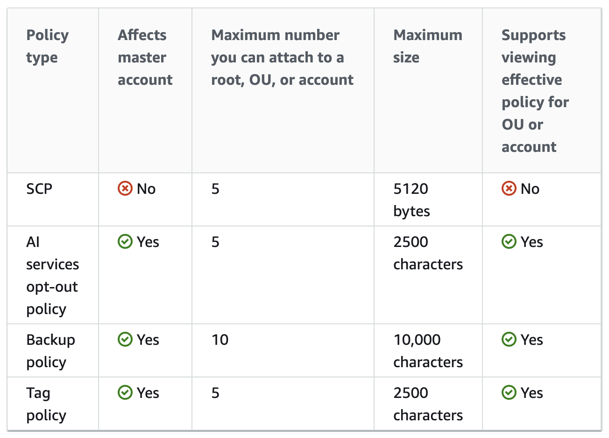
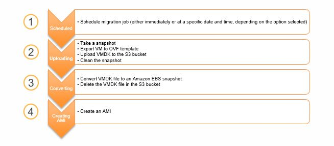

# DevOps Engineer Professional


# Sample Questions
📙https://d1.awsstatic.com/training-and-certification/docs-devops-pro/AWS-Certified-DevOps-Engineer-Professional_Sample-Questions.pdf

# Exam Guide
📙https://d1.awsstatic.com/training-and-certification/docs-devops-pro/AWS-Certified-DevOps-Engineer-Professional_Exam-Guide.pdf

# Informal Guide
https://quip-amazon.com/ykFGAVaKPb88/AWS-Certification-Prep-DevOps-Engineer-Professional-DOP-C01


Training course notes

# Whitepapers
📗https://d1.awsstatic.com/whitepapers/AWS_DevOps.pdf
📗https://d1.awsstatic.com/training-and-certification/docs-devops-pro/running-containerized-microservices-on-aws.pdf  
📗https://d1.awsstatic.com/training-and-certification/docs-devops-pro/microservices-on-aws.pdf  
📗https://d1.awsstatic.com/training-and-certification/docs-devops-pro/infrastructure-as-code.pdf  
📗https://d0.awsstatic.com/whitepapers/DevOps/practicing-continuous-integration-continuous-delivery-on-AWS.pdf  
📗https://d1.awsstatic.com/whitepapers/DevOps/import-windows-server-to-amazon-ec2.pdf  
📗https://d1.awsstatic.com/whitepapers/AWS_Blue_Green_Deployments.pdf  
📗https://d1.awsstatic.com/whitepapers/AWS_DevOps.pdf  
📗https://d1.awsstatic.com/whitepapers/aws-development-test-environments.pdf  


# LinuxAcademy Courses
📒https://linuxacademy.com/cp/modules/view/id/494  

# High Availability and Disaster Recovery

## AWS SSO
Integrates with AWS Organisations
Create/manage users and groups
Highly Available/Fault tolerant

## CloudFront
[arhitect pro CloudFront](../architect-pro/architect-pro-notes.md#CloudFront)

## AutoScaling and Lifecycle hooks

  

- Can be created on `Instance launch` or `Instance terminate` (instance state `Pending:Wait` or `Terminating:Wait`)  
- Can set the default result to `CONTINUE` or `ABANDON`
- Can set heartbeat timeout (1h default) - amount of time for the instance to remain in **wait** state (30 to 7200s)  
- Can call the `record-lifecycle-action-heartbeat` to add  more time to the timeout (max 48h)
- Can send notification metadata

- Setup CloudWatch rule (EventBridge) for notifications and define notification target
- EventBridge rule must match the lifecycle action:
```json
{
  "source": [ "aws.autoscaling" ],
  "detail-type": [ "EC2 Instance-launch Lifecycle Action" ]
}
```

ScaleOut
Pending:Wait
  Auto Scaling sends a message to the notification target defined for the hook
  Waits until you tell it to continue or the timeout ends (default 1h)
Pending:Proceed
InService

## Route53

## RDS

## Aurora

Connection Management:
- **Cluster Endpoint**: R/W, connects to the current primary DB instance for that DB cluster
- **Reader Endpoint**: RO, load-balancing for read-only connections
- **Custom Endpoint**: can include set of DB instances you choose
- **Instance Endpoint**: connects to specific instance

## DynamoDB

### DynamoDB Keys and Streams

## Jenkins on AWS
📒https://docs.aws.amazon.com/codebuild/latest/userguide/jenkins-plugin.html
📙https://aws.amazon.com/blogs/devops/setting-up-a-ci-cd-pipeline-by-integrating-jenkins-with-aws-codebuild-and-aws-codedeploy/


# Tagging
📗https://d1.awsstatic.com/whitepapers/aws-tagging-best-practices.pdf  

Cost allocation tags:
- Enabled in billing console
- AWS generates a cost allocation report based on your tags:
  - .csv file


# EFS
📒https://docs.aws.amazon.com/efs/latest/ug/performance.html  
📒https://docs.aws.amazon.com/efs/latest/ug/using-amazon-efs-utils.html  


- resides inside VPC
- Multiple AZs
- data encryption _at rest_ can be enabled when **creating** EFS
- data encryption _in transit_ can be enabled when **mount** the file system
- create mount targets in each availability zone
- NFS v4/4.1
- Storage classes (Lifecycle Management):
  - Infrequent Access
  - Standard
- can apply lifecycle policies
- throughput for parallel workloads
- for on-prem servers, use **AWS DX or VPN**  
- Linux only
- 2 Performance modes (should be selected at _creation_ time):
  - **General Purpose**: ideal for latency-sensitive use cases
  - **Max I/O**: high level of aggregate throughput, but higher latency. Use for highly parallelized apps
  - monitor `PercentIOLimit`
- 2 throughput modes (can be adjusted _after_ creation):
  - **Bursting**: scales as size grows
  - **Provisioned throughput**: independent of the amount of data
  - < 1TB - burst to 100MB/s independent of size
  - > 1TB - burst to 100MB/s per 1TB of data stored

❗EFS Mount Targets can be accessed **only on following systems**:
- Amazon EC2 instance in local VPC
- Lambda via VPC
- EC2 instance in VPC having VPC peering with other VPC
- On-prem servers having **AWS DX** or **VPN to Amazon VPC**

❗Security groups attached to mount target should allow inbound connection on NFS port

Supports POSIX permissions

Can use:
- AWS DataSync
- AWS Backup

Encrypting EFS data in transit with TLS:
  - done by enabling TLS when you mount EFS using EFS mount helper:
  `sudo mount -t efs  -o tls fs-12345678:/ /mnt/efs`  
  - encryption of data in transit is configured on a per-connection basis

## FSx
📒https://docs.aws.amazon.com/fsx/latest/WindowsGuide/using-file-shares.html  
📒https://docs.aws.amazon.com/fsx/latest/WindowsGuide/multi-az-deployments.html  
📒https://docs.aws.amazon.com/fsx/latest/WindowsGuide/group-file-systems.html  
📒https://docs.aws.amazon.com/fsx/latest/WindowsGuide/limits.html  

SMB file share for Windows
integration with AD (AD Trust must be configured)
encrypted by default

FSx for Lustre (for Lustre file system for HPC)
**Not HA**, need be deployed in two AZ

- Resilience:
VSS Backup
Microsoft DFS Replication


# EFS Monitoring
📒https://docs.aws.amazon.com/efs/latest/ug/monitoring-cloudwatch.html  

- metric sent at 1m intervals and retained for 15months

# Whiteboard Sessions (LinuxAcademy)
https://linuxacademy.com/cp/modules/view/id/494

## OpsWorks Scenarios

Ops Stack with layers
🔹Latest AMI deploy with minimal or no downtime:
  - create a parallel new stack (blue/green deployment)

🔹Variable traffic:
  - Automatic scaling:
    - Time based
    - Load-based instances (CPU utilization) for unpredictable load
  - 24/7 instances for base load

# Elastic Beanstalk
📒https://docs.aws.amazon.com/elasticbeanstalk/latest/dg/environment-configuration-methods-before.html  
📒https://docs.aws.amazon.com/elasticbeanstalk/latest/dg/using-features.CNAMESwap.html  
📒https://docs.aws.amazon.com/elasticbeanstalk/latest/dg/using-features.managing.as.html  
📒https://docs.aws.amazon.com/elasticbeanstalk/latest/dg/using-features.managing.db.html  

Manages everything required for less complex application
Platform as a Service
Automated provisioning, auto scaling, load balancing, software updates

Application - logical container
Environments inside application (environments are transitory). Environment has only one version running
Application versions are deployed  to environments
Two types of Beanstalk environments:
  - _Web server environment_: serve web applications on the Internet
  - _Worker environment_: use in background SQS processing for decoupling applications
Environments are deployed via CloudFormation stack (behind the scenes)

[Deployment options](https://blog.shikisoft.com/which_elastic_beanstalk_deployment_should_you_use/):   
  **All at once**  
  starts deployment on all instances. Downtimes are possible. Suitable for dev or test environments

  **Rolling**  
  deploy one by one. If deployment fails, only failed instance will be effected

  **Rolling with additional batch**  
  launch new instances (batch) and first deploy on them - maintains full capacity during deployments

  **Immutable**  
  launch a completely new set of instances, deploy the new version and terminate old instances.
  The new set is launched in a separate temporary ASG first and then transferred to the original ASG and terminates the temporary ASG

  **Traffic-splitting**  
  canary testing as part of application deployment. Full set of new instances (like immutable deployment). Forward a specified percentage of client traffic to the new version.

  **Blue/Green**  (not on Elastic Beanstalk deployment type list)  
  replicates the current environment (including ELB and ASG) and redirect the traffic to the new environment
  1. Clone current environment (or launch a new environment)
  2. Deploy the new application version to the new environment
  3. Test
  4. In **Environment actions** choose **Swap environment URLs**  
  Elastic Beanstalk swaps the CNAME records

  

Elastic Beanstalk Supports two methods of saving configuration option settings:
  - config files in YAML or JSON in `.ebextensions` folder
  - saved configurations created from a running environment or JSON option file

Elastic Beanstalk creates Auto Scaling Group to manage EC2 instances. You can modifiy the **launch configuration** to change the instance type, key pair, EBS, and other settings.  
You can include a YAML [environment manifest](https://docs.aws.amazon.com/elasticbeanstalk/latest/dg/environment-cfg-manifest.html) in the root of the application source bundle to configure the environment name, solution stack and [environment links](https://docs.aws.amazon.com/elasticbeanstalk/latest/dg/environment-cfg-links.html) to use.  

You can use Packer to create a custom platform  

# Monitoring

## CloudWatch
- By default EC2 monitoring is 5m, detailed - 1m, but it depends on service
- By default store indefinitely (can change the retention period)
- Host-level metrics: CPU, Network, Disk, StatusCheck
- _Minimum granularity_ for custom metric - 1m

Free metrics:
- RDS, EC2, EBS

- **Alarm** can trigger:
    SNS (multiple SNS topics are possible)  
    Auto scaling action (ASG or ECS)  
    EC2 action (recover, stop, terminate, reboot) - _Per-instance_ metric is required  
- **Rule** can trigger:  
    SNS, SQS, EC2, ECS Task, Lambda, CodeBuild, CodePipeline, Step Function, SSM, Eventbus in other account, Kinesis Data Streams and Firehose  
    Event Source for the rule can be almost any AWS Service (Event type: CloudTrail API Call)

CloudWatch agents on Windows use `StatsD` protocol and `collectd` on Linux

CloudWatch Events:
- consists of three parts:
  - **Event Source**  
  - **Rule**  
  - **Target**: can be more than one  

- Retention:
  - <1m metric - 3h (high resolution)
  - 1m metric - 15d
  - 5m metric - 63d
  - 1h metric - 455d

  use API to move data to durable storage if needed more than 15months

- Metric resolution:
  - Default: 5m
  - Detailed: 1m
  - High-resolution: CloudWatch stores it with resolution 1s and you can read and retrieve it with a period of 1, 5, 10, 30 or any multiple of 60s

- Can be used on-prem: Need to install SSM agent and CloudWatch agent

Create EC2 custom metric [LAB](labs/custom-cloudwatch-metric/script.sh):
 - create a EC2 role with CloudWatch access policy (or use an appropriate AWS managed policy)
 - send a custom metric to CloudWatch from EC2  
    helper scripts: `curl https://aws-cloudwatch.s3.amazonaws.com/downloads/CloudWatchMonitoringScripts-1.2.2.zip -O`

## X-Ray
https://docs.aws.amazon.com/xray/latest/devguide/aws-xray.html
https://docs.aws.amazon.com/xray/latest/devguide/xray-api-sampling.html

- Integrates with ELB, Lambda, API Gateway, EC2, Beanstalk
- Need to have X-Ray daemon running on EC2 instance (and role attached to EC2 instance to upload data onto X-Ray)

X-Ray receives data from services as _segments_  
Then groups segments that have common request into _traces_  
Tracess processed to generate a _service graph_  


X-Ray SDK provides:
  - **Interceptors**: to add to your code to trace incoming HTTP requests
  - **Client handlers**: to instrument AWS SDK clients that your application uses to call other AWS Services
  - **HTTP Client**: to use to instrument calls to other internal or external HTTP services  

X-Ray Configuration:
  - you need both **X-Ray SDK** and **X-Ray Daemon** on your systems

  On-prem and EC2 instances:
    - install X-Ray daemon on EC2 or on-prem  
  In Elastic Beanstalk:  
    - install X-Ray daemon on EC2 instances inside Beanstalk environment  
  ECS:  
    - install X-Ray daemon on its **own Docker container** on your ECS cluster alongside your app  

If you want to record application specific information in the form of key-value pairs, use `annotations` to add user defined key-value pairs to X-Ray data  

- For Lambda you should attach `AWSXrayWriteOnlyAccess` policy to the Lambda execution role

X-Ray error classification:  
- `Error` - Client errors `400-series errors`  
- `Fault` - Server faults `500-series errors`  
- `Throttle` - Throttling errors `419 Too Many Requests`  

- Allow to search through request information using:
  - Annotations
  - Trace IDs
  - URL Paths (partial or complete)
- Trace IDs are added as custom HTTP headers
- X-Ray applies a sampling algorithm by default
  - 1 request/s & 5% of any additional request per host
  - Sampling rules:
  `ReservoirRate + FixedRate*(TotalRequests-ReservoirRate)`   

- You can implement your own sampling frequences for data collecton

Running the X-Ray daemon on ECS:
  - create a Docker image that runs X-Ray daemon, upload to Docker repo (there is the official Docker image):
  `docker pull amazon/aws-xray-daemon`  
  - deploy to ECS cluster
  - assign a role to the docker container in ECS with policy allowing writing to X-Ray

# Configuration Management and Infrastructure as Code

## AWS CloudFormation
📘https://linuxacademy.com/cp/modules/view/id/157  
📒https://docs.aws.amazon.com/AWSCloudFormation/latest/UserGuide/intrinsic-function-reference.html  
📒https://docs.aws.amazon.com/AWSCloudFormation/latest/UserGuide/parameters-section-structure.html
📒https://docs.aws.amazon.com/AWSCloudFormation/latest/UserGuide/pseudo-parameter-reference.html
📒https://docs.aws.amazon.com/AWSCloudFormation/latest/UserGuide/using-cfn-updating-stacks-update-behaviors.html  
📒https://docs.aws.amazon.com/AWSCloudFormation/latest/UserGuide/aws-template-resource-type-ref.html  

- Template JSON or YAML
- Only `Resources` section is required
- Max 60 parameters
- **CloudFormer**: create CloudFormation template from existing resources
- Resources:
  - Format `AWS::aws-product-name::data-type-name`
  - Properties depending on resource
  - Policies:
    - _CreationPolicy_
    - _DeletionPolicy_
    - _DependsOn_
    - _Metadata_
    - _UpdatePolicy_
- Parameter data types:
  - `String`  
  - `Number`  
  - `List`: array of integers or floats separated by commas  
  - `CommaDelimitedList`: array of literal strings separated by commas  
  - AWS-Specific Parameter Types: such as EC2 key pair names and VPC IDs
  - SSM Parameter Types: points to SSM parameter store, CloudFormation fetches automatically the parameter values  
- CloudFormation Stacks
  - Stack resources are treaded as one single unit
- You can create nested CloudFormation stacks by using `AWS::CloudFormation::Stack` resource
- CloudFormation Functions (intrinsic functions), here is some:
  - `Fn::GetAtt`
  - `Fn::GetAZs`  
  - `Fn::Join`  
  - `Ref`  
  - `Fn::ImportValue`  

### Intrinsic Functions
❗can be used only in _specific parts_ of a template:
  - resource properties  
  - outputs  
  - metadata attributes  
  - update policy attributes  

- `Fn:Ref`
- `Fn:FindInMap`  
- `Fn:Base64`: used to pass encoded data to the UserData in EC2  
- `Fn:Cidr`: returns an array of CIDR address blocks (from 1 to 256) `!Cidr [ipBlock, count, cidrBits]`  
- `Fn:ImportValue`: returns the value of an output exported by another stack (used to create cross-stack references)
- `Fn:Split`  
- `Fn:Join`  
- `Fn:Select`
- `Fn:Sub`  
- `Fn:Transform`: perform custom processing on template

#### Condition Functions
used to conditionally create stack resources
evaluated based on input parameters you declare when you create/update a

- `Fn:And`  
- `Fn:Equals`  
- `Fn:Not`  
- `Fn:If`  
- `Fn:Or`  

### Stack Updates and UpdatePolicy attribute
https://docs.aws.amazon.com/AWSCloudFormation/latest/UserGuide/aws-attribute-updatepolicy.html  
You can create new resources, update or delete existing

Update behaviors of Stack Resources:
- Update with **No Interruption** (no changing physical ID), e.g. change ProvisionedThroughput for DDB
- Updates with **Some Interruption** (no changing physical ID), e.g. change Instance type
- **Replacement** (new physical ID), e.g. change of AZ of EC2 instance
- **Delete**: the resource is deleted

Stack policies:
- The absense of a stack policy allows all updates
- Once a stack policy is applied, it can't be deleted
- Once a policy is applied, by default **all** objects are protected and `Update:*` is **denied**

### Template Portability and Reuse
Use default values for parameters (for automated deployment)
Use SSM to retrieve region-dependend values (e.g. AMI id)
Use **Pseudo Parameters**: pre-defined parameters in CloudFormation
Use **Intrisic Functions**  
Do not specify explicit resource names

### Wait Conditions
You can use a wait condition for situations like the following:
- To coordinate stack resource creation with configuration actions that are external to the stack creation
- To track the status of a configuration process

🔸**`DependsOn` attribute**:  
you can specify that the creation of a specific resource follows another. When you add a `DependsOn` attribute to a resource, that resource is created only after the creation of the resource specified in the `DependsOn` attribute.

❗Dependent stacks also have _implicit_ dependencies in the form of target properties `!Ref` and `!GetAtt`

Use cases for `DependsOn` attribute:
- Declare dependencies for resources that must be created or deleted in a specific order
- Override default parallelism when creating, updating, or deleting resources
- Determine when a [wait condition](https://docs.aws.amazon.com/AWSCloudFormation/latest/UserGuide/using-cfn-waitcondition.html) goes into effect (see next section on `WaitCondition`)  


🔸**`AWS::CloudFormation::WaitConditionHandle`** and **`AWS::CloudFormation::WaitCondition`** resources:  
- coordinate stack resource creation with **other** configuration action that are **external** to the stack
- `AWS::CloudFormation::WaitConditionHandle` has no properties and generates a signed URL which can be used to communicate **SUCCESS** or **FAILURE**:

  ```json
  "myWaitHandle" : {
     "Type" : "AWS::CloudFormation::WaitConditionHandle",
     "Properties" : {
     }
  }

  "myWaitCondition" : {
    "Type" : "AWS::CloudFormation::WaitCondition",
    "DependsOn" : "Ec2Instance",
    "Properties" : {
        "Handle" : { "Ref" : "myWaitHandle" },
        "Timeout" : "4500"
    }
  }
  ```
  wait condition begins after the successful creation of Ec2Instance resource

- Additional data can be passed back via the signed URL
- you can influence the order in which resources are built using `DependsOn` with `WaitConditions`
- you can implement a complex order of conditions

🔸**`CreationPolicy` attribute**:  
For Amazon **EC2** and **Auto Scaling resources**, it is recommended to use a `CreationPolicy` attribute instead of wait conditions. Can **only** be used with EC2 and ASG

Associate the `CreationPolicy` attribute with a resource to prevent its status from reaching create complete until AWS CloudFormation receives a specified number of success signals or the timeout period is exceeded
Use `cfn-signal` helper script or `SignalResource` API to signal when creation process completed successfully

```yaml
CreationPolicy:
  AutoScalingCreationPolicy:
    MinSuccessfulInstancesPercent: Integer
  ResourceSignal:    
    Count: Integer
    Timeout: String
```

### Deletion Policies
📒https://docs.aws.amazon.com/AWSCloudFormation/latest/UserGuide/aws-attribute-deletionpolicy.html

`DeletionPolicy` attribute

if no `DeletionPolicy` attribute is specified, CloudFormation **deletes** the resource by default
**Exception**: the default policy is `Snapshot` for RDS Cluster and DB Instances

Values:
- **`Delete`**: delete the resource and all its content if applicable during stack deletion
  you can use this deletion policy with any resource
  **for S3 buckets you must delete all objects in the bucket for deletion to succeed**  

- **`Retain`**: keep a resource when its stack is deleted, can use for any resource
  if you want to modify resource outside of CloudFormation, use a retain policy and then delete the stack

- **`Snapshot`**: for resources that support snapshot CloudFormation create a snapshot and deletes the resource
  Resources that support snapshots:
  - `AWS::EC2::Volume`  
  - `AWS::ElastiCache::CacheCluster`  
  - `AWS::ElastiCache::ReplicationGroup`  
  - `AWS::Neptune::DBCluster`  
  - `AWS::RDS::DBCluster`  
  - `AWS::RDS::DBInstance`  
  - `AWS::Redshift::Cluster`  


### Stack References and Nested Stacks

cross-stack references: **re-use the existing stack**  
  Stack A (provider of the reference) defines all exported resource references in `Outputs` section
  Stack B (recipient of the reference) references an imported resource via `Fn::ImportValue`

nested stacks: **re-use the template** (infrastructure as code re-use)  
  - There are limits to stacks (e.g. 200 resources, 60 outputs, 60 parameters) - use nested stacks to split a huge set of infrastructure over multiple templates
  - For nested stacks use resource type `AWS:CloudFormation:Stack`
  - Refer to nested stack output via `!GetAtt <StackName>.Outputs.<LogicalResourceId>`

### Stack roles
IAM CloudFormation role - create resources on your behalf
Allows for role separation

### Stack Sets
📒https://docs.aws.amazon.com/AWSCloudFormation/latest/UserGuide/what-is-cfnstacksets.html  

- You can use StackSets to create, update, or delete stacks across multiple accounts and regions
- StackSets orchestrate the deployment of stacks in mulitple accounts
- Using an administrator account, you define and manage an AWS CloudFormation template, and use the template as the basis for provisioning stacks into selected target accounts across specified regions.

### Change Sets
- preview how your changes will impact your stack and resources
- see if changes will delete or replace critical resources
- let you make changes only when you execute the change set
- available via console, AWS CLI or CloudFormation API


### Using CloudFormation for DR
📗https://d1.awsstatic.com/asset-repository/products/CloudEndure/CloudEndure_Affordable%20Enterprise-Grade%20Disaster%20Recovery%20Using%20AWS%20082019.pdf  

### CloudFormation Security Best Practicies
📗https://aws.amazon.com/blogs/devops/aws-cloudformation-security-best-practices/

There are three CloudFormation-specific IAM conditions that you can add to your IAM policies:
- `cloudformation:TemplateURL`  
- `cloudformation:ResourceTypes`  
- `cloudformation:StackPolicyURL`  

#### DR Scenarios
🔸**Backup and Restore Method**  
- Slowest restoration time after an event
- Requires frequent snapshots of data
- Storage Gateway enables snapshots of on-prem data to be copied to S3
- Gateway VTL can replace magnetic tape backup
- Used with other DR methods

🔸**Pilot Light Method**
- Quicker than backup and restore
- slower than warm standby
- _most critical core components_ are always running and kept up to date
- typically includes DB servers (replication)
- restoring other components include EBS snapshots and EC2 AMIs

🔸**Warm Standby Method**
- Scaled-down version of fully functional environment is always running
- resize instances after failover
- like pilot light uses DB replication

🔸**Multi-Site Solution Method**
- Fastest possible system restore
- 1:1 copy of all Infrastructure in another AZ/region
- **Active-Active**  
- Can perform weighted DNS routing
- uses ASG and instance resizing to increase capacity in a disaster scenario

### Custom Resources
📒https://docs.aws.amazon.com/AWSCloudFormation/latest/UserGuide/template-custom-resources.html
📒https://docs.aws.amazon.com/AWSCloudFormation/latest/UserGuide/walkthrough-custom-resources-lambda-lookup-amiids.html  

Use the `AWS::CloudFormation::CustomResource` or `Custom::<MyCustomResourceTypeName>` resource type to define custom resources in your templates.

The template developer defines a custom resource in their template, which includes a service token and any input data parameters. Depending on the custom resource, the input data might be required; however, the service token is always required.

The service token specifies where AWS CloudFormation sends requests to, such as to an Amazon SNS topic ARN or to an AWS Lambda function ARN.


# Polices and Standards Automation

## AWS Service Catalog
📒https://docs.aws.amazon.com/servicecatalog/latest/adminguide/getstarted-iamenduser.html  

Regional service

Administrators define products and portfolios (groups of products and configurations) make them available for end users
personalised portal - deploy only approved resources that comply with organisational policies and budget constraints
- Access Control
- Enforce Standards

Portfolio - collection or grouping of products, selectively grant access
Product - definition, support contract, owner - CFN template
Add users to the portfolio
Can share portfolio cross-account or within AWS Organisations

Service Catalog Admin:
1. Create portfolio
2. Author template (CloudFormation)
3. Create product (upload the CloudFormation template)
4. Add constraints and access
8. Events from CloudFormation

need to create a `Service Catalog` service role for product cloud formation template (which creates all resources for the product, not the end users)

End Users:
5. Browse products
6. Launch products
7. Events from CloudFormation

## AWS Trusted Advisor
5 Categories of checks:
- Cost Optimization
- Performance (resource utilization)
- Security
- Fault Tolerance
- Service Limits

## AWS Systems Manager
:question:https://aws.amazon.com/systems-manager/faq/  
📒https://docs.aws.amazon.com/systems-manager/latest/userguide/systems-manager-managedinstances.html  

Access methods:
- Console
- SDK's
- Powershell
- CLI

SSM Agent is **preinstalled**, by default, on the following Amazon Machine Images (AMIs):
- Amazon Linux
- Amazon Linux 2
- Ubuntu Server 16.04, 18.04, and 20.04
- Amazon ECS-Optimized AMIs

❗SSM runs inside public zone and EC2 instance need either an Internet GW or VPC endpoint to access the SSM

❗The Systems Manager Run Command requires **no inbound ports to be open** - it operates entirely over outbound HTTPS (which is open by default for security groups).

Provisioning, Deployment, Management

managed policy `AmazonEC2RoleforSSM` to attach to EC2 role to communicate with SSM
Parts:
- **SSM Automation**  
- SSM Inventory
- **Patch Manager**  
- **Run Command**  
- Parameter Store
- Trusted Advisor and PHD

For set-up of Systems Manager for Hybrid environment:

Step 1: Complete general Systems Manager setup steps
Step 2: Create an IAM service role for a hybrid environment (to communicate with SSM service)
Step 3: Install a TLS certificate on on-premises servers and VMs
Step 4: Create a **managed-instance activation** for a hybrid environment
Step 5: Install SSM Agent for a hybrid environment (Linux or Windows)
Step 6: (Optional) Enable Advanced-Instances Tier for **more than 1000 servers per account per region**  

### SSM State Manager
📒https://docs.aws.amazon.com/systems-manager/latest/userguide/sysman-ssm-docs.html  

uses **Command Document** to keep EC2 in predefined state
Different Types of SSM Documents
Type | Use with
---|---
Command Document | Run command, State Manager, Maintenance Windows, apply to configuration
Automation Document | Automation, common deployment/maintenance tasks
Package Document | ZIP archive files that contain software to install on managed instances
Session Document | Session Manager (type of session to start)
Policy Document | Enforcing a policy on a managed instance
Change Calendar Document | Associated events that can allow/prevent Automation actions

## AWS Organisations
📒https://docs.aws.amazon.com/awsaccountbilling/latest/aboutv2/useconsolidatedbilling-discounts.html   
📒https://docs.aws.amazon.com/organizations/latest/userguide/orgs_introduction.html  

AWS Organisations is a global service physically hosted in us-east-1

Only one single master account in any organisation
**Master account** (root container):
- A master account is the AWS account you use to create your organization
- You cannot change which account in your organization is the master account
- Can be in any OU
- Create organisations and OUs
- Create member accounts
- Invite an external account to join organisation
- Pay all charges accrued by all accounts in organisation
- **Never affected by SCP**  

**Member account**:
- can join only **one** Organisation even if it receives multiple invitations
- if an invitation is not accepted or rejected for over 15d, the invitation will expire

**Organisation Unit (OU)**:
- can contain other OUs
- an OU can have exactly one parent
- each account can be a member of exactly one OU
- before deleting an OU, you must firstly move all accounts out of the OU and any child OU. Child OUs need to be deleted as well
- OU names must be unique within a parent OU or root
- OU can be nested up to 5 levels deep
- ❗You cannot move an OU to another place from the console or CLI. You has to create a new OU and move accounts to it

Minimum permissions needed to create an OU
  - `organizations:DescribeOrganization` (console only)
  - `organizations:CreateOrganizationalUnit`

Delete an OU:
  - `organizations:DescribeOrganization` (console only)
  - `organizations:DeleteOrganizationalUnit`

Minimum permissions needed to move accounts among OUs:
  - `organisations:DescribeOrganisation` (console only)
  - `organisations:MoveAccount`

IAM -> Organisation activity:
  you can review access activity of the account within the organisation

Applying policies at the root level propagates them to all OUs and accounts below

Organisations operate in either **Consolidated Billing** or **All Features** mode
❗**All Features** cannot be switched back to **Consolidated Billing
If you create an organization with consolidated billing features only, you can later enable all features.

AWS Organisations is a free service regardless of how many OUs in the Organisation

When you **create** a member account in your organization, AWS Organizations automatically creates an IAM role `OrganizationAccountAccessRole` in the member account that enables IAM users in the master account to exercise full administrative control over the member account. This role is subject to any service control policies (SCPs) that apply to the member account.

When an **invited** account joins your organization, you **do not** automatically have full administrator control over the account, unlike created accounts. If you want the master account to have full administrative control over an invited member account, you must create the `OrganizationAccountAccessRole` IAM role in the member account and grant permission to the master account to assume the role.

AWS Organizations also automatically creates a service-linked role named `AWSServiceRoleForOrganizations` that enables integration with select AWS services. You must configure the other services to allow the integration.

### Adding accounts to AWS Organisation
📒https://docs.aws.amazon.com/organizations/latest/userguide/orgs_manage_accounts_invites.html


### Remove member account
📒https://docs.aws.amazon.com/organizations/latest/userguide/orgs_manage_accounts_remove.html  

- you can remove a member account only after you enable IAM user access to billing in the member account
- you can remove an account from your organisation only if the account has the information required for it to operate as a standalone account

Minimum permissions:
- To remove a member account from your organisation, master account IAM user must have the following permissions:
  `organizations:DescribeOrganization` (console only)  
  `organizations:RemoveAccountFromOrganization`  
- Member account can leave the organisation if member account IAM user has the following permissions:
  `organizations:DescribeOrganization` (console only)  
  `organizations:LeaveOrganization`   
  ❗also the member account must have IAM user access to billing enabled

❗To remove the **the master account** you must **delete the organization**  

## AWS Organizations Policy Types
**Authorization policies**:  
  - Service Control Policies (SCP)

**Management policies**:  
  - AI services opt-out policies
  - Backup policies
  - Tag policies




## Service Control Policies (SCP)
similar to IAM permissions policies but SCP _don't grant any permissions_  
SCP's don't have any effect on **master** account, but for all other accounts they **impact** IAM and ROOT user

If multiple SCPs apply to an account - only the **overlap** of those SCPs is permitted

- **Allow list strategy**: explicitly specify the access that is allowed. All other access is implicitly blocked.
  By default, AWS Organisations attaches an AWS managed policy `FullAWSAccess` to all roots, OUs and accounts.
  When you restrict permissions, you _replace_ the `FullAWSAccess`
  You can't add permissions back at lower lever in the hierarchy
- **Deny list strategy**: explicitly specify the access that is not allowed. All other access is allowed.
  This is the default behavior of AWS Organisations.
  You leave the default `FullAWSAccess` policy in place and attach additional policies that explicitly _deny_ access to unwanted services and actions


## AWS Secrets Manager
📒https://docs.aws.amazon.com/secretsmanager/latest/userguide/intro.html  

Encryption (KMS) + rotation

Secret types (all DB credentials are username/password):
- credentials for RDS database
- credentials for DocumentDB database
- credentials for Redshift cluster
- credentials for other database
- other type of secret (secret key/value or plaintext key/value)

Automatic rotation:
- can be enabled/disabled
- if enabled:
  - select rotation interval (30,60,90d or custom)
  - select new or existing Lambda function


## Amazon Macie
📒https://aws.amazon.com/macie/  

- Can recognize any PII
- Provides a dashboard
- Monitors data access for anomalies

Can store sensitive data discovery results in a separate S3 bucket
Can create (daily, weekly, monthly) jobs to scan selected S3 buckets

Supports AWS Organisations (can scan other accounts)

## AWS Certificate Manager
📒https://docs.aws.amazon.com/acm/latest/userguide/acm-concepts.html   
📒https://docs.aws.amazon.com/IAM/latest/UserGuide/id_credentials_server-certs.html  

managed service providing **X509 v4 SSL/TLS certificates**. The certificates are asymmetric. One half is private and stored on resources (Servers, Load Balancers) and the other half is public.

ACM is **regional**
KMS is used - certificates are **never** stored unencrypted

Only supported on ELB, CloudFront, Elastic Beanstalk, API Gateway

Certificates provided by ACM are free and automatically renew

❗Use IAM as a certificate manager in a Region that is not supported by ACM

#### Certificate renewal and replacement:
🔸Certificates **provided by ACM** and deployed on your load balancer can be renewed automatically
🔸If you **imported a certificate into ACM**, you must monitor the expiration date of the certificate and renew it before it expires
🔸If you **imported a certificate into IAM**, you must create a new certificate, import the new certificate to ACM or IAM, add the new certificate to your load balancer, and remove the expired certificate from your load balancer

## AWS Landing Zone
📒https://aws.amazon.com/solutions/implementations/aws-landing-zone/  

Help to quickly setup a secure, multi-account AWS

Components:

- _Multi-account structure_ - four accounts are deployed:
  - _AWS Organisations_ account:
    - S3 bucket and pipeline
    - account configuration StackSets
    - SCPs
    - AWS SSO
  - _Shared Services_ account
    - infrastructure shared services like AD and SSO integration in shared VPC
    - VPC can be automatically peered with new AWS accounts
  - _Log Archive_ account
    - a central S3 bucket for storing copies of all AWS CloudTrail and AWS Config files
  - _Security_ account
    - auditor (RO) role
    - administrator (full access) role
    - Amazon GuardDuty + Security Hub (master)
    - SNS security notifications
- _Account Vending Machine (AVM)_
  provided as **AWS Service Catalog** product which allows customers to create new AWS accounts in OUs preconfigured with account security baseline, and a predefined network baseline
- _Security Baseline_
  - CloudTrail
  - AWS Config
  - AWS Config Rules
  - IAM (password policy)
  - Cross-Account Access (admin access to the accounts from the security account)
  - VPC
  - AWS Landing Zone Notifications (e.g. on root account login, console sign-in failures, API authentication failures)
  - Amazon GuardDuty
- _User Access_
  - AWS SSO (with AWS SSO Directory) or
  - Federated Access to AWS Accounts
- _Notifications_
  - Aggregated security notifications (GuardDuty master)
  - Local Security Notifications


## AWS Control Tower
📒https://aws.amazon.com/controltower/  
:question:https://aws.amazon.com/controltower/faqs/  

- Multi-account AWS environment implementing best practices
- All created accounts aligned with centrally established, company-wide polices
- AWS Control Tower automates the creation of a landing zone with best-practices blueprints


- You can use your existing AWS Organisations mater account with AWS Control Tower and enroll existing linked accounts

# Amazon GuardDuty
📒https://docs.aws.amazon.com/guardduty/latest/ug/what-is-guardduty.html  

GuardDuty monitors event sources (VPC Flow  Logs, R53 DNS Query logs, Cloudtrail events)
Publish events to Guard Duty console or CloudWatch events
Multiple AWS accounts (via AWS Organisation) can be added to Guard Duty
Requires role permission

Regional service

# Amazon Inspector
https://aws.amazon.com/inspector/
https://docs.aws.amazon.com/inspector/latest/userguide/inspector_network-reachability.html

Amazon Marketplace has Amazon Linux AMI with built-in Inspector agent

- Analyze the behavior of your AWS resources
- Test network accessibility and security state
- Accesses for security vulnerabilities and deviations from best practices
- Provides recommendation for resolution

Target: a collection of EC2 instances
Requires an agent installed on EC2 instance

API-driven (can be implemented in existing DevOps environment), generates JSON reports

**Network Assessments** (agent is not required):  
  Network configuration analysis to checks for ports reachable from outside the VPC  

**Host Assessments** (agent is required):  
  Vulnerable software (CVE), host hardening (CIS benchmarks), and security best practices  
  Can automatically install the agent for instances that allow SSM **run command**  (or can be manually installed)

### Network Reachability
An Amazon Inspector agent **is not required** to assess your EC2 instances with this rules package. However, an installed agent can provide information about the presence of any processes listening on the ports. Do not install an agent on an operating system that Amazon Inspector does not support. If an agent is present on an instance that runs an unsupported operating system, then the Network Reachability rules package will not work on that instance.

# AWS CDK

# VPC Network Infrastructure

## VPC to VPC connectivity
📗https://d1.awsstatic.com/whitepapers/building-a-scalable-and-secure-multi-vpc-aws-network-infrastructure.pdf  

### VPC Peering
No transitive routing
Max 125 peering connections per VPC
No bandwidth limits
Supports placement groups
Lowest latency
_Layer 3 IP connectivity between VPCs_  

❗If you are using VPC peering, on-premises connectivity (VPN and/or Direct Connect) must be made to each VPC. Resources in a VPC cannot reach on-premises using the hybrid connectivity of a peered VPC

VPC peering is best used when resources in one VPC must communicate with resources in another VPC, the environment of both VPCs is controlled and secured, and the number of VPCs to be connected is less than 10 (to allow for the individual management of each connection). VPC peering offers the **lowest overall cost** when compared to other options for inter-VPC connectivity

### Transit VPC Solutions
Hub and spoke design
limited throughput per VPC (1.25 Gbps per VPN tunnel)
3rd party routing/networking solutions (e.g. Cisco) is running in the Transit VPC (on EC2 instances)
- Need to ensure HA/DR/FT for EC2 instances with the solution

### Transit Gateway
You can attach all hybrid connectivity (VPN or DX connections) to a single Transit Gateway
Gateway controls traffic using route tables
Regional resource, can be multiple Transit Gateway per Region
_Layer 3 IP connectivity between VPCs_  

- place your organisation's Transit Gateway in its Network Account
- Use AWS Resource Access Manager (RAM) to share a Transit Gateway for connecting VPC across multiple accounts
- **50 Gbps** bandwidth per AZ
- Transit Gateway has an hourly charge per attachment + data transfer fees
- Supports both BGP and static VPN connections
- Supports VPN consolidation on a single Transit Gateway. 1.25 Gbps single-VPN tunnel bandwidth can be aggregated with ECMP

### AWS PrivatLink


**Use AWS PrivateLink** when you have a client/server set up where you want:
- to allow one or more consumer VPCs _unidirectional_ access to a specific service or set of instances in the service provider VPC. Only the clients in the consumer VPC can initiate a connection to the service in the service provider VPC.
- when client and servers in the two VPCs have overlapping IP addresses as AWS PrivateLink leverages **ENIs** within the client VPC such that there are no IP conflicts with the service provider.

You can access AWS PrivateLink endpoints over VPC Peering, VPN, and AWS Direct Connect.

### Amazon VPC Sharing
📒https://docs.aws.amazon.com/vpc/latest/userguide/vpc-sharing.html
Sharing VPCs is useful when network isolation between teams does not need to be strictly managed by the VPC owner, but the account level users and permissions must be.
With Shared VPC, multiple AWS accounts create their application resources (such as Amazon EC2 instances) in shared, centrally managed Amazon VPCs.

## Hybrid Connectivity

Approaches:
1. **One-to-one Connectivity** - a VPN connection and/or Direct Connect private VIF is created for every VPC  
2. **Edge Consolidation** -

### VPN


❗VPN throughput to a VPC via VGW is limited to 1.25 Gbps and ECMP load balancing is not supported

### Direct Connect
Consistent, low latency, high-bandwidth dedicated fiber connectivity between customer data centers and AWS


Connection options:
1. **Private VIFs to VGW**:  
  - up to 50 VIFs per DX connection, connecting up to 50 VPCs
  - one BGP peering per VPC
  - connectivity is restricted to the Region of DX location
2. **Private VIF to Direct Connect Gateway associated with multiple VGWs**:  
  - each VGW is attached to VPC
  - up to 10 VGWs per Direct Connect Gateway per account
  - global access
  - one BGP peering per Direct Connect Gateway per Direct Connect connection
  - not transitive via Direct Connect Gateway (north/south traffic flow only)
3. **Transit VIF to a Direct Connect Gateway associated with Transit Gateway**:  
  - up to 3 Transit Gateways over one VIF and BGP peering
4. **VPN connection to Transit Gateway over Direct Connect public VIF**:  
  - access all AWS public services and endpoints using the public IP addresses

For HA you should have at least two connections at two different Direct Connect locations (total 4 connections)
You also create VPN as a backup connectivity

Hybrid connectivity sample reference architecture:


### Direct Connect Architecture
:tv:https://www.youtube.com/watch?v=Pj11NFXDbLY  
📒https://docs.aws.amazon.com/directconnect/latest/UserGuide/getting_started.html  
📒https://aws.amazon.com/answers/networking/aws-multiple-data-center-ha-network-connectivity  

For dedicated connections DX requires **single-mode fiber**: 1Gbps (1000BASE-LX) or 10Gbps
The network device on-prem must support BGP

1. Submit App for DX port (on DX location)
2. Connect your customer router to port on DX location
3. Create **Public** or **Private VIF** associated with VGW and
  - Public VIF allows only to contact the AWS public services **globally**
  - Private VIF is associated with VPC via VGW - can be **cross-region**

Connection over DX is **unencrypted**

❗You can use Direct Connect Gateway (DXGW) to connect CGW to multiple VGW in **different VPC** in **different regions**  

#### Link Aggregation Groups (LAGs)
📒https://docs.aws.amazon.com/directconnect/latest/UserGuide/lags.html  

You can use multiple connections for redundancy. A link aggregation group (LAG) is a logical interface that uses the Link Aggregation Control Protocol (LACP) to aggregate multiple dedicated connections at a single AWS Direct Connect endpoint, allowing you to treat them as a single, managed connection. LAGs streamline configuration because the LAG configuration applies to all connections in the group.

The following rules apply:
- All connections must be dedicated connections and have a port speed of 1Gbps or 10Gbps
- All connections in the LAG must use the same bandwidth
- You can have a maximum of four connections in a LAG. Each connection in the LAG counts towards your overall connection limit for the Region
- All connections in the LAG must terminate at the same AWS Direct Connect endpoint

### AWS Transit Gateway (TGW)
📒https://aws.amazon.com/about-aws/whats-new/2019/12/aws-transit-gateway-supports-inter-region-peering/  
📒https://docs.aws.amazon.com/vpc/latest/tgw/what-is-transit-gateway.html  

Transit Gateways have multiple route tables allowing complex routing hierarchies to be defined from true **hub-and-spoke** to edge consolidation and anywhere in between

Compatible with RAM (can be shared between accounts - TGW can work cross-accounts


## Centralized egress to internet
As you deploy applications in your Landing Zone, many apps will require outbound only internet access (for example, downloading libraries/patches/OS updates). You can achieve this preferably by using a network address translation (NAT) gateway, or alternatively an EC2 instance (configured with Source NAT(SNAT)) as the next hop for all egress internet access. Internal applications reside in private subnets, while NAT Gateway/EC2 NAT instances reside in a public subnet.


## Centralized network security for VPC-to-VPC and on-premises to VPC traffic

AWS provides **security groups** and **NACLs** to implement network security  
Both are **Layer 4** firewalls  

## DNS


## Centralized access to VPC private endpoints
VPCE:
- Interface Endpoints (powered by AWS PrivateLink)
- Gateway Endpoints

### Interface VPC endpoints
- one or more ENI with private IP (serves as entry point for traffic to a supported AWS service)
- billed by an hour the endpoint running
- create an interface endpoint in every VPC from which you want to access the AWS service (small number of VPC) **or**  
- host the interface endpoints in one centralized VPC
- can enable Private DNS (creates R53 private hosted zone PHZ) - enables resolution of public AWS service endpoint to private IP of the interface endpoint. **managed PHZ only works within the VPC with the interface endpoint**  


# Elasticsearch
📘https://linuxacademy.com/cp/modules/view/id/193  
📘https://linuxacademy.com/cp/modules/view/id/213  

Implementation of ELK stack (Elasticsearch, Logstash, Kibana)

Components:
- Kibana: Visualize
- Elasticsearch: Store, Search, Analyze (stores data in document-based format)
- Beats + Logstash: Ingest & Transform

Use case: Real-time monitoring of logs

Configure:
  - Data nodes
  - Dedicated master nodes
  - Storage

Can be deployed in 3-AZ (recommendation for production workloads) or 2-AZ

# Migration to AWS Cloud
:tv: https://www.youtube.com/watch?v=UpeV4OqB6Us&list=PL_RVC-cMNyYTz8zlxq117O1bfji-knooI&index=23  

## AWS Migration Hub
📒https://docs.aws.amazon.com/migrationhub/latest/ug/whatishub.html  

supports migration status updates from:
- Database Migration Service
- Server Migration Service
- CloudEndure Migration

Discover > Asses > Migrate

## Application Discovery Service
📒https://docs.aws.amazon.com/application-discovery/latest/userguide/what-is-appdiscovery.html  
📒https://docs.aws.amazon.com/application-discovery/latest/userguide/discovery-connector.html  
📒https://docs.aws.amazon.com/application-discovery/latest/userguide/discovery-agent.html  
📒https://docs.aws.amazon.com/application-discovery/latest/userguide/discovery-import.html   

  

🔹**Agentless discovery**  
    - Discovery Connector
    - Installed as a VM in VMware vCenter using OVA file
    - Supported OS: _any OS running in VMware vCenter_ (V5.5, V6, V6.5)
    - Can collect static configuration and utilization data including CPU/RAM/Disk IO for each VM running in vCenter (but it cannot look inside each of the VM, e.g. cannot figure out processes are running on each VM)

🔹**Agent-based discovery**  
    - Discovery Agent
    - Installed on your on-prem physical servers and VMs
    - Supported OS: Amazon Linux, Linux 2, Ubuntu, Red Hat Enterprise Linux, CentOS, SUSE, Windows Server

🔹**Migration Hub Import**  
    For the situations that Discovery Connector and Discovery Agent cannot be used, users can upload data directly with import template (including server specifications and utilization data)


## AWS Server Migration Service (SMS)
📒https://docs.aws.amazon.com/server-migration-service/latest/userguide/server-migration.html  
📒https://aws.amazon.com/blogs/apn/category/aws-server-migration-service/   
📒https://docs.aws.amazon.com/server-migration-service/latest/userguide/application-migration.html   

AWS Server Migration Service automates the migration of your on-premises **VMware vSphere**, **Microsoft Hyper-V/SCVMM**, and **Azure virtual machines** to the AWS Cloud. AWS SMS **incrementally** replicates your server VMs as cloud-hosted Amazon Machine Images (AMIs) ready for deployment on Amazon EC2. So SMS can upload the servers while the data center cluster is still running. The data center cluster must be shut down prior to the final incremental sync of all the VMs only.

SMS is **agentless** service

- Automates an incremental replication of live server volumes to AWS reducing server downtime at cutover.
- Orchestrates large-scale server migrations in a cost effective manner.
- Supports most widely used operating systems.
- Manages and tracks the progress of your server migration through an easy to use UI.
- Test migration incrementally




The final output of AWS SMS is an Amazon Machine Image (AMI); the migration process will produce an AMI for each replication run until the job is terminated (deleted by you or terminated automatically after 90 days).

The migration stages are iterative with an adjusted replication frequency. The minimum time between each replication run is **12 hours**, and the maximum time is **24 hours**. The lifetime of this iterative cycle is 90 days, and after that, the replication job is terminated.

You can select a group of VMs for migration. SMS supports up to 50 concurrent VM migrations per account.

### Application Migration with SMS
Where server migration is accomplished by replicating a single server as an Amazon Machine Image (AMI), application migration replicates all of the servers in an application as AMIs and generates an AWS **CloudFormation template** to launch them in a coordinated fashion.

## VM Import/Export
📒https://aws.amazon.com/ec2/vm-import/

- You can import Windows and Linux VMs that use VMware ESX or Workstation, Microsoft Hyper-V, and Citrix Xen virtualization formats
- To import your images, use the AWS CLI or other developer tools to import a virtual machine (VM) image from your VMware environment
- As part of the import process, VM Import will convert your VM into an Amazon EC2 AMI, which you can use to run Amazon EC2 instances

Common Uses for VM Import/Export
- Migrate Your Existing Applications and Workloads to Amazon EC2
- Copy Your VM Image Catalog to Amazon EC2
- Create a Disaster Recovery Repository for your VM images


## AWS Database Migration Service
📒https://docs.aws.amazon.com/dms/latest/userguide/Welcome.html  

❗The only requirement to use AWS DMS is that one of your endpoints must be on an AWS service. You can't use AWS DMS to migrate from an on-premises database to another on-premises database.

An AWS DMS migration consists of three components:
- replication instance
- source and target endpoints
- replication task  

You create an AWS DMS migration by creating the necessary replication instance, endpoints, and tasks in an AWS Region.

Replication instance can be setup as Multi-AZ (active-standby)

Sophisticated migration tasks can be achieved by using:
- Table Selection (you can specify selection criteria for migration)
- Transformation using JSON

📒https://docs.aws.amazon.com/dms/latest/userguide/CHAP_Tasks.CustomizingTasks.TableMapping.html

# RAID Configuration Options

RAID 0 - performance focus, IOPS is aggregated
RAID 1 - fault tolerance focus

RAID 5 & 6 are not recommended by EBS because the parity operations consume some of the IOPS (20-30% fewer usable IOPS)

# AWS Backup
📒https://docs.aws.amazon.com/aws-backup/latest/devguide/whatisbackup.html  

Managed backup service to centralize and automate the backup of data across AWS services
Supported resources:
- EFS
- DynamoDB
- EC2 instances (EBS-backed, **no support** for instance-store backed)
- EBS volumes
- RDS
- Aurora
- Storage Gateway Volumes

Capabilities:
- Centralized backup management
- Cross-Region backup
- Cross-account management
- Policy-based backup solutions
- Tag-based
- backup activity monitoring
- lifecycle management policies
- backup access policies

# Billing

## Cost & Usage Reports (CUR)
Can be delivered:
- S3 (mandatory) as CSV-files

Time granularity:
- Hourly/Daily/Monthly

Versioning:
- Create new version of report/Overwrite existing report

Data Integration for:
- Athena
- Redshift
- QuickSight
