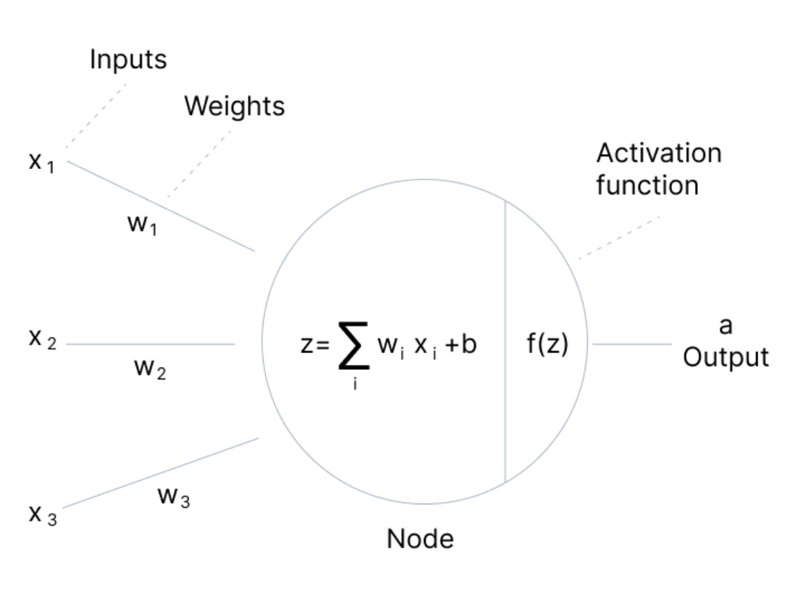

# Machine Learning Speciality

# Learning plan

## Courses
1. [Udemy AWS Certified Machine Learning Speciality 2022 - Hands On!](https://www.udemy.com/course/aws-machine-learning/learn/lecture/16368832?start=15#overview)
1. [Coursera Machine Learning Andrew Ng](https://www.coursera.org/learn/machine-learning/lecture/RKFpn/welcome)

## Books and hands-on
1. [DataScience on AWS](https://github.com/data-science-on-aws/oreilly_book)
1. [Hands-on Machine Learning with Scikit-Learn, Keras, and TensorFlow: GitHub repository](https://github.com/ageron/handson-ml2)
1. [Dive into Deep Learning (d2l) book](http://d2l.ai/index.html)
1. [Python Data Science Handbook](https://jakevdp.github.io/PythonDataScienceHandbook/)
1. [Python Data Science Handbook notebooks](https://github.com/jakevdp/PythonDataScienceHandbook)
1. [The Elements of Statistical Learning - Hastie et al](https://hastie.su.domains/Papers/ESLII.pdf)
1. [Practical Deep Learning for Coders by Sylvain Gugger and Jeremy Howard](https://course.fast.ai/)
1. [Pattern recognition and machine learning by Bishop](http://users.isr.ist.utl.pt/~wurmd/Livros/school/Bishop%20-%20Pattern%20Recognition%20And%20Machine%20Learning%20-%20Springer%20%202006.pdf)
1. [Interpretable Machine Learning by Molnar](https://christophm.github.io/interpretable-ml-book/)

# Resources

## Certification
- [AWS Certified Machine Learning - Speciality](https://aws.amazon.com/certification/certified-machine-learning-specialty/)
- [AI/ML Learning Journey](https://w.amazon.com/bin/view/Acannin/ml-journey/)
- [AWS ML Specialty FabG GitHub repo](https://github.com/FabG/ml-aws-specialty-lab)

## ML topics
- [Bias-variation explanation](https://mla.corp.amazon.com/explain/bias-variance)
- [12 Types of Neural Network Activation Functions: How to Choose?](https://www.v7labs.com/blog/neural-networks-activation-functions)
- [Parametric and Nonparametric Machine Learning Algorithms](https://machinelearningmastery.com/parametric-and-nonparametric-machine-learning-algorithms/)

### Imputation
- [DataWig - Imputation for Tables](https://github.com/awslabs/datawig)


## Probability
- [Probability Distributions and their Mass/Density Functions](https://tinyheero.github.io/2016/03/17/prob-distr.html)
- [PROBABILISTIC APPROACHES: SCENARIO ANALYSIS, DECISION TREES AND SIMULATIONS](http://people.stern.nyu.edu/adamodar/pdfiles/papers/probabilistic.pdf)
- [Doing Bayesian Data Analysis - A Tutorial with R, JAGS, and Stan](https://sites.google.com/site/doingbayesiandataanalysis/)
- [Probability Distribution Table - Intro with tossing a coin 3 times](https://www.youtube.com/watch?v=5lpqiGixDd0)
- [What is a Probability Distribution?](http://stattrek.com/probability-distributions/probability-distribution.aspx)
- [Continuous Probability Distribution](http://stattrek.com/statistics/dictionary.aspx?definition=Continuous%20probability%20distribution)
- [Khan Academy - Probability density function](https://www.youtube.com/watch?v=Fvi9A_tEmXQ)
- [PennState STAT 414/415 - Probability Density Functions](https://onlinecourses.science.psu.edu/stat414/node/97)
- [What is the relationship between the probability mass, density, and cumulative distribution functions?](https://www.quora.com/What-is-the-relationship-between-the-probability-mass-density-and-cumulative-distribution-functions)


https://quip-amazon.com/Zh52ATqZ1dbI/AWS-Certification-Prep-Machine-Learning-Specialty-MLS-C01

https://arxiv.org/pdf/1609.04836.pdf
https://scikit-learn.org/stable/modules/generated/sklearn.feature_extraction.text.TfidfVectorizer.html
https://academic.oup.com/bib/article/14/1/13/304457
https://www.omicsonline.org/open-access/a-comparison-of-six-methods-for-missing-data-imputation-2155-6180-1000224.php?aid=54590

https://docs.aws.amazon.com/sagemaker/latest/dg/object2vec.html
https://aws.amazon.com/blogs/machine-learning/introduction-to-amazon-sagemaker-object2vec/
https://www.jair.org/index.php/jair/article/view/10302

- [Coursera - Practical Data Science Specialization](https://www.coursera.org/specializations/practical-data-science/?action=enroll)
- [Hands-on Machine Learning with Scikit-Learn, Keras, and TensorFlow: GitHub repository](https://github.com/ageron/handson-ml2)


I’m happy to report that I passed my AWS ML Specialty Certification test yesterday. A few points to share for those still on the journey:

- aCloudGuru and LinuxAcademy training should be considered a baseline only. You’ll need to dive a good deal deeper on your own.
- Whizlabs practice tests (which have been instrumental in earning my other certs) aren’t that well aligned with the actual test, they’re much more verbose and there aren’t enough of them (two full tests, 5 short subject-area tests), so if you use these to diagnose your weaknesses you won’t have fresh tests by which to confirm you’re on good ground.
- Groking the SageMaker Algorithm descriptions is critical, but requires a fair baseline in ML techniques. The above program's didn't give me enough, but by the time I finished with those below, and a fair bit of Internet reading on terms/techniques I didn't quite get, I started to get them.  https://machinelearningmastery.com is a great resource.
- I found the Andrew NG Coursera program good for firming up my understanding of what’s happening under the covers. I didn’t go past the neural network classes.
- I also did the Google ML Crash course. Their playgrounds are great for getting intuition about tuning.
- I’d say that each of these courses built upon the others.
- Glue and the Kinesis suite are important to know, as is some EMR.
- I didn’t get any questions where I needed to have memorized the exact names of hyperparameters (like in a lot of Whizlab questions), but be sure you know how learning rate, batchsize, epochs, dropout, the regularization params address, common training problems.
- Process of elimination is your friend, but often require good ML fundamentals to recognize the “obvious” wrong choices.  

[#aws-certified-machine-learning-speciality-exam slack channel](https://amzn-aws.slack.com/archives/C01D55G3PQA/p1634008133008100)

# Udemy course
- [AWS Certified Machine Learning Speciality 2022 - Hands On!](https://www.udemy.com/course/aws-machine-learning/learn/lecture/16368832?start=15#overview)
- [Course materials](https://sundog-education.com/aws-certified-machine-learning-course-materials/)

## Data engineering

### S3
Encryption:
- **SSE-S3**: keys handled and managed by AWS
- **SSE-KMS**: keys handled and managed by AWS KMS, audit trail for key usage, usage of CMKs
- **SSE-C**: customer manages own keys
- **Client Side Encryption**

Security:
- User based:
  - IAM policies
- Resource based:
  - bucket policies
  - ACL

new way of enforce encryption - use _S3 default encryption_

use VPC Endpoints to access S3 buckets

Logging & Audit:
- S3 access logs (stored in other S3 bucket)
- API calls logged in AWS CloudTrail

Tagged based security (combined with IAM policies and bucket policies)

### Kinesis
- data is replicated to 3 AZ

Services:
- Kinesis Streams
- Kinesis Analytics
- Kinesis Firehose
- Kinesis Video Streams

#### Kinesis Data Streams (KDS)
- streams divided into Shards (Partitions)
- Shards have to be provisioned in advance (capacity planning)
- Data retention 24h default, up to 365d
- Record up to 1MB
- Data cannot be deleted

Capacity:
- Producer:
  - **1MB/s or 1000 msg/s at write per shard**
  - `ProvisionedThroughputException` otherwise

- Consumer classic:
  - 2MB/s at read per shard
  - 5 API calls/s per shard across all consumers

#### Kinesis Data Firehose (KDF)
Data transformation through Lambda function
All or failed data can be saved to S3 backup bucket
Automatic scaling
Data conversion (CSV/JSON -> Parquet/ORC), only for S3
Supports compression for S3 (GZIP, ZIP, and SNAPPY)
60s minimum latency, 900s max buffer interval
1MB to 100MB buffer size
pay per data amount
delivery retry every 5s for 24h period
24h max retention
can encrypt data at destination

Producers/data sources:
- Kinesis Data Streams
- CloudWatch, EventBridge
- AWS IoT
- AWS Pinpoint
- Kinesis Data Firehose API, Kinesis Agent
- Fluentbit

Destinations (batch writes):
- Amazon S3
- Amazon Redshift (copy through S3)
- Amazon OpenSearch
- HTTP endpoint
- 3rd party destinations (e.g. Splunk, Datadog, NewRelic, Dynatrace, Sumologic, MongoDB)


#### KDF vs. KDS
KDS:
- need to write custom code (producer/consumer) - KDS API
- real time, 200ms latency for classic, 70ms latency for enhanced fan-out
- need to manage scaling (shard splitting/merging)
- data storage 1 - 365d, replay capability, multi-consumers

KDF:
- Near real time (60s is lowest buffer time)
- Data transformation via Lambda
- Auto scaling
- no data storage, only delivery retry, 24h max retention

#### Kinesis Data Analytics (KDA)


Use cases:
- Streaming ETL
- Continuos metric generation
- Responsive analytics
- ML inference

SQL to Flink to write the computation
Schema discovery

ML on KDA:
- **Random cut forest** (`RANDOM_CUT_FOREST` SQL function) for anomaly detection
- `HOTSPOTS` for detecting dense regions in the data

#### Kinesis Video Streams (KVS)
Data retention 1h - 10y

Producers:
- cameras, AWS DeepLens, radar data etc
- Producer SDK
- one producer per video stream

Consumers:
- AWS SageMaker
- Amazon Rekognition Video
- custom (MXNet, Tensorflow)

Use cases:
- consume video real-time + inference

### Glue
Transformations:
- FindMatches ML: de-duplication

### AWS Data Stores

### AWS Data Pipeline
Glue vs. Data Pipeline
Glue:
- Run Apache Spark code, Scala or Python, focus on ETL
- Managed serverless
- Data catalog

Data Pipeline:
- Orchestration service
- More control over the environment, compute resources that run code & code
- Allow access to EC2 or EMR instances

### AWS Batch
Run batch jobs as Docker images, can run any computing job with provided Docker image  
Dynamic provisioning of the instances (EC2 & spot)  
Optimal quantity and type based on volume and requirements  
Fully serverless  
Pay for underlying EC2 instances  
Schedule batch jobs using CWE  
Orchestrate using Step Functions  

### AWS DMS

### AWS Step Functions
Max execution time 1y

## EDA

### Types of data
- Numerical
- Categorical -> ordinal (ordered, e.g. size or rating), nominal (unordered, e.g. color)
- Text 

### Data distributions


Is data _discrete_ or _continuous_?
- **probability density function (p.d.f.)** ->  used to describe continuous probability distributions
- **probability mass function (p.m.f)** -> used to describe discrete probability distributions

E.g. continuous distribution:
- normal

E.g. discrete distribution:
- Poisson
- Binominal
- Bernoulli

### Time Series
- Trends
- Seasonality
- Both
- Noise

Additive model:
- seasonality + trends + noise
  seasonal variation is constant

Multiplicative model:
- seasonality*trends*noise
  seasonal variation increases as the trend increases

### Amazon Athena

### Amazon QuickSight
ML Features:
- Anomaly detection (RCF)
- Forecasting
- Auto-narratives

### EMR & Hadoop
Managed Hadoop framework on EC2 instances  
Spark, HBase, Presto, Hive, etc  
EMR notebooks  

Main node  
Core node(s), can be scaled up and down  
Task node(s), good use of spot instances  

Can use AWS Data Pipeline to schedule and start/stop your cluster

EMR Storage:
- HDFS
- EMRFS
- EBS for HDFS
- Local file system

### Apache Spark on EMR
Hadoop: MapReduce, YARN, HDFS
Apache Spark: MapReduce, Spark, YARN, HDFS

Spark MLLib:
- classification, regression, DT, recommendation engine (ALS), clustering (K-Means), LDA (topic modeling), SVD, PCA, statistics, ML workflow utilities

EMR: choose instance types:
- Main node:  
  `m4.large` for < 50 nodes, `m4.xlarge` > 50 nodes
- Core/Task nodes:  
  `m4.large` is baseline, `m4.xlarge` for improved performance
  `t2.medium` if a cluster waits a lot for external dependencies

### Feature engineering
- Feature _construction_: multiplication, squaring, etc.  
- Feature _extraction_: encoding, vectorization, etc.
- Feature _selection_: dimensionality reduction

### Imputing missing data
**mean** values   
**median** is better when outliers are present  
**mode**  
**placeholder** - impute a constant value
**most frequent** - works for categorical data

Limitations:  
- only works on column level, misses correlations between features
- can't use mean/median/mode on categorical features (imputing with the most frequent value can work)
- not very accurate

**dropping** rows with missing data
- never going to be the right answer for "best" approach
- almost anything is better
- can lead to overfitting/underfitting

**ML-based** imputing:
- KNN: find K "nearest" (most similar) rows and average their values - works on _numerical_ data

Better for _categorical_ data:
- Deep learning
- Regression: find linear or non-linear relationship between the missing feature and other features  
  most advanced: **MICE** - multiple imputation by chained equations

Better than imputing data - getting more real data!
Try harder or collect more data

### Addressing class imbalance
- **down-sampling**: reduce the size of the dominant class(es)
- **up-sampling**: increase the size of rare/small class(es), duplicate samples from the rare class(es)
- **data generation**: create new records, similar but not identical
- **sample weights**: for a model that uses a cost function, assign higher weights to rare classes

**SMOTE**
Synthetic Minority Over-sampling Technique  
- generates new samples of the rare class using KNN 
- undersamples majority class
- better than just oversampling

**Adjust thresholds**
- increasing threshold will reduce false positive, but can result in more false negatives

### Handling outliers
metrics are:
- **variance**: average of the squared differences from the mean
- **stdev**: sqrt(variance)

data points further than 1 stdev can be considered outliers

Dealing with outliers:
- remove
- use RCF (Random Cut Forest) for outlier detection

### Encoding
categorical:  
- Ordinal encoding
- One hot encoding
- Target (mean) encoding: average the target value for each category, replace the categorical values with the average target value.

Numerical:
- binning

Define a hierarchy structure

### Binning
- Bucket observations together based on range of values
- Quantile binning ensures even sizes of bins (equal number of samples in each bin)
- Transforms numeric data to ordinal data
- Useful when there is uncertainty in the measurements

### Transforming
- Apply some function to a feature to make it better suited for training
- e.g. `log()` or `sqrt()` etc

### Scaling/Normalizing
- most models require feature data to at least be scaled to comparable values

### Shuffling

### SageMaker Ground Truth
GT creates its own model as images are labeled by people. As model learns, only images the model isn't sure about are sent to human labelers.

### TF-IDF
_Term Frequency - Inverse Document Frequency_  
Measure of how important and unique this word is for a specific document  

**Term Frequency (TF)**: how often a word occurs in a document
**Document Frequency (DF)**: how often a word occurs in an entire set of documents

`TF-IDF = TF/DF = TF*1/DF = TF*IDF`

Practically the `log(IDF)` is used -> better weighting of a word's overall popularity

compute relevancy for `n-grams` as well

Compute TF-IDF for unigrams and bigrams for 2 documents:


### Metrics
**Accuracy**  
ratio of cases classified _correctly_

`accuracy = (TP+TN)/(TP+TN+FP+FN)`

**Precision**  
accuracy of predicted positive, ignores TN (!)
AKA correct positives
- How many predicted items are relevant?

`precision = TP/(TP+FP)`

**Recall**  
ability to predict a positive outcome  
AKA sensitivity, true positive rate, completeness
- How many relevant items are predicted?

`recall = TP/(TP+FN)`

**Specificity**  
True negative rate

`specificity = TN/(TN+FP)`

**F1 Score**  
Harmonic mean of precision and sensitivity

`F1 = 2TP/(2TP+FP+FN)`

**RMSE**  
Root mean square error
only cares about right/wrong answers

**AUC**
ROC AUC 0.5 is useless, 1.0 is perfect


## Modeling: Deep Learning


**Input layer**:  
The input layer takes raw input from the domain. No computation is performed at this layer. Nodes here just pass on the information (features) to the hidden layer.

**Hidden layer**:  
The hidden layer performs all kinds of computation on the features entered through the input layer and transfers the result to the output layer.

**Output Layer**:  
It’s the final layer of the network that brings the information learned through the hidden layer and delivers the final value as a result.

**Note**: All hidden layers usually use the same activation function. However, the output layer will typically use a different activation function from the hidden layers. The choice depends on the goal or type of prediction made by the model.

Each neuron is characterized by its **weight**, **bias**, and **activation function**:



**Feedforward Propagation** - the flow of information occurs in the forward direction. The input is used to calculate some intermediate function in the hidden layer, which is then used to calculate an output. 

**Backpropagation** - the weights of the network connections are repeatedly adjusted to minimize the difference between the actual output vector of the net and the desired output vector.

Backpropagation aims to minimize the cost function by adjusting the network’s weights and biases. The cost function gradients determine the level of adjustment with respect to parameters like activation function, weights, bias, etc.

DL frameworks:
- Tensorflow/Keras
- MXNet

Types of neural networks:
- Feedforward Neural Network
- Convolutional NN (CNN), e.g. for image classification
- Recurrent NN (RNN), e.g. for predicting sequences in time such as stock prices, translation, words in sentence  
  - LSTM, GRU

### Activation functions
- Define the output of a node/neuron given its input signal
- Help the neural network to use important information while suppressing irrelevant data points
- without an activation function, every neuron will only be performing a linear transformation on the inputs using the weights and biases. All layers will behave in the same way because the composition of two linear functions is a linear function itself. Although the neural network becomes simpler, learning any complex task is impossible, and our model would be just a linear regression model.
- A neural network will almost always have the same activation function in all hidden layers. This activation function should be differentiable so that the parameters of the network are learned in backpropagation
- ReLU is the most commonly used activation function for hidden layers
- While selecting an activation function, you must consider the problems it might face: vanishing and exploding gradients
- Regarding the output layer, we must always consider the expected value range of the predictions. If it can be any numeric value (as in case of the regression problem) you can use the linear activation function or ReLU
- Use Softmax or Sigmoid function for the classification problems

**2 linear NN activation functions:**
- _Linear_: not possible to use backpropagation as the derivative is constant (no relation to x), all layers degenerate to a single layer (all linear functions). Is simply a linear regression model
- _Binary step_: cannot be used for multi-class classification problems, the gradient = 0, causes a hindrance in the backpropagation process

Non-linear activation functions:
- can create **complex mappings** (non-linear) between inputs and outputs
- allow **backpropagation** (because they have a useful derivative)
- allow for **multiple layers** (linear functions degenerate to a single layer)

**10 non-linear NN activation functions**:
- _Sigmoid (Logistic)_ -> scales (0,1)  
  - commonly used for models where we have to predict the probability as an output
  - differentiable and provides a smooth gradient
  - limitation: gradient values are only significant for range (-3,3) (vanishing gradient problem)
- _TanH (Hyperbolic Tangent)_ -> scales (-1, 1)
  - output is zero-centered, output values can be easily mapped as strongly negative, neutral, or strongly positive
  - usually used in hidden layers of a neutral network - mean for the hidden layer comes out to be 0 or very close to; makes learning for the next layer much easier
  - also faces the vanishing gradient problem
  - 💡 Tanh generally preferred over sigmoid
  - Compute expensive
- _Rectified Linear Unit (ReLU)_ `f(x) = max(0,x)`
  - has a derivative and allows for backpropagation
  - main characteristic is that ReLU doesn't activate all the neurons at the same time
  - computationally efficient compared to sigmoid and tanh
  - accelerates the convergence of gradient descent towards the global minimum of the loss function
  - has "**Dying ReLU problem**": All the negative input values become zero immediately, which decreases the model’s ability to fit or train from the data properly.
- _Leaky ReLU_ `f(x) = max(0.1*x,x)`: improved version to solve the Dying ReLU problem (has a small positive slope in the negative area)
   - enables backpropagation even for negative input values
   - limitation: the gradient for negative values is a small value that makes the learning of model parameters time-consuming
   - limitation: the predictions may not be consistent for negative input values
- _Parametric ReLU_ `f(x) = max(a*x,x)`
- _Exponential Linear Unit (ELU)_: variant of ReLU that modifies the slope of the negative part of the function
  - strong alternative for ReLU
  - becomes smooth slowly until its output equal to -α whereas RELU sharply smoothes
  - avoids dead ReLU problem by introducing log curve for negative values of input
  - computationally expensive
  - no learning of α
  - exploding gradient problem
- _Softmax_
  - used for the final output layer, converts outputs to probabilities of each classification
  - it calculates the relative probabilities. Similar to the sigmoid/logistic activation function, the SoftMax function returns the probability of each class
  - most commonly used as an activation function for the last layer of the neural network in the case of multi-class classification
- _Swish_ `f(x) = x*sigmoid(x)`
  - consistently matches or outperforms ReLU activation function on deep networks for image classification, machine translation etc
  - smooth function that means that it does not abruptly change direction like ReLU does near x = 0
  - Small negative values were zeroed out in ReLU activation function. However, those negative values may still be relevant for capturing patterns underlying the data. Large negative values are zeroed out for reasons of sparsity making it a win-win situation
  - being non-monotonous enhances the expression of input data and weight to be learnt
- _Gaussian Error Linear Unit (GELU)_
  - This activation function is motivated by combining properties from dropout, zoneout, and ReLUs
  - GELU nonlinearity is better than ReLU and ELU activations and finds performance improvements across all tasks in domains of computer vision, natural language processing, and speech recognition
- _Maxout_


### How to choose the right activation function
You need to match your activation function for your output layer based on the type of prediction problem that you are solving—specifically, the type of predicted variable.

- For multi-class, use softmax on the output layer
- RNN's do well with Tanh
- For everything else:
  - start with ReLU
  - ReLU should only be used in the hidden layers
  - if you need to do better, try Leaky ReLU/Parametric ReLU
  - last resort: PReLU, Maxout
  - Swish for really deep (> 40 layers) networks
  - Sigmoid if you need more than one classification for same thing
  - Sigmoid/Logistic and Tanh functions should not be used in hidden layers as they make the model more susceptible to problems during training (due to vanishing gradients)

Based on type of prediction problem, use for **output** layer:
- **Regression** - Linear Activation Function
- **Binary Classification** - Sigmoid/Logistic Activation Function
- **Multiclass Classification** - Softmax
- **Multilabel Classification** - Sigmoid

Based on the type of NN architecture, use for **hidden** layers:
- **Convolutional Neural Network (CNN)**: ReLU activation function
- **Recurrent Neural Network (RNN)**: Tanh and/or Sigmoid activation function
  
### CNN
- "feature-location invariant"
- can find features that aren't in a specific spot
- images, translation, sentence classification, sentiment analysis

Typical usage:  
Conv2D > MaxPooling2D > Dropout > Flatten > Dense > Dropout > Softmax

Specialized CNN architectures:
- Define specific arrangement of layers, padding, and hyperparameters
E.g.:
- LeNet-5
- AlexNet
- GoogLeNet
- ResNet

### RNN
- Time-series data:
  - web logs, sensor logs, stock trades
  - self-driving based on past trajectories
- Data that consists of sequences of arbitrary length:
  - machine translation
  - image captions
  - machine-generated music

Concept: a recurrent neuron > a "memory cell", maintain memory about previous behavior, layer of recurrent neurons

#### RNN topologies
- Sequence to sequence: e.g. predict stock prices
- Sequence to vector: e.g. words in a sentence to sentiment
- Vector to sequence: e.g. create a caption from an image
- Encoder to decoder: e.g. sequence > vector > sequence, machine translation

Training:
- backpropagation through time

**LSTM Cell**:
- Long Short-Term Memory Cell
- maintains separate short-term and long-term states

**GRU Cell**:
- Gated Recurrent Unit
- Simplified LSTM Cell that performs about as well

### Deep learning on EC2/EMR
- EMR supports MXNet and GPU instance types

Appropriate instance types:
- P3: up to 8 Tesla V100 GPUs
- P2: up to 16 K80 GPUs
- G3: up to 4 M60 GPUs
- Deep learning AMI

### Tuning neural networks
Learning rate:
- NN are trained by gradient descent (or similar means)
- minimize some cost function over many _epochs_
- _learning rate_: how far apart these samples

_Learning rate_ is a **hyperparameter**    
- Too high -> you might overshoot the optimal solution
- Too small -> it might take too long to find the optimal solution

_Batch size_: how many training samples are used withing each epoch  
- Smaller batch sizes can work their way out of local minima more easily
- Too large batch sizes can get stuck in the wrong solution
- Random shuffling at each epoch can make this look like very inconsistent results from run to run with large batch size

**Important:**
- Small batch sizes tend to not get stuck in local minima
- Large batch sizes can converge on the wrong solution at random (large batch sizes tend to get stuck, at random, inside "local minima" instead of the correct solution)
- Large learning rates can overshoot the correct solution
- Small learning rates can increase training time

### Regularization techniques for NN
- Prevents _overfitting_
- Used to balance model complexity and model fit, with the ultimate goal of ensuring the model generalize beyond the training dataset
- Compromise between fit and complexity (drop features, reduce weights)

Too many layers or too many neurons  

Regularization:
- use simpler model, less layers, less neurons  
- drop features, reduce weights
- **Dropout** - remove some neurons
- **Early stopping**
- Tune model complexity by adding a _penalty_ for complexity to the cost function `C(x)`:
```
Creg(w) = C(w) + α*penalty(w)
```
α - a _regularizer_ parameter

#### L1 and L2 regularization
Prevents overfitting in ML in general  
A regularization term is added as weights are learned  
- **L1** (LASSO): penalizes the model by sum of the abs(weights) 
  - **performs feature selection** - entire features go to 0
  - essential if dimensionality is high due to feature engineering
  - computationally inefficient
  - sparse output, can make up for computational inefficiency
  - feature selection can reduce dimensionality, out of 100 features, maybe only 10 end up with non-zero coefficients!

- **L2** (Ridge): penalizes the model by minimizing the sum of the squared weights
  - all features remain considered, just weighted
  - will try to make all weights smaller, but not necessarily driving them to 0
  - computationally efficient
  - dense output
  - better choice than L1 if all features are important

- **ElasticNet**: both L1 and L2

! Need to scale the features first !

### Vanishing gradient problem
Like the sigmoid function, certain activation functions squish an ample input space into a small output space between 0 and 1. 

Therefore, a large change in the input of the sigmoid function will cause a small change in the output. Hence, the derivative becomes small. For shallow networks with only a few layers that use these activations, this isn’t a big problem. 

However, when more layers are used, it can cause the gradient to be too small for training to work effectively. 

- when the slope of the learning curve approaches zero, things can get stuck
- becomes a problem with deeper networks and RNN's as these "vanishing gradients" propagate to deeper layers

Handling the vanishing gradient problem:
- Multi-level hierarchy, break up levels into their own sub-networks trained individually
- Long short-term memory (LSTM)
- Residual networks (e.g. ResNet)
- Ensemble of shorter networks
- Better choice of activation function, ReLU is a good choice

### Exploding gradient problem
Exploding gradients are problems where significant error gradients accumulate and result in very large updates to neural network model weights during training. 

An unstable network can result when there are exploding gradients, and the learning cannot be completed. 

The values of the weights can also become so large as to overflow and result in something called NaN values. 

### Ensemble learning
Common example: random forest (RF)
- make lots of decision trees and let them all vote on the result - RF

**Bagging**:  
- generate N new training sets by random sampling with replacement, each resampled model can be trained in **parallel**.

**Boosting**:
Boosting is an ensemble method that creates a strong model by combining the predictions of multiple weak models.  
- observations are weighted
- some will take part in new training sets more often
- training is **sequential**, each classifier takes into account the previous one's success - attempts to boost performance by reducing the errors of the previous model
- weak models need to be different
- using same data, same algorithm, but focus on **minimize the prediction error** - 
- residual of the previous model (prediction error) - the data samples with the largest prediction error - becomes a **target** of the next model
- adjust next model's hyperparameter accordingly
- add each weak learner to the ensemble

Depending on your goals:
- **Boosting** generally yields better accuracy
- **Bagging** avoids overfitting
- Bagging is easier to parallelize

## Modeling: Amazon SageMaker
ideal format - RecordIO/Protobuf

Training options:
- Built-in training algorithms
- Spark MLLib
- Custom Python Tensoflow/MXNet code
- Own custom docker image
- Algorithm from AWS marketplace

Model endpoint capabilities:
- On-demand inference (persistent endpoint)
- Batch transform
- Inference pipelines for complex processing
- SageMaker Neo for deploying to edge devices
- Elastic inference for accelerating deep learning models
- Automatic scaling for the endpoint

### Built-in algorithms
- no coding required to start running experiments
- algorithms come with parallelization across multiple compute instances and GPU support:
  - algorithms that are parallelizable can be deployed on multiple compute instances for distributed training

Commonly supported `ContentType` values and the algorithms that use them:


#### Supervised learning
General purpose algorithms that can be used for classification or regression problems:
- **Linear learner**: learns a linear function
- **Factorization machines**
- **XGBoost**
- **k-NN**: non-parametric

Specialized algorithms:
- **Object2Vec**
- **DeepAR forecasting**

#### Unsupervised learning
- **PCA**: reduces the dimensionality (number of features) within a dataset by projecting data points onto the first few principal components
- **K-Means**
- **IP insights**
- **Random Cut Forest (RCF)**: anomaly detection

#### Textual analysis
- **BlazingText**:
- **Sequence-to-Sequence**
- **Latent Dirichlet Allocation (LDA)**: determining topics in a set of documents, _unsupervised_
- **Neural Topic Model (NTM)**: unsupervised technique for determining topics in a set of documents, using a neural network approach.

#### Image processing
- **Image classification**
- **Semantic segmentation**
- **Object detection**

### Links
- [Common Information About Built-in Algorithms](https://docs.aws.amazon.com/sagemaker/latest/dg/common-info-all-im-models.html)
- [Use Amazon SageMaker Built-in Algorithms](https://docs.aws.amazon.com/sagemaker/latest/dg/algos.html)

### Linear learner
- linear regression
- can handle both numeric regression and classification
- can do binary or multi class
- uses _softmax_ loss function to train multiclass classifiers
- `File` or `Pipe` mode both supported
- supports `recordIO-wrapped` `protobuf` and `CSV` formats
- CPU or GPU
- Parallelizable
- `dtype` of all feature and label values must be `float32`
- `CSV`: first column has to be the label
- the best model optimizes either of the following:
  - **Continuous objectives**, such as mean square error, cross entropy loss, absolute error.
  - **Discrete objectives** suited for classification, such as F1 measure, precision, recall, or accuracy.

Preprocessing:
- Training data must be normalized (can be done automatically by LL)
- Input data should be shuffled -> **That's important for algorithms trained using stochastic gradient descent**

Training:
- uses stochastic gradient descent (SGD)
- choose an optimization algorithm (Adam, AdaGrad, SGD, etc)
- multiple models are optimized in parallel
- L1, L2 regularization

Validation:
- most optimal model is selected

#### Hyperparameters
- `balance_multiclass_weights`: gives each class equal importance in loss functions
- `learning_rate`
- `mini_batch_size`
- `l1`: L1 regularization parameter
- `wd`: weight decay (L2 regularization)
- `loss`: specifies the loss function

#### Links
- [Documentation](https://docs.aws.amazon.com/sagemaker/latest/dg/linear-learner.html)
- [Build multiclass classifiers with Amazon SageMaker linear learner](https://github.com/aws/amazon-sagemaker-examples/blob/master/scientific_details_of_algorithms/linear_learner_multiclass_classification/linear_learner_multiclass_classification.ipynb)

### XGBoost
- boosted group of decision trees
- uses gradient descent to minimize loss as new trees are added
- can be used for classification and regression (using regression trees)
- takes `CSV`/`libsvm` or `Parquet`
- for `CSV`: the label is in the first column and CSV doesn't have a header record
- for `libsvm`: the label is in the first column. Subsequent columns contain the zero-based index value pairs for features
- CPU and GPU (for 1.2-1)
- Parallelizable
- `File` and `Pipe` training input mode
- can be used in framework mode within notebooks (`sagemaker.xgboost`) or as built-in SageMaker algorithm
- **memory-bound**, not compute-bound
- uses CPU's only for multiple instance training
- a general-purpose instance (e.g. `m5`) is a good choice, better than a compute-optimized, e.g. `c4`
- v1.2 can train single-instance GPU, e.g. `p3`. `tree_method` hyperparameter must be set to `gpu_hist`

❗ For `CSV` training input mode, the total memory available to the algorithm (`Instance Count` * the memory available in the `InstanceType`) must be able to hold the training dataset. For `libsvm` training input mode, it's not required, but recommended.

#### Hyperparameters
Important:
- `subsample`: prevents overfitting
- `eta`: step size shrinkage, prevents overfitting
- `gamma`: minimum loss reduction to create a partition, larger = more conservative
- `alpha`: L1 regularization term, larger = more conservative
- `lambda`: L2 regularization term, larger = more conservative
- `eval_metric`: metric to optimize, e.g. AUC, error, mse
- `scale_pos_weight`: adjust balance of positive and negative weights, helpful for unbalanced classes, might be set to `sum(negative_classes)/sum(positive_classes)`
- `max_depth`: controls overfitting/underfitting
- `csv_weights`: allows to differentiate the importance of labelled data points by assigning each instance a weight value.

#### Links
- [Documentation](https://docs.aws.amazon.com/sagemaker/latest/dg/xgboost.html)
- [Multiclass classification with Amazon SageMaker XGBoost algorithm](https://github.com/aws/amazon-sagemaker-examples/blob/master/introduction_to_amazon_algorithms/xgboost_mnist/xgboost_mnist.ipynb)

### Seq2Seq (Sequence-to-Sequence)
Supervised learning algorithm where the input is a sequence of tokens (for example, text, audio) and the output generated is another sequence of tokens.
Applications: 
- machine translation
- text summarization (input a longer string of words and predict a shorter string of words)
- speech-to-text

Uses RNNs and CNNs models with attention as encoder-decoder architectures

- expects data in `RecordIO-Protobuf` format
- tokens are expected as integers and not floats as majority of algorithms
- start with tokenized text files
- convert to `protobuf`
- three channels are required: `train`, `validation`, `vocab`
- **only supported on GPU instances and only train on a single instance, but multiple GPUs**
- can optimize on:
  - accuracy vs. provided validation dataset
  - `BLEU` score (compares against multiple reference translations)
  - Perplexity (cross-entropy)

#### Hyperparameters
- `batch_size`
- `optimizer_type`
- `learning_rate`
- `num_layers_encoder`
- `num_layers_decoder`

#### Links
- [Documentation](https://docs.aws.amazon.com/sagemaker/latest/dg/seq-2-seq.html)
- [Example notebook](https://sagemaker-examples.readthedocs.io/en/latest/introduction_to_amazon_algorithms/seq2seq_translation_en-de/SageMaker-Seq2Seq-Translation-English-German.html)

### Deep AR
- forecast **scalar** (one-dimensional) time series data
- uses RNN's
- allows to train the same model over several related time series -> when your dataset contains hundreds of related time series, DeepAR outperforms the standard ARIMA and ETS methods -> "global" algorithm
- finds frequencies and seasonality
- `train` (mandatory) and `test` (optional) data channels
- `JSON Lines` format (`.jsonl`), `gzip` or `Parquet` file format
- each record **must** contain:
  - `start`: the starting timestamp
  - `target`: time series values
- each record **can** contain:
  - `dynamic_feat`: dynamic features (e.g. promotion applied)
  - `cat`: categorical features
- can specify a single file or a directory with multiple files (and subdirectories)
- can train on both GPU and CPU, both single and multi-machine settings
- start with `ml.c4.2xlarge` or `ml.c4.4xlarge`, switch to GPU and multiple instances only when necessary
- inference only on CPU instances
- always include **entire time series** for training, testing, and inference
- use entire dataset as **test** set, remove last `prediction_length` points for **training**
- don't use very large values (>400) for `prediction_length`. If you want to forecast further into the future, consider aggregating your data at a lower frequency
- train on many time series and not just one when possible

#### Hyperparameters
- `context_length`: to control how far in the past the network can see. **However, the model will lag one year anyway**
- `prediction_length`: control how far in the future predictions can be made
- `epochs`
- `mini_batch_size`
- `learning_rate`
- `num_cells`
- `time_freq`: the **resolution of time series** (from minutes to months)

#### Links
- [Documentation](https://docs.aws.amazon.com/sagemaker/latest/dg/deepar.html)
- [DeepAR: Probabilistic Forecasting with Autoregressive Recurrent Networks](https://arxiv.org/abs/1704.04110)
- [DeepAR demo on electricity dataset](https://github.com/aws/amazon-sagemaker-examples/blob/master/introduction_to_amazon_algorithms/deepar_electricity/DeepAR-Electricity.ipynb)
- [DeepAR demo on synthetic dataset](https://github.com/aws/amazon-sagemaker-examples/blob/master/introduction_to_amazon_algorithms/deepar_synthetic/deepar_synthetic.ipynb)
- [Predicting world temperature with time series and DeepAR on Amazon SageMaker](https://julsimon.medium.com/predicting-world-temperature-with-time-series-and-deepar-on-amazon-sagemaker-e371cf94ddb5)

### BlazingText
Highly optimized implementations of the `Word2vec` and `text classification` algorithms.

Applications:
- `text classification`: predict labels for a sentence, useful in web searches, information retrieval
  - supervised multi-class, multi-label classification
  - can use GPU
  - for large datasets (> 2GB) use single GPU instance (`p2` or `p3`)
- `Word2vec`: useful for downstream NLP tasks, but not is not an NLP algorithm
  - maps words to high-quality distributed vectors - _word embedding_
  - words that are semantically similar correspond to vectors that are close together
  - can scale to large datasets easily
  - provides Skip-gram and `CBOW` training architectures
  - GPU training
  - for `cbow` and `skipgram` recommended a **single** `p3` instance or any single CPU/single GPU instance
  - for `batch_skipgram` can use single or multiple CPU instances
- **only works on individual words, not sentences or documents**
- expects a single preprocessed text file with space-separated tokens. Each line should contain a single sentence.
- for **supervised** mode (`text classification`):
  - one sentence per line along with labels
  - first word in the sentence: `__label__<label>`
  - supports `validation` channel
  - supports `Pipe` mode with **Augmented Manifest Text Format**
- for **upsupervised** mode (`Word2Vec`) training:
  - only `train` channel is supported
  - one sentence per line
- not parallelizable

#### Hyperparameters
Word2Vec:
- `mode` (`batch_skipgram`, `skipgram`, `cbow`)
- `learning_rate`
- `window_size`
- `vecto_dim`
- `negative_samples`

Text classification:
- `learning_rate`
- `epochs`
- `word_ngrams`
- `vector_dim`

#### Links
- [Documentation](https://docs.aws.amazon.com/sagemaker/latest/dg/blazingtext.html)

### Object2Vec
A general-purpose neural embedding algorithm, similar to `Word2Vec`
It can learn low-dimensional dense embeddings of high-dimensional objects.  

The embeddings are learned in a way that preserves the semantics of the relationship between pairs of objects in the original space in the embedding space. You can use the learned embeddings to efficiently compute nearest neighbors of objects and to visualize natural clusters of related objects in low-dimensional space.

Applications:
- information retrieval
- product search
- item matching
- customer profiling
- collaborative recommendation system -> training with pairs of {token, token} `{embedding for user features, embedding for item features}`
- multi-label document classification -> training with pairs of {token, sequence} `{embedding for document, embedding for label}`
- sentence embeddings -> training with pairs of {sequence, sequence} `{embedding for sentence 1, embedding for seqence 2}`


- pre-processing is required to transform the input data to the supported formats
- supports a discrete token (list of a single `integer-id`, `[10]`) or sequence of discrete tokens (`[1,4,10]`)
- requires labeled data for training -> `Object2Vec` is a **supervised** learner 
- the architecture of `Object2Vec` requires the user to make the relationship between objects in each pair explicit at training time, but the relationships themselves may be obtained from natural groupings in data, and they might not require explicit human labeling
- supports a training data channel, a validation data channel, and a test data channel
- provides an auxiliary data channel for you to provide a pre-trained embedding file and a vocabulary file
- using pre-trained embedding provides a warm start to the algorithm training since it starts from an informed initial point in the input layer
- for **training**: start with `ml.m5.2xlarge`, for GPU with `ml.p2.xlarge`
- single machine only training, support for multiple GPUs
- for **inference**: `ml.p3.2xlarge`
- input for training: `JSON lines`
- inference modes:
  - To convert singleton input objects into fixed length embeddings using the corresponding encoder
  - To predict the relationship label or score between a pair of input objects
- the inference server automatically figures out which of these two modes is requested based on the input data

#### Hyperparameters
- `network`: encoder network
- `optimizer`
- `token_embedding_dim`
- `enc_dim`
- Early stopping tolerance and patience 

#### Links
- [Documentation](https://docs.aws.amazon.com/sagemaker/latest/dg/object2vec.html)
- [Introduction to Amazon SageMaker Object2Vec](https://aws.amazon.com/blogs/machine-learning/introduction-to-amazon-sagemaker-object2vec/)
- [Movie recommender notebook](https://github.com/awslabs/amazon-sagemaker-examples/tree/master/introduction_to_amazon_algorithms/object2vec_movie_recommendation/)
-[Using Object2Vec to Encode Sentences into Fixed Length Embeddings notebook](https://sagemaker-examples.readthedocs.io/en/latest/introduction_to_amazon_algorithms/object2vec_sentence_similarity/object2vec_sentence_similarity.html)
- [Using Object2Vec to learn document embeddings notebook](https://sagemaker-examples.readthedocs.io/en/latest/introduction_to_applying_machine_learning/object2vec_document_embedding/object2vec_document_embedding.html)


## Modeling: High-level ML services

## ML implementation and operations

## Wrapping up


# LinuxAcademy course by **Mike Chambers**
https://linuxacademy.com/cp/modules/view/id/340

- Training Data
- Testing Data

Overfit and failing to generalize

1. Data
2. Algorithm
3. Train
4. Model

# Deep Learning
Artificial Neuron
- inputs
- outputs
- activation function

Mesh network of neurons

Input layer
Hidden layers
Output layer - one neuron for each outcome

# Machine Learning Lifecycle
Collect Data
Process Data
- Features
- Label (in case of labeled data)
- Feature engineering
- Feature reduction
- Encoding
- Formatting

Split Data
- Training (80%)
- Validation (optional)
- Testing (20%)

Train
- algorithm "sees" and directly influenced by the **training** data

Test
- algorithm "does not see" **testing** data

Deploy
- DevOps
- Infrastructure

Infer -> Predictions
      -> Improve cycle
- real-world unlabeled data
- take statistics etc -> repeat the life cycle

## Different Types of Machine Learning

**Supervised**  
- Labeled data
- Numberic data
- Classified data

**Unsupervised**
- looking for patterns in the data

**Reinforcement Learning**
- Action-Reward
- often used in robotics and automatics
- e.g. Deep Racer


## Optimization
**Gradient Descent**
  - Step size sets the learning rate

  used to optimize:
  - Linear Regression
  - Logistical Regression
  - Support Vector Machines


## Regularization
Regularization through regression
change sensitivity of the model in different dimensions
- L1
- L2

apply when model is overfit

## Hyperparameters
_external_ parameters to set on model when starting training
- **Learning rate** - size of step taken during gradient descent optimization (0,1)
- **Batch size** - number of samples used to train at any one time (all, one, or some)
- **Epochs** - number of times the algorithm will process the entire training data (contains one or more batches)

# Cross-validation
Split data:
- training (seen by the training process)
- validation (indirectly influences the model, **not** seen by training process)
- testing

**K-Fold Cross-Validation**
Split training data in K parts and use K-1 for training and 1 for validation - repeat K times

# Data

## Feature Selection and Engineering
Selecting relevant data
- removing irrelevant data/features
- looking at correlation and variance in the data - drop features with very low correlation to the labeled data or with very low variance

Gaps and Anomalies
Engineer new feature (e.g. take a function from multiple features)

See:
- [PCA - Principal Component Analysis](https://bityl.co/4ILJ)
- [Label Encoding](https://bityl.co/4ILQ)
- [One Hot Encoding](https://bityl.co/4ILQ)

### Principal Component Analysis
Dimension reduction
Determine the most important components of the data

PCA is an unsupervised ML model
PCA is often used as a data preprocessing step
There can be as many PC's as features or values
PC1 and PC2 can be used to plot a 2D graph to show groups of features

### Label and One Hot Encoding
Label encoding - replace a name (in the category) with a number
_Problem with label encoding_ - implying a hiearchy or ranking
One Hot Encoding - introduce a feature for each value in the category

Use _label encoding_ to replace string values
Use _one hot encoding_ for categorical features

## Missing and Unbalanced Data
Options for dealing with missing data:
- Impute data - e.g. take a mean of all data values for the feature
- Remove data or remove the whole feature

Unbalanced:
- Source more data
- Oversample minority data
- Synthesize data (use domain knowledge)
- Try different types of algorithm

## Splitting and Randomization
Training
Validation
Testing

Important to understand how the data is collected
- Data collected over time
- Batches of data (class sorted)

Always randomize the data
Even you're unaware of data clumping
Some algorithms will shuffle data during training, but not between the training and test data sets

## RecordIO format
Pipe mode streams data
Faster training start times and better throughput
Most SageMaker algorithms work best with RecordIO
  - Streams data directly from S3
  - Training instances don't need a local disk copy of data

# Machine Learning Algorithms

## Logistical Regression
**Supervised**
Inference: Binary _Yes_ or _No_

Use Cases:
- credit risk
- medical condition
- if person will take an action

Sigmoid function

## Linear Regression
**Supervised**
Inference: numeric 1,2,3...

Use Cases:
- Financial forecasting
- Marketing effectiveness
- Risk evaluation

## Support Vector Machines
**Supervised**
Inference: Classification

Use cases:
- customer classification
- Genomic identification

use support vectors to define margins and draw a hyperplane between margins

## Decision Trees
**Supervised**
Inference: Binary, Numeric, Classification

Tree root node - the feature correlating the most with the label
Continue with features on the internal nodes/leaf nodes in the order of correlation rank

## Random Forests
**Supervised**
Inference: Binary, Numeric, Classification

Collection of decision trees

Takes the random subset of features available and build multiple decision trees
For the inference it runs all the trees and averages the result

## K-Means
**Unsupervised**
Inference: classification

Use cases:
- data exploration
- customer categorization

Elbow Plot

## K-Nearest Neighbour
**Supervised**
Inference: classification

k - number of Neighbours taken into account
- make k large enough to reduce the influence of outliers
- make k small enough that classes with a small sample size don't lose influence

Use case:
- recommendation engine
- similar articles and objects

## Latent Dirichlet Allocation (LDA) Algorithm
**Unsupervised**
Inference: classification

Use cases:
- topic discovery/analysis
- sentiment analysis
- automated document tagging

Document<->Topic<->Word

- remove "stop words"
- apply "stemming"
- tokenize
- chose the number of topics (k)
- randomly assign topics to each word
- count the words by topic
- reassign words to topics iteratively

# Deep Learning Algorithms

## Neural Networks Terminology
supervised
artificial neurons

Input Layer - image split on all individual neurons
**weights**

sum(value on neuron * weight) + **bias** -> activation function

Activation Functions:
- Sigmoid (squashing function - between 0 and 1)
- ReLU (if value <= 0 -> 0, if value > 0 -> value)
- Tanh (between 0 and 1)

combination of bias and weights - training

**forward propagation**
**loss function** -> optimization e.g. gradient decent, learning rate
**back propagation**

epoch - repeat forward propagation + back propagation

## Convolutional Neural Networks (CNN)
Supervised
Inference: image classification

Convolutional layers
Pre-trained edge detection (transfer learning)

## Recurrent Neural Networks (RNN)
Supervised
Inference:
- stock prediction
- time series data
- voice recognition (seq to seq)

the algorithm has memory built in
has ability to remember _a bit_

LSTMM (long short-term memory) - remember _a lot_

# Model Performance and Optimization

## Confusion Matrix

True Positives | False Positives
---|---
False Negatives | True Negatives

Size of the matrix NxN - where N - number of categories

## Sensitivity and Specificity

**Sensitivity**
True Positive Rate (TPR)
Recall or hit rate - what % of the actual positives does the classifier get right

True Positives / (True Positives + False Negatives)

Higher sensitivity decreases _false negatives_

**Specificity**
True Negative Rate (TNR)

True Negatives / (True Negatives + False Positives)

Higher specificity decreases _false positives_

## Accuracy and Precison
**Accuracy**
(True Positives + True Negatives) / all predictions

a model that produces completely correct prediction has an accuracy = 1.0

**Precision**
the proportion of _actual positives_ that were correctly identified

True Positives / True Positives + False Positives

a model that produces no false positives has a precision = 1.0

## ROC and AUC
ROC - Receiver Operating Characteristics
AUC - Area Under the Curve

x axis - False Positive Rate
y axis - True Positive Rate

False Positive Rate (FPR) = False Positive / (True Negatives + False Positives)
false alarm rate - what % of the actual negatives does the classifier get wrong (i.e. predict to  be positive)

## Gini Impurity
Gini impurity = 1 - (probability of label 1)^2 - (probability of label 2)^2
take weighted Gini impurity over all branches

The feature with the **lowest** weighted Gini impurity is the best choice for the root node (best separates labels)

## F1 Score

F1 = [(Recall x Precision) / (Recall + Precision)] * 2

Recall (sensitivity) = True Positives / (True Positives + False Negatives)
Precision = True Positives / True Positives + False Positives

F1 Score takes more into account and can be a better measure for models if we have an uneven class distribution.

# Machine Learning Tools and Frameworks

## Jupyter Notebooks
- wiki for code
- combines executable code with documentation
- designed to be shared

User/Browser <-> Jupyter Notebook Server <-> Kernel
Notebook files

SageMaker
- fully-managed notebook instances
- Multiple kernel options
- used by AWS to demo SageMaker algorithms

## ML and DL Frameworks
set of APIs, libraries, compilers etc
implementation of algorithms

- TensorFlow (google)
- Keras (goes together with TensorFlow)

- mxnet (AWS)
- Gluon

- PyTorch
- Scikit learn (great place for experimenting)

Languages:
- Python
- R
- Go

### TensorFlow

### PyTorch

### MXNet

### Scikit-learn


---
