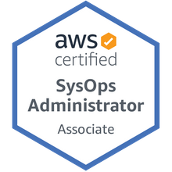
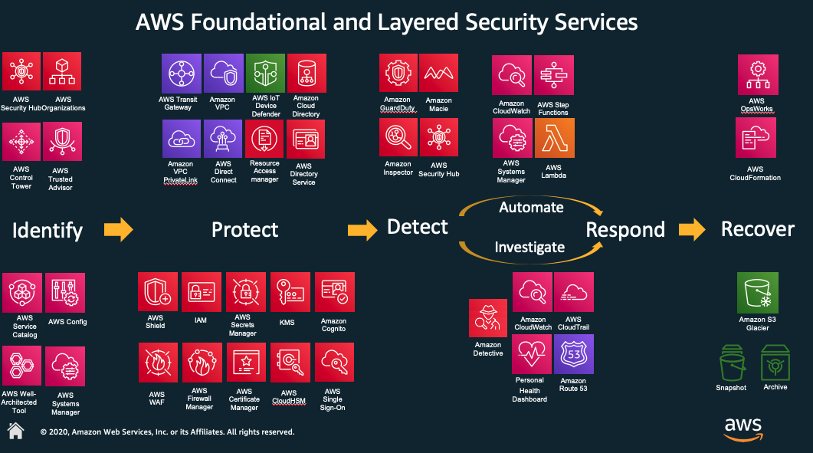

# SysOps Administrator Associate



Training course notes
These notes are incremental to AWS Certified Developer Associate and Solutions Architect Associate

# Whitepapers


# CloudWatch
- By default EC2 monitoring is 5m, detailed - 1m, but it depends on service
- By default store indefinitely (can change the retention period)
- Host-level metrics: CPU, Network, Disk, StatusCheck
- _Minimum granularity_ for custom metric - 1m

Free metrics:
- RDS, EC2, EBS

- **Alarm** can trigger:
    SNS (multiple SNS topics are possible)  
    Auto scaling action (ASG or ECS)  
    EC2 action (recover, stop, terminate, reboot) - _Per-instance_ metric is required  
- **Rule** can trigger:  
    SNS, SQS, EC2, ECS Task, Lambda, CodeBuild, CodePipeline, Step Function, SSM, Eventbus in other account, Kinesis Data Streams and Firehose  
    Event Source for the rule can be almost any AWS Service (Event type: CloudTrail API Call)

CloudWatch agents on Windows use `StatsD` protocol and `collectd` on Linux


CloudWatch Events:
- consists of three parts:
  - **Event Source**  
  - **Rule**  
  - **Target**: can be more than one  

- Retention:
  - 1m metric - 15d
  - 5m metric - 63d
  - 1h metric - 455d

- Metric resolution:
  - Default: 5m
  - Detailed: 1m
  - High-resolution: CloudWatch stores it with resolution 1s and you can read and retrieve it with a period of 1, 5, 10, 30 or any multiple of 60s

- Can be used on-prem: Need to install SSM agent and CloudWatch agent

Create EC2 custom metric [LAB](labs/custom-cloudwatch-metric/script.sh):
 - create a EC2 role with CloudWatch access policy
 - send a custom metric to CloudWatch from EC2  
    helper scripts: `curl https://aws-cloudwatch.s3.amazonaws.com/downloads/CloudWatchMonitoringScripts-1.2.2.zip -O`

## Monitoring EBS
- EBS initialisation for
- 5m at no charge
- io1 (provisioned IOPS) send 1m metric automatically
- CloudWatch Metrics:
  - `VolumeRead/Write Bytes`  
  - `VolumeRead/Write Ops`  
  - `VolumneTotalRead/Write Time`  
  - `VolumeIdleTime`: if high, consider using snapshot instead of volume  
  - `VolumeQueueLength`:: if high, consider increasing IOPS  
- Provisioned IOPS (SSD) only
  - `VolumeThroughputPercentage`  
  - `VolumeConsumedReadWriteOps`  
- gp2, st1, sc1 only:
  - `BurstBalance`

- Status Checks, runs every 5m:
|Status|I/O Performance Status|
|---|---|
|ok |normal|
|warning|Degrated or Severely Degraded|
|impaired|Stalled or Not Available|
|insufficient data|insufficient data|

## EBS Volume Initialisation
https://docs.aws.amazon.com/AWSEC2/latest/UserGuide/ebs-initialize.html

New EBS volumes are at maximum performance immedeately
Volumes restored from snapshots:
- max performance is not reached until all blocks on the volume are read
- must be initialised - reading all blocks

```
lsblk
sudo dd if=/dev/xvdf of=/dev/null bs=1M
```
or
```
sudo yum install -y fio
sudo fio --filename=/dev/xvdf \
  --rw=read \
  --bs-128k \
  --iodepth=32 \
  --ioengine=libaio \
  --direct=1 \
  --name=volume-initialise
```

## EBS Snapshots
You can use Data Lifecycle Manager to schedule creation and deletion of EBS snapshots

## Monitoring ELB
### ALB
https://docs.aws.amazon.com/elasticloadbalancing/latest/application/load-balancer-access-logs.html

**CloudWatch**: metrics to monitor:
  - `ActiveConnectionCount`  
  - `HealthyHostCount`  
  - `HTTP code totals`  

**Access logs**: disabled by default, can store data where EC2 instance has been deleted. Detailed information for every request (including requests that never made it to the target, e.g. mailformed requests) received by ELB (logs are stored in S3):
 - client IP:port
 - target IP:port
 - latencies (request processing time, target processing time, response processing time)
 - request paths
 - server responses
 - send/received bytes
 - SSL details (cipher, protocol)

 Each log is automatically encrypted using SSE-S3
 No additional charge (only S3 costs)

**Request tracing**: _for ALB only_. Track HTTP requests from clients to targets or other services. ALB adds `X-Amzn-Trace-Id` header that includes a trace ID  
**CloudTrail**: calls made to ELB API

### NLB
**CloudWatch**:
  - `ActiveFlowCount`, `HealthyHostCount`, `UnhealthyHostCount`  
**VPC Flow Logs**: detailed log of traffic to and from NLB
**CloudTrail**:  records API activity

### Classic LB
https://docs.aws.amazon.com/elasticloadbalancing/latest/classic/elb-cloudwatch-metrics.html

The Classic Load Balancer metric `SurgeQueueLength` measures the total number of requests queued by your Classic Load Balancer. An increased maximum statistic for `SurgeQueueLength` indicates that backend systems aren't able to process incoming requests as fast as the requests are received (`HTTP 503 Service Unvailable` or `HTTP 504 Gateway Timeout`)


## ALB components
- Load Balancer
- Listeners
  read the request from the clients
  compare the request to rules and forwards to a target group
- Target Group
  Targets can be:
  - Instance
  - IP (including outside of VPC, e.g. on-prem), supports dynamic port mapping (for microservices)
  - Lambda
  Health checks are configured per target group
  Targets can be in multiple target
ALB content-based routing:
- **Path-based**: forwards based on URL in the request
- **Host-based**: forwards based on the host field of HTTP header

## NLB
- Each AZ assigned gets a node created in it with static IP (or EIP) - reduces latency
- register targets by:
  - InstanceID: source addresses of clients are preserved
  - IP Address: source addresses of clients are the private IP of NLB node (NLB will re-write the headers)

## ASG
https://docs.aws.amazon.com/autoscaling/ec2/userguide/as-suspend-resume-processes.html

## SSL Offloading
https://aws.amazon.com/blogs/aws/new-application-load-balancer-sni/


Terminate HTTPS on ELB

## Network Bottlenecks
Potential networking issues:
- EC2 instances:
  - instances in different AZ, regions or continents
  - EC2 instances sizes (larger have better network performance)
  - not using enhanced networking features
  - you can check network performance with `iperf3`
- VPCs can use VPC peering to create a reliable connection:
  - no single point of failure
  - peer VPCs between regions to avoid traffic transiting the public internet

Bandwidth limitations on your VPN to AWS VPC
Use AWS

## CloudFront
Common CloudFront errors:
- `4xx`: client side errors - something wrong with client request
  - `400 Bad Request`  
  - `403 Access Denied`  
  - `404 File Not Found`  
- `5xx`: server side errors
  - `502 Bad gateway`: cannot connect to origin  
  - `503 Service unavailable`: performance issues on origin server  
  - `504 Gateway timeout`: request expired before a response was received from the origin  
  usually caused by high traffic to the website

## Monitoring Elasticache
Memcached: https://docs.aws.amazon.com/AmazonElastiCache/latest/mem-ug/CacheMetrics.WhichShouldIMonitor.html  
Redis: https://docs.aws.amazon.com/AmazonElastiCache/latest/red-ug/CacheMetrics.html  

Node types:
- General purpose
- Memory optimized

Metrics to watch:
`CPU Utilisation`: see below
`Swap Usage`: amount of Swap file that is used, should be close to 0    
`Evictions`: Memcached: Either Scale up or out. Redis: Only Scale Out  
`Concurrent Connections`: set alarm on that metric

Memcached CPU Utilisation:
 - Multithreaded  
 - Can handle load up to 90%, >90% __add more nodes to the cluster__  
 - `SwapUsage` should be around 0 and not > than 50Mb. Increase `memcached_connection_overhead` parameter  

Redis CPU Utilisation:
 - Not multithreaded  
 - To determine the point in which to scale, divide 90% by the number of cores  
 - No `SwapUsage` metric, instead use `reserved-memory`  

## CloudWatch Dashboard
https://docs.aws.amazon.com/AmazonCloudWatch/latest/monitoring/cloudwatch_xaxr_dashboard.html

All dashboards are global, not Region-specific, widget added on the region basis
`PutDashboard` and `PutMetricData` permissions are needed
To create a custom dashboard with metric data from different regions, **Detailed Monitoring** is required to be enabled  

# AWS Organisations
https://aws.amazon.com/organizations/faqs/
https://docs.aws.amazon.com/organizations/latest/userguide/orgs_getting-started_concepts.html

Manage multiple AWS accounts, can create groups of accounts and apply policies to the groups
- Central management of accounts
- Control Access with SCP (allow or deny individual AWS services on account group basis). Attach policies to the OU (applies to all accounts within OU). Can select _black_ or _white_ listing for SCP
- Automate AWS account creation
- Consolidated billing

Master account:
- A master account is the AWS account you use to create your organization
- You cannot change which account in your organization is the master account
- Create organisations and OUs
- Invite an external account to join organisation
- Pay all charges accrued by all accounts in organisation
- Never affected by SCP

## Service Control Policy (SCP)
similar to IAM permissions policies but SCP don't grant any permissions
- **Allow list strategy**: explicitly specify the access that is allowed. All other access is implicitly blocked.
  By default, AWS Organisations attaches an AWS managed policy `FullAWSAccess` to all roots, OUs and accounts.
  When you restrict permissions, you _replace_ the `FullAWSAccess`
  You can't add permissions back at lower lever in the hierarchy
- **Deny list strategy**: explicitly specify the access that is not allowed. All other access is allowed.
  This is the default behavior of AWS Organisations.
  You leave the default `FullAWSAccess` policy in place and attach additional policies that explicitly _deny_ access to unwanted services and actions

# Tagging and Resource Groups
https://d1.awsstatic.com/whitepapers/aws-tagging-best-practices.pdf

- Sometimes can be inherited
- You can group resources that shares one or more tags
- Region based
- Create resource group:
  - select group type (Tag- or CloudFormation stack-based)
  - select resource type
  - select Tags to group upon
- You can execute automation on the resource group via **Systems Manager**

To ensure all resources are launched with tags:
**Proactive approach**:  
- Use IAM resource-level permissions to add tags to all AWS resources during creation
- Use AWS Service Catalog to add tags to all AWS resources during resource creation
- Use CloudFormation to create resources with tags

**Reactive approach**:  
- Resource Groups Tagging API
- AWS Config Rules
- Custom Scripts


# AWS Cost Explorer & Cost Allocation Tags
Can generate cost allocation report (need to activate cost allocation tags)
Display data from the last 13 months, projected for the next 3 months

# Cost Optimisation
https://docs.aws.amazon.com/AWSEC2/latest/UserGuide/spot-requests.html#fixed-duration-spot-instances

- EC2 Reserved Instances
- Spot Instances
- Spot Instances with defined duration: _Spot blocks_, ideal for jobs that take a finite time to complete.
  You can use a duration 1,2,3,4,5,6 hours, price depends on the specified duration
- Low Utilisation: set CloudWatch alarms to terminate underutilized instances
- Unused ELBs
- EBS Volumes (delete unused, take snapshot. Storing snapshot is cheaper)
- Elastic IPs
- Idle RDS Instances


AWS Trusted Advisor

# AWS Cost & Usage Report
cost details for all resources in AWS
customized reports
Multiple files with flexible column structure + manifest file listing data files in report

# EC2 Pricing Refresher
On Demand
Reserved:
  - standard RIs
  - convertible RIs
  - scheduled RIs
  - you can also purchase reserved capacity for **RDS and ElastiCache** instances
Spot
Dedicated Hosts

# AWS Config
https://aws.amazon.com/blogs/aws/aws-config-rules-dynamic-compliance-checking-for-cloud-resources
https://docs.aws.amazon.com/config/latest/developerguide/evaluate-config-rules.html

- AWS resource inventory, configuration history and configuration change notification
- Region-based
- Stores all in S3 Bucket
- Snapshot of current configuration of your account
- Can stream configuration changes to SNS
- Can trigger Lambda on Events
- Can enable rule compliance by monitoring and triggering SNS notification
- Compliance checks - periodic or triggered
- Managed Rules available (AWS Config Rules)
- You can see the timeline of changes and retrieve past configurations

AWS Config requires IAM role with permissions:
 - Read-only to recorded resources
 - Write to S3 logging bucket
 - Publish access to SNS

AWS Config rules can, e.g:
- Ensure that EC2 instances launched in a particular VPC are properly tagged.
- Make sure that every instance is associated with at least one security group.
- Check to make sure that port 22 is not open in any production security group.


# CloudWatch vs Cloudtrail vs Config
https://aws.amazon.com/cloudtrail/faqs/
https://aws.amazon.com/config/faq/

CloudWatch|CloudTrail|Config
---|---|---
Monitors performance|Monitors API calls|Records the state of resources and notify about changes
e.g. what was the CPU utilisation 3 weeks ago|e.g. who provisioned SG 3 weeks ago|e.g. what were the rules on my SG 3 weeks ago

CloudTrail is enabled when an account is created and can be used globally

# Health Dashboards
https://docs.aws.amazon.com/health/latest/ug/getting-started-phd.html
https://docs.aws.amazon.com/health/latest/ug/cloudwatch-events-health.html
https://www.youtube.com/watch?v=rCq8OH_8Rko

 - Service Health Dashboard: https://status.aws.amazon.com/
 - Personal Health Dashboard (global by default), personalised view of performance and availability of AWS services for your AWS resources: https://phd.aws.amazon.com
 Only AWS Health events that are specific to your AWS account and resources are published to CloudWatch Events. This includes events such as Amazon Elastic Block Store (Amazon EBS) volume lost, Amazon Elastic Compute Cloud (Amazon EC2) instance store drive performance degraded, and all the scheduled change events

# AWS API Access
All interactions with AWS API signed with `AccessKeyId` and `SecretAccessKey` using Sig4
`AccessKeyId` and `SecretAccessKey` map to users or roles in IAM

The _default credential provider chain_ implemented by `DefaultAWSCredentialsProviderChain` looks for credentials in this order:
  1. Specified in the code  
  2. Environment variables `AWS_ACCESS_KEY_ID` and `AWS_SECRET_ACCESS_KEY`  
  3. Default credential profile in the `~/.aws/credentials` file  
  4. Amazon ECS container credentials: loaded from ECS if environment variable `AWS_CONTAINER_CREDENTIALS_RELATIVE_URI` is set  
  5. Amazon EC2 instance role: used on EC2 instance and delivered via EC2 metadata service  

## SSH agent forwarding
```
  ssh-add keyfile.pem
  ssh -A ec2-user@<bastion_host_ip>

  (on the bastion host)$ ssh ec2-user@<private_host_ip>
```

# EC2 Launch Issues
- `InstanceLimitExceeded`: per region
- `InsufficientInstanceCapacity`: AWS not enough available On-Demand capacity
Options to resolve: wait, request fewer instances, change instances type, purchase RIs, submit request without AZ

# EC2 Status Checks
System Status Checks
- monitors the systems on which your instances run
- Amazon must solve
- how to resolve:
  - for **EBS-backed** instances: start/stop to obtain new hardware  
  - for **instance-store-backed**: terminate and replace (can't recover the data)

Instance Status Checks
- you must intervene to fix

`aws ec2 describe-instances-status [--instance-ids i-xxxxxx]`  
`aws ec2 describe-instances-status --filters Name=instance-status.status,Values=impaired`

## AMI Virtualisation Types:
- **Hardware Virtual Machine (HVM)** AMIs: faster access to host hardware, enhanced networking and GPU processing  
- **Paravirtual (PV)** AMIs: Runs on hardware that does not support Virtualisation, no hardware extension support  

# EBS Volumes
https://docs.aws.amazon.com/AWSEC2/latest/UserGuide/EBSVolumeTypes.html

- max 16TB
- mounted only to **one** instance at a time
- mulitple volumes can be mounted to a single instance
- in one AZ, replicated within one AZ

Performance:
gp2:
- size 1GB to 16TB
- 100 to 16000 IOPS
- 3 IOPS per 1GB, min 100 IOPS
- max throughput 250 MB/s
- burst up to 3000 IOPS for 30m (never deplete for > 1000GB)

io1:
- size 4GB to 16TB
- 100 to 64000 IOPS
- max throughput 1000 MB/s
- AWS SLA = 99.9 of time within 10% of IOPS
- max ratio 50:1
  - 640GB or greater can use max IOPS
- AWS recommends a ratio larger than 2:1 with io1
  - if 4000 IOPS are needed, volume size should be less than 2000GB

## How to preserve data on EBS volume
- uncheck "Delete on Termination"
- create a snapshot before deletion
- create a separate volume and attach to the instance (attached volumes are not deleted when instance is terminated)


# Instance store
https://docs.aws.amazon.com/AWSEC2/latest/UserGuide/InstanceStorage.html

You can specify instance store volumes for an instance only when you launch it. You can't detach an instance store volume from one instance and attach it to a different instance.

The data in an instance store persists only during the lifetime of its associated instance. If an instance reboots (intentionally or unintentionally), **data in the instance store persists**. However, data in the instance store is lost under any of the following circumstances:
- The underlying disk drive fails
- The instance stops
- The instance terminates

# EFS
- Multiple AZs
- Storage classes:
  - Infrequent Access
  - Standard
- can apply lifecycle policies
- throughput for parallel workloads
- for on-prem servers, use **AWS DX or VPN**  
- Linux only
- 2 Performance modes (should be selected at _creation_ time):
  - **General Purpose**: ideal for latency-sensitive use cases
  - **Max I/O**: high level of aggregate throughput, but higher latency. Use for highly parallelized apps
  - monitor `PercentIOLimit`
- 2 throughput modes:
  - **Bursting**: scales as size grows
  - **Provisioned throughput**: independent of the amount of data
  - < 1TB - burst to 100MB/s
  - > 1TB - burst to 100MB/s per 1TB of data stored

EFS Mount Targets can be accessed only on following systems:
- Amazon EC2 instance in local VPC
- EC2 instance in VPC having VPC peering with other VPC
- On-prem servers having AWS DX or VPN to Amazon VPC

Security groups attached to mount target should allow inbound connection on NFS port

# EFS Monitoring
https://docs.aws.amazon.com/efs/latest/ug/monitoring-cloudwatch.html

- metric sent at 1m intervals and retained for 15months

## Amazon Lightsail
- VPS (Virtual Private Server)
- Singel instance
- One-click application deployments:
  - WordPress, Magento, Drupal, Joomla!, Redmine, Piesk
- Developement stacks:
  - Node.js, GitLab, LAMP, MEAN, Nginx

## AWS Batch
Runs batch computing workloads at scale

# S3 cross-region replication
- Bucket-level
- versioning must be enabled
- can select key name prefixes (folders)
- can select different storage class for destination
- what is not replicated:
  - objects that existed before replication was activated
  - encrypted objects:
    - SSE-C and SSE-KMS (but for KMS can be explicitly enabled by selecting destination KMS key)
  - objects that were replicated to source bucket (no transitive replication)

# S3 large file encryption with KMS key
https://aws.amazon.com/premiumsupport/knowledge-center/s3-large-file-encryption-kms-key/

The AWS CLI, AWS SDKs, and many third-party programs automatically perform a multipart upload when the file is large. To perform a multipart upload with encryption using an AWS KMS key, the requester must have `kms:GenerateDataKey` permissions to initiate the upload, and `kms:Decrypt` permissions to upload object parts. The requester must have `kms:Decrypt` permissions so that newly uploaded parts can be encrypted with the same key used for previous parts of the same object.


# S3 Server Access Logs
https://docs.aws.amazon.com/AmazonS3/latest/dev/ServerLogs.html
provides detailed records for the requests that are made to a bucket
Details: single access request, requester, bucket name, request time, request action, response status, error code
No extra charge for enabling and PUTs (but usual charge for storing)
Logs are saved to a bucket in the same AWS regions as the source bucket
Uses a special log delivery account _Log Delivery Group_ to write access log  
Best effort server log delivery:
The completeness and timeliness of server logging is not guaranteed. The log record for a particular request might be delivered long after the request was actually processed, or _it might not be delivered at all_.

To enable:
1. Turn on logging on S3 bucket
2. Grant S3 _Log Delivery group_ write persmission on the target bucket
    **only through bucket ACL** and not through bucket policy
    only SSE-S3 can be used, **SSE-KMS is not supported**  
    Object Lock _cannot_ be enabled on the target bucket
You can _optionally_ specify prefix in the target bucket while enabling logging

# Amazon GuardDuty
https://docs.aws.amazon.com/guardduty/latest/ug/what-is-guardduty.html

Amazon GuardDuty is a continuous security monitoring service that analyzes and processes the following Data sources:
- VPC Flow Logs
- AWS CloudTrail management event logs
- Cloudtrail S3 data event logs
- DNS logs

Maintains two types of lists:
- Trusted IP list: whitelisted IPs
- Threat List: malicious IPs for which GuardDuty generates findings


# AWS Storage Gateway
**File Gateway**: stores data on S3
- NFS or SMB
**Volume Gateway**
  - _Cached Volumes_:
    - mounted iSCSI devices, data stored on S3, cached on-prem
  - _Stored Volumes_:
    - store all data locally
    - takes snapshot periodically as incremental backup and store on S3
**Tape Gateway**
- Virtual tape library writes to Glacier
- Can run as VM on-prem or EC2 instance

# AWS Systems Manager
https://docs.aws.amazon.com/systems-manager/latest/userguide/systems-manager-managedinstances.html

Provisioning, Deployment, Management
managed policy `AmazonEC2RoleforSSM` to attach to EC2 role to communicate with SSM
Parts:
- SSM Automation
- SSM Inventory
- Patch Manager
- Run Command
- Parameter Store
- Trusted Advisor and PHD

For set-up of Systems Manager for Hybrid environment:

Step 1: Complete general Systems Manager setup steps
Step 2: Create an IAM service role for a hybrid environment (to communicate with SSM service)
Step 3: Install a TLS certificate on on-premises servers and VMs
Step 4: Create a managed-instance activation for a hybrid environment
Step 5: Install SSM Agent for a hybrid environment (Linux or Windows)
Step 6: (Optional) Enable Advanced-Instances Tier for more than 1000 servers per account per region

## SSM State Manager
https://docs.aws.amazon.com/systems-manager/latest/userguide/sysman-ssm-docs.html

uses **Command Document** to keep EC2 in predefined state
Different Types of SSM Documents
Type | Use with
---|---
Command Document | Run command, State Manager, Maintenance Windows, apply to configuration
Automation Document | Automation, common deployment/maintenance tasks
Package Document | ZIP archive files that contain software to install on managed instances
Session Document | Session Manager (type of session to start)
Policy Document | Enforcing a policy on a managed instance
Change Calendar Document | Associated events that can allow/prevent Automation ations


# Disaster Recovery
RTO
RPO

**Backup and Restore Method**  
- Slowest restoration time after an event
- Requires frequent snapshots of data
- Storage Gateway enables snapshots of on-prem data to be copied to S3
- Gateway VTL can replace magnetic tape backup
- Used with other DR methods

**Pilot Light Method**
- Quicker than backup and restore
- slower than warm standby
- _most critical core components_ are always running and kept up to date
- typically includes DB servers (replication)
- restoring other components include EBS snapshots and EC2 AMIs

**Warm Standby Method**
- Scaled-down version of fully functional environment is always running
- resize instances after failover
- like pilot light uses DB replication

**Multi-Site Solution Method**
- Fastest possible system restore
- 1:1 copy of all Infrastructure in another AZ/region
- **Active-Active**  
- Can perform weighted DNS routing
- uses ASG and instance resizing to increase capacity in a disaster scenario

# VPC
Size from /16 to /28

Reserved IP addresses (first 4 + last):
- 10.0.0.0 - Network address
- 10.0.0.1 - VPC router
- 10.0.0.2 - DNS server address
- 10.0.0.3 - reserved
- 10.0.0.255 - broadcast address (VPC does not support broadcast)

Default VPC
- Size /16
- Default SN in each AZ size /20
- IGW
- RT with route sending all trafic to IGW
- Default SG allowing all trafic
- Default ACL allowing all traffic
- Default DHCP option

## VPC Flog Logs
https://docs.aws.amazon.com/vpc/latest/userguide/flow-logs.html#flow-log-records
https://docs.aws.amazon.com/athena/latest/ug/vpc-flow-logs.html

```
<version> <account-id> <interface-id> <srcaddr> <dstaddr> <srcport> <dstport> <protocol> <packets> <bytes> <start> <end> <action> <log-status>
```
Protocol:
id | Protocol
---|---
1 | ICMP
6 | TCP
17 | UDP
27 | RDP


Stored in CloudWatch logs (but can be sent to S3 bucket)
Each network interface has a unique log stream
Can be on the level:
  - VPC
  - Subnet
  - Network interface
**Not real-time** - delay of several min

Ability to create multiple flog logs per interface (e.g. accepted, rejected or all traffic)
Launching EC2 _after_ creating flow logs will automatically create logs for each new NI

Log schema:
```
CREATE EXTERNAL TABLE IF NOT EXISTS vpc_flow_logs (
  version int,
  account string,
  interfaceid string,
  sourceaddress string,
  destinationaddress string,
  sourceport int,
  destinationport int,
  protocol int,
  numpackets int,
  numbytes bigint,
  starttime int,
  endtime int,
  action string,
  logstatus string
)
PARTITIONED BY (`date` date)
ROW FORMAT DELIMITED
FIELDS TERMINATED BY ' '
LOCATION 's3://your_log_bucket/prefix/AWSLogs/{account_id}/vpcflowlogs/{region_code}/'
TBLPROPERTIES ("skip.header.line.count"="1");
```

https://docs.aws.amazon.com/vpc/latest/userguide/flow-logs-troubleshooting.html

`LogDestinationNotFoundException` or `Access Denied for LogDestination` error
- Ensure that you have specified the ARN for an existing S3 bucket, and that the ARN is in the correct format
- If you do not own the S3 bucket, verify that the bucket policy has sufficient permissions to publish logs to it. In the bucket policy, verify the account ID and bucket name

`LogDestinationPermissionIssueException`:  
Amazon S3 bucket policies are limited to 20 KB in size.
Each time that you create a flow log that publishes to an Amazon S3 bucket, we automatically add the specified bucket ARN, which includes the folder path, to the Resource element in the bucket's policy.
Creating multiple flow logs that publish to the same bucket could cause you to exceed the bucket policy limit.

- Clean up the bucket's policy by removing the flow log entries that are no longer needed.
- Grant permissions to the entire bucket by replacing the individual flow log entries with the following:
```
arn:aws:s3:::bucket_name/*
```

## VPC Peering
direct network routing between different VPCs using private IP addresses
Limitations:
- no matching or overalpping CIDR blocks for participating VPCs
- no transitive peering
- one peering connection for same two VPC
- DNS resolution for private hostnames must be enabled

Inter-Region VPC peering:
possible to have cross-region

## VPC Lambda Configuration
https://docs.aws.amazon.com/lambda/latest/dg/configuration-vpc.html

You can configure a Lambda function to connect to private subnets in VPC
Lambda create an ENI for each combination of SG and subnet in your Lambda VPC configuration
Lambda uses **Condition keys** to specify additional permission controls:

IAM condition parameters:
`lambda:VpcIds`: to allow or deny specific VPC to be used by function
`lambda:SubnetIds`: Subnets
`lambda:SecurityGroupIds`: Security groups


## VPN
Components:
- Customer Gateway (initiates VPN connection)
- Virtual private gateway: One per VPC - used with IPSec and AWS DX
- VPN connnection - two VPN tunnels - you need to provision two IP addresses on the customer side

If customer gateway becomes unavailable you can setup a second VPN connection to VPC and Virtual Private gateway by using a second customer gateway

## AWS Direct Connect
For dedicated connections DX requires **single-mode fiber**: 1Gbps (1000BASE-LX) or 10Gbps
The network device on-prem must support BGP
Using a private peered connection might not need extra security

### Multi-account Access to Direct Connect
Access to up to 10 VPC in multi-account, all accounts must be in AWS Organisations which have the same payer account - they can share the same DX Gateway

## Elastic IP (EIP) and Elastic Network Interface (ENI)
EIP:
- region specific
- IPv6 not supported
- to implement: 1) allocate 2) associate
- to remove: 1) disassociate 2) release
- any previous public IP is released (DNS hostname changes as well)
- charges for:
  - EIP not associated
  - more then one EIP on an instance

ENI:
- virtual network card
- can include primary and secondary IPv4 addresses
- can include public IPv4, EIP, public IPv6
- security group
- MAC addresses
- description

Every EC2 instance in VPC has a default ENI - **primary network interface** (`eth0`) - cannot be detached from the instance
when attaching/reattaching to instances, the attributes (SG) and traffic follow the interface
you can modify attributes (SG and IP) after creation

# Security
https://aws.amazon.com/compliance/shared-responsibility-model/
https://aws.amazon.com/security/penetration-testing/



## IAM Roles
- Temporary credentials in AWS managed by STS
- another entity can **assume** the specific permissions defined by the role
- roles must be used because policies cannot be directly attached to AWS services
- Services can have only **one** role attached at a time

Other use of roles:
- Cross-account access (delegation)
- Identity Federation
  - these users assume an **identity provider** access role

## PassRole
https://docs.aws.amazon.com/IAM/latest/UserGuide/id_roles_use_passrole.html
https://aws.amazon.com/blogs/security/granting-permission-to-launch-ec2-instances-with-iam-roles-passrole-permission/

- A trust policy for the role that allows the service to assume the role
- A permission policy attached to IAM user that allows the user to pass only those roles that are approved
  `iam:PassRole` is usually is accompanied by `iam:GetRole` (so the user can get details of the role to be passed)


## S3 Bucket Policies
https://docs.aws.amazon.com/AmazonS3/latest/dev/example-bucket-policies.html
https://docs.aws.amazon.com/AmazonS3/latest/dev/example-policies-s3.html

Limited to 20KB in size

Mandatory elements:
- Effect (Deny or Allow)
- Action
- Resource
- Principal
  - account or user that this policy applies to
  - Specific to S3 bucket policies

Optional:
- Sid
- Condition

Use `/*` to apply policy to **all objects** in the bucket

Bucket policies apply to all files in a bucket **owned by a bucket owner**  

`*` makes sense only with objects, not with buckets
Bucket-level Actions
- CreateBucket, DeleteBucket, ListBucket, ListAllMyBuckets
- `arn:aws:s3:::bucket`

Object-level Actions
- GetObject
- DeleteObject
- PubObject
- RestoreObject
-`arn:aws:s3:::bucket/*`

Amazon **S3 inventory** creates lists of the objects in an Amazon S3 bucket, and Amazon **S3 analytics** export creates output files of the data used in the analysis

Policy examples:
- Allowing an IAM User Access to One of Your Buckets
```json
{
   "Version":"2012-10-17",
   "Statement":[
      {
         "Effect":"Allow",
         "Action": "s3:ListAllMyBuckets",
         "Resource":"arn:aws:s3:::*"
      },
      {
         "Effect":"Allow",
         "Action":["s3:ListBucket","s3:GetBucketLocation"],
         "Resource":"arn:aws:s3:::awsexamplebucket1"
      },
      {
         "Effect":"Allow",
         "Action":[
            "s3:PutObject",
            "s3:PutObjectAcl",
            "s3:GetObject",
            "s3:GetObjectAcl",
            "s3:DeleteObject"
         ],
         "Resource":"arn:aws:s3:::awsexamplebucket1/*"
      }
   ]
}
```  
Note you need also `s3:ListAllMyBuckets`, `s3:GetBucketLocation`, and `s3:ListBucket` permissions for the AWS console

using unique userid:
```json
{
   "Version":"2012-10-17",
   "Statement":[
      {
         "Effect":"Allow",
         "Action":[
            "s3:PutObject",
            "s3:GetObject",
            "s3:GetObjectVersion",
            "s3:DeleteObject",
            "s3:DeleteObjectVersion"
         ],
         "Resource":"arn:aws:s3:::mycorporatebucket/home/${aws:userid}/*"
      }
   ]
}
```

- Allowing a Partner to Drop Files into a Specific Portion of the Corporate Bucket:
```json
{
   "Version":"2012-10-17",
   "Statement":[
      {
         "Effect":"Allow",
         "Action":"s3:PutObject",
         "Resource":"arn:aws:s3:::mycorporatebucket/uploads/widgetco/*"
      },
      {
         "Effect":"Deny",
         "NotAction":"s3:PutObject",
         "Resource":"arn:aws:s3:::mycorporatebucket/uploads/widgetco/*"
      },
      {
         "Effect":"Deny",
         "Action":"s3:*",
         "NotResource":"arn:aws:s3:::mycorporatebucket/uploads/widgetco/*"
      }
   ]
}
```

- access to specific IP Addresses:
```json
{
  "Version": "2012-10-17",
  "Id": "S3PolicyId1",
  "Statement": [
    {
      "Sid": "IPAllow",
      "Effect": "Deny",
      "Principal": "*",
      "Action": "s3:*",
      "Resource": [
	 "arn:aws:s3:::awsexamplebucket1",
         "arn:aws:s3:::awsexamplebucket1/*"
      ],
      "Condition": {
	    "NotIpAddress": {"aws:SourceIp": "54.240.143.0/24"}
      }
    }
  ]
}
```

- Allowing IPv4 and IPv6 addresses:
```json
{
  "Id":"PolicyId2",
  "Version":"2012-10-17",
  "Statement":[
    {
      "Sid":"AllowIPmix",
      "Effect":"Allow",
      "Principal":"*",
      "Action":"s3:*",
      "Resource":"arn:aws:s3:::awsexamplebucket1/*",
      "Condition": {
        "IpAddress": {
          "aws:SourceIp": [
            "54.240.143.0/24",
	    "2001:DB8:1234:5678::/64"
          ]
        },
        "NotIpAddress": {
          "aws:SourceIp": [
	     "54.240.143.128/30",
	     "2001:DB8:1234:5678:ABCD::/80"
          ]
        }
      }
    }
  ]
}
```

- Restricting Access to a Specific HTTP Referer:
```json
{
  "Version":"2012-10-17",
  "Id":"http referer policy example",
  "Statement":[
    {
      "Sid":"Allow get requests originating from www.example.com and example.com.",
      "Effect":"Allow",
      "Principal":"*",
      "Action":["s3:GetObject","s3:GetObjectVersion"],
      "Resource":"arn:aws:s3:::awsexamplebucket1/*",
      "Condition":{
        "StringLike":{"aws:Referer":["http://www.example.com/*","http://example.com/*"]}
      }
    }
  ]
}
```

- Granting Permission to an Amazon CloudFront OAI:
```json
{
    "Version": "2012-10-17",
    "Id": "PolicyForCloudFrontPrivateContent",
    "Statement": [
        {
            "Effect": "Allow",
            "Principal": {
                "AWS": "arn:aws:iam::cloudfront:user/CloudFront Origin Access Identity EH1HDMB1FH2TC"
            },
            "Action": "s3:GetObject",
            "Resource": "arn:aws:s3:::awsexamplebucket1/*"
        }
    ]
}
```

- Adding a Bucket Policy to Require MFA:
```json
{
    "Version": "2012-10-17",
    "Id": "123",
    "Statement": [
      {
        "Sid": "",
        "Effect": "Deny",
        "Principal": "*",
        "Action": "s3:*",
        "Resource": "arn:aws:s3:::awsexamplebucket1/taxdocuments/*",
        "Condition": { "Null": { "aws:MultiFactorAuthAge": true }}
      }
    ]
 }
```

- Granting Cross-Account Permissions to Upload Objects While Ensuring the Bucket Owner Has Full Control:
```json
{
   "Version":"2012-10-17",
   "Statement":[
     {
       "Sid":"111",
       "Effect":"Allow",
       "Principal":{"AWS":"123456789012"},
       "Action":"s3:PutObject",
       "Resource":"arn:aws:s3:::awsexamplebucket1/*"
     },
     {
       "Sid":"112",
       "Effect":"Deny",
       "Principal":{"AWS":"123456789012" },
       "Action":"s3:PutObject",
       "Resource":"arn:aws:s3:::awsexamplebucket1/*",
       "Condition": {
         "StringNotEquals": {"s3:x-amz-grant-full-control":["emailAddress=xyz@amazon.com"]}
       }
     }
   ]
}
```

## Security Groups and NACLs
Security Group - Instance level
NACL - Subnet level

## AWS STS: Federation
credentials remain active 15m to 1h (default)
credentials are not stored with the user or service, token is used
uses a single endpoint https://sts.amazonaws.com, resides in `us-east-1`
temporary credentials have global scope

Web Identity Federation Playground

## AWS Inspector
https://aws.amazon.com/inspector/
https://docs.aws.amazon.com/inspector/latest/userguide/inspector_network-reachability.html

Amazon Marketplace has Amazon Linux AMI with built-in Inspector agent

- Analyze the behavior of your AWS resources
- Test network accessibility and security state
- Accesses for security vulnerabilities and deviations from best practices
- Provides recommendation for resolution

Target: a collection of EC2 instances
Requires an agent installed on EC2 instance

### Network Reachability
An Amazon Inspector agent **is not required** to assess your EC2 instances with this rules package. However, an installed agent can provide information about the presence of any processes listening on the ports. Do not install an agent on an operating system that Amazon Inspector does not support. If an agent is present on an instance that runs an unsupported operating system, then the Network Reachability rules package will not work on that instance.

## AWS Certificate Manager (ACM
Naitive integration with AWS Services
No associated costs for certificates
Certificates auto-renew

## AWS WAF
https://docs.aws.amazon.com/waf/latest/developerguide/how-aws-waf-works.html

integrated with
- ALB
- API Gateway
- CloudFront - WAF is available globally, but you must use us-east-1 for all of your work

- **Web ACLs**: contain rules  
- **Rules**: block, allow or count matching requests  
- **Rules Groups**: reusable rule group

WAF Rules are based on conditions:
- IP addresses
- HTTP headers
- HTTP body
- URI strings
- SQL injection
- Cross-site scripting (XXS)

when using WAF on ALB, rules run in region

## AWS Trusted Advisor
Cost Optimization
Perfromance
Security
Fault Tolerance
Service Limits

Can be used to check usage details of AWS resources and if they are within the service limits for a resource

Available to all **customers**:  
- seven core checks:
  1. S3 Bucket Permissions
  2. Security Groups - Specific Ports Unrestricted
  3. IAM Use
  4. MFA on Root Account
  5. EBS Public Snapshots
  6. RDS Public Snapshots
  7. Service Limits
Available to **Business and Enterprise Support Customers**:  
- Access to the full set of checks
- Notifications (CloudWatch alerts)
- Programmatic access
  - Retrieve results from the AWS Support API

# RAID configuration options
https://docs.aws.amazon.com/AWSEC2/latest/UserGuide/raid-config.html

Use RAID 0 (performance) or RAID 1 (Fault-tolerance)
Do not use RAID 5 or RAID 6

# QuickSight
https://docs.aws.amazon.com/quicksight/latest/user/editions.html

Enterpise Edition:
- can select AD groups in directory services for access to Amazon QuickSight
- supports encryption at rest (Standard doesn't)

# Service Catalog
Create catalog of approved AWS products and make available for your users
Pesonalised Portal - deploy only approved resources that comply with organisational policies and budget constraint
Access Control
Enforce Standards

Portfolio - collection or grouping of products, selectively grant access
Product - definition, support contract, owner, CFN template
Add users to the portfolio
Can share portfolio cross-account or within AWS Organisations

# CloudFormation
https://aws.amazon.com/blogs/devops/aws-cloudformation-security-best-practices/

Best practices:
- IAM
- be aware of service limits
- avoid manual updates
- use CloudTrail to log API calls
- Use StackPolicy: JSON doc that describes what update actions can be performed on resources

Rolling Back:
by default, CloudFormation will roll back to the previous
can fail if something has been changed outside of CloudFormation
E.g.
- resource no longer exists -> manually sync resources, e.g. recreate that resource with same name and properties before you try to rn rollback

you cannot update a stack in `UPDATE_ROLLBACK_FAILED` state

Sections:
- `Metadata`    
- `Parameters`  
- `Conditions`: e.g. provision resources based on environment
- `Mappings`: e.g. set values based on region, key->values matching  
- `Templates`: include snippets of code outside the main template, can reference addtional code stored in S3, e.g. for Lambda code  
- `Resources`: mandatory  
- `Outputs`  


# Support Plans
https://aws.amazon.com/premiumsupport/plans/

# EC2 key pairs
https://docs.aws.amazon.com/AWSEC2/latest/UserGuide/ec2-key-pairs.html


# Route53
https://docs.aws.amazon.com/Route53/latest/DeveloperGuide/resource-record-sets-choosing-alias-non-alias.html

## Services with maintenance window
- RDS
- ElastiCache
- Redshift
- DynamoDB DAX
- Neptune
- DocumentDB

## AWS Shield
Free service that protects:
- ELB
- CloudFront
- Route53

Against SYN/UDP floods, reflection attacks and other layer3/4 attacks

Advanced edition:
- protection against larger and more sophisticated attacks
- always-on, flow-based monitoring, near-real time notifications of DDoS
- DDoS response Team (DRT) 24x7
- protects AWS bill against higher fees during DDoS


---
